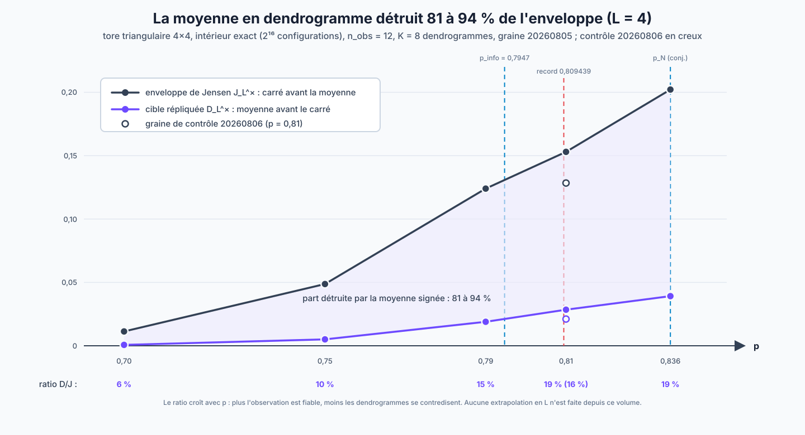

# Expérience E1 : première mesure directe de la cible répliquée

Cette note documente la première réalisation de la priorité n°2 du
[statut canonique](../hierarchical-swendsen-wang/CURRENT_STATUS.md) :
« estimer directement $`\mathcal D_L^\times`$ en moyennant les
dendrogrammes à observation et endpoints fixés **avant** le carré ». La
mesure est faite à $`L=4`$ avec un intérieur exact (énumération des
$`2^{16}`$ configurations) et un extérieur Monte-Carlo à graines
documentées.



## 1. La quantité mesurée

Pour une observation $O$ et une paire $`(i,j)`$, la
[note 41](../hierarchical-swendsen-wang/active/41_DESINTEGRATION_PALM_RESTE_SIGNE.md)
définit

```math
d_{O,ij}
=
\mathbb E_{D\mid O}
\left[
\mathbf1_{\{i,j\in R_\star(D)\}}
\mathbf1_{\{A_D(i)\ne A_D(j)\}}
\pi_{O,D}(\sigma_i\sigma_j)
\right],
\qquad
\mathcal D_L^\times(p)
=
\frac1{n_L^2}
\mathbb E_O\sum_{i,j}d_{O,ij}^2,
```

où $`R_\star(D)`$ est la racine géante du dendrogramme, $`A_D(\cdot)`$ le
bloc critique à la coupe $`\beta_c(p)`$, et $`\pi_{O,D}`$ le Gibbs complet
conditionnel à $D$ (tous les facteurs, y compris postcritiques). La
moyenne en $D$ est prise **avant** le carré : c'est ce qui distingue la
cible de toutes les enveloppes quenched. On mesure conjointement
l'enveloppe de Jensen à un dendrogramme

```math
\mathcal J_L^\times(p)
=
\frac1{n_L^2}
\mathbb E_O\sum_{i,j}
\mathbb E_{D\mid O}
\left[
\left(
\mathbf1_{\{i,j\in R_\star,\,A_D(i)\ne A_D(j)\}}
\pi_{O,D}(\sigma_i\sigma_j)
\right)^2
\right]
\ge
\mathcal D_L^\times(p),
```

le critère exact $`Q_L(p)`$ et la masse quadratique
$`S_L^c`$ des blocs critiques de la géante. Le **ratio de cancellation**
$`\mathcal D_L^\times/\mathcal J_L^\times`$ quantifie ce que la moyenne
signée détruit par rapport à son enveloppe.

## 2. Protocole

Le module est
[`gsbm_replicated_target_exact.py`](../hierarchical-swendsen-wang/computations/gsbm_replicated_target_exact.py)
(bibliothèque standard uniquement), testé par
[`test_gsbm_replicated_target_exact.py`](../hierarchical-swendsen-wang/computations/test_gsbm_replicated_target_exact.py).

**Couche exacte (pas d'erreur d'échantillonnage).**

- jauge de Nishimori all-plus : la vérité est prise $`\Sigma\equiv+1`$ et
  $`O_e=+1`$ avec probabilité $p$, indépendamment — licite par invariance
  de jauge de la postérieure ;
- la postérieure $`\mu_O`$, toutes les corrélations
  $`\langle\sigma_i\sigma_j\rangle_O`$ (donc $`Q_L`$ à $O$ fixé) et le
  Gibbs conditionnel $`\pi_{O,D}`$ sont calculés par énumération des
  $`2^{16}`$ configurations ; $`\pi_{O,D}`$ utilise, fusion par fusion,
  le facteur exact $`\Lambda_v(\sigma)e^{(1-\beta_v)\Lambda_v(\sigma)}`$
  où $`\Lambda_v(\sigma)`$ est le poids satisfait de la coupe complète
  $`E_v`$ (toutes les arêtes du réseau entre les deux composantes
  fusionnées).

**Couche Monte-Carlo (graines documentées).**

- l'observation $O$ est tirée $`n_{\mathrm{obs}}`$ fois ;
- à $O$ fixé, $K$ dendrogrammes indépendants sont tirés comme dans la
  dynamique : réplique postérieure $`\sigma\sim\mu_O`$ (Nishimori), puis
  horloges $`\mathrm{Exp}(u_p)`$ sur les arêtes satisfaites, censurées à
  $1$, puis Kruskal non marqué avec coupes complètes ;
- le carré $`d_{O,ij}^2`$ est estimé **sans biais** par la U-statistique
  sur les $K$ tirages,

```math
\widehat{d^2}
=
\frac{\left(\sum_kX_k\right)^2-\sum_kX_k^2}{K(K-1)},
```

  qui évite l'inflation de Jensen qu'introduirait le carré de la moyenne
  empirique.

Les tests unitaires vérifient notamment la propriété de partition des
coupes (chaque arête intra-racine apparaît dans exactement une fusion —
le lemme de partition par LCA de la
[note 42](../hierarchical-swendsen-wang/foundations/ancestral/42_PROBLEME_CENTRAL_FUSION_CRITIQUE.md)),
la croissance des temps de fusion, la concentration de la postérieure
sous observation pure, et la domination
$`\widehat{\mathcal D}\le\widehat{\mathcal J}`$.

## 3. Commandes reproductibles

```bash
cd research/hierarchical-swendsen-wang/computations
PYTHONDONTWRITEBYTECODE=1 python3 -m unittest test_gsbm_replicated_target_exact -v
PYTHONDONTWRITEBYTECODE=1 python3 gsbm_replicated_target_exact.py
```

et, pour un point de la campagne fine :

```bash
PYTHONDONTWRITEBYTECODE=1 python3 -c "
from gsbm_replicated_target_exact import measure
print(measure(size=4, p=0.81, n_obs=12, k_dendro=8, seed=20260805))"
```

## 4. Résultats

Campagne principale : $`L=4`$, $`n_{\mathrm{obs}}=12`$, $`K=8`$,
graine $`20260805`$ (contrôle $`20260806`$ à $`p=0{,}81`$).

| $p$ | $`\beta_c(p)`$ | $`Q_L`$ | $`\mathcal D_L^\times`$ | $`\mathcal J_L^\times`$ | $`S_L^c`$ | ratio $`\mathcal D/\mathcal J`$ |
|---:|---:|---:|---:|---:|---:|---:|
| 0.700 | 0.808986 | 0.187415 | 0.000711 | 0.011295 | 0.758057 | **0.063** |
| 0.750 | 0.566053 | 0.385562 | 0.005063 | 0.048721 | 0.774577 | **0.104** |
| 0.790 | 0.437106 | 0.579271 | 0.018905 | 0.123977 | 0.746216 | **0.152** |
| 0.810 | 0.386168 | 0.639843 | 0.028457 | 0.152989 | 0.745076 | **0.186** |
| 0.836 | 0.329620 | 0.782621 | 0.039156 | 0.202155 | 0.730754 | **0.194** |
| 0.810 (graine 20260806) | 0.386168 | 0.689696 | 0.021078 | 0.128391 | 0.774577 | **0.164** |

Première passe (mêmes définitions, $`n_{\mathrm{obs}}=8`$, $`K=6`$) :
$`p=0{,}75`$ donne $`\mathcal D=0{,}005496`$, ratio $`0{,}096`$ ;
$`p=0{,}81`$ donne $`\mathcal D=0{,}023357`$, ratio $`0{,}153`$ —
cohérent avec la campagne aux fluctuations près.

## 5. Lecture

### 5.1 La cancellation signée est massive et monotone en $p$

À $`L=4`$, la moyenne en dendrogramme détruit entre $`81`$ et $`94\,\%`$
de l'enveloppe de Jensen. C'est la **première quantification** du
phénomène sur lequel la route B est fondée : les enveloppes à un
dendrogramme (toutes saturées à ces volumes,
[note 40](../hierarchical-swendsen-wang/diagnostics/finite_volume/40_GIBBS_CRITIQUE_RESTE_SIGNE_P081.md) ;
plafond structurel $`\approx0{,}997`$,
[note 36](../hierarchical-swendsen-wang/active/36_ARBRE_GEANT_GIBBS_CRITIQUE.md))
ne voient rien, alors que l'objet correctement moyenné est plus petit
d'un ordre de grandeur. Le ratio croît avec $p$
($`0{,}063\to0{,}194`$ de $`p=0{,}70`$ au point de Nishimori), comme il
se doit : plus l'observation est fiable, moins les dendrogrammes se
contredisent entre eux.

### 5.2 Ce que la mesure ne dit pas

- **Aucune asymptotique.** $`S_L^c\approx0{,}73`$–$`0{,}77`$ à $`L=4`$ :
  les blocs critiques occupent encore presque tout le tore, et
  l'inégalité de transfert
  $`|\mathcal E-\mathcal D^\times|\le2\sqrt{S_L^c}`$ de la note 41 est
  vide à ce volume. La mesure est un diagnostic de cancellation, pas une
  borne sur $`Q_L`$.
- **Barres d'erreur.** Les deux graines à $`p=0{,}81`$ donnent
  $`\mathcal D=0{,}028`$ et $`0{,}021`$ : un écart d'environ $`30\,\%`$
  entre elles (soit $`\pm15\,\%`$ autour de leur moyenne), sur deux
  échantillons seulement et sans estimation de variance. La tendance en
  $p$ est robuste (elle excède largement cet écart) ; les valeurs
  individuelles ne le sont pas.
- **$`Q_L`$ reste macroscopique partout**, y compris à $`p=0{,}70`$ où la
  weak recovery est rigoureusement impossible : à $`L=4`$, le diamètre du
  tore est $2$ et tout est corrélé à tout. Seule la **décroissance en
  $L`$** de ces quantités porterait un signal de seuil.

### 5.3 La porte GB est maintenant chiffrable

La [porte GB du programme](01_PROGRAMME_DE_RECHERCHE.md) est maintenant
chiffrée : à $`p=0{,}81`$, $`\mathcal D_4^\times\approx0{,}02`$–$`0{,}03`$,
et c'est cette quantité qui doit décroître à $`L=5,6`$ ; le ratio
$`\mathcal D/\mathcal J\approx0{,}17\pm0{,}02`$ n'est qu'un diagnostic de
cancellation.
L'énumération directe est infaisable à $`L=5`$ ($`2^{25}`$
configurations) : il faut d'abord l'expérience E2 (junction tree exact
sur les spins physiques), qui est aussi la priorité n°1 du statut
canonique.

## 6. Prochaines étapes

1. E2 : junction tree exact à $`L=5`$, puis rejouer exactement ce
   protocole et comparer le ratio à $`L=4`$.
2. Augmenter $`n_{\mathrm{obs}}`$ à $`L=4`$ (coût linéaire) pour des
   barres d'erreur au niveau de $`\pm5\,\%`$ avant toute comparaison
   inter-volumes.
3. Histogrammer $`(m,\beta_v)`$ des fusions cross-block sous la même
   mesure : premier intrant de la route C
   (loi du squelette proche-critique).
