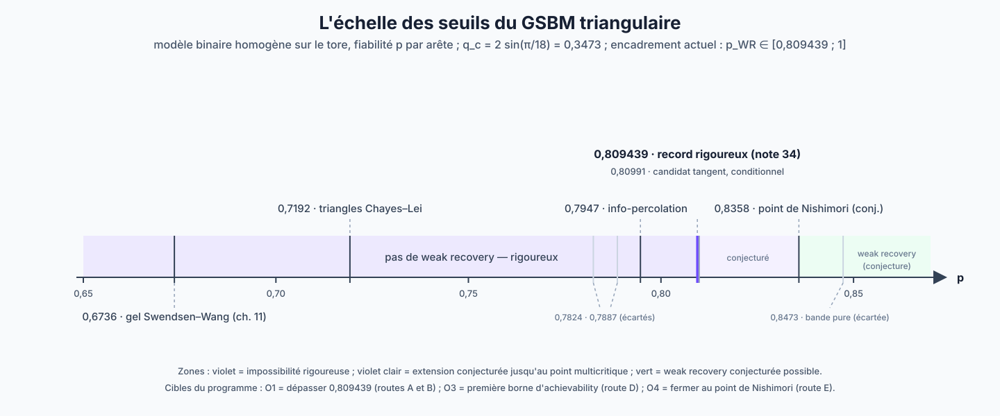

# GSBM — weak recovery sur la grille triangulaire par la coupe critique

Ce dossier ouvre le front **geometric SBM** : le modèle binaire homogène
sur le tore triangulaire, observé arête par arête avec fiabilité $p$, dans
le régime difficile $`p>0{,}8`$ — jusqu'au point conjecturé critique de
Nishimori. La question directrice est :

> **La dynamique hiérarchique de Swendsen--Wang à horloges exponentielles,
> coupée au temps $`\beta_c(p)`$ associé à la percolation critique par
> arêtes, permet-elle d'obtenir un seuil de weak recovery meilleur que les
> seuils existants — au mieux, le seuil exact ?**

Le dossier suit la même discipline que le dossier [SBM](../SBM/) : chaque
énoncé porte son statut (identité exacte, théorème, emprunt, conjecture,
mesure numérique), et les routes de recherche sont assorties de portes
falsifiables.

## 1. Le modèle

Sur le tore triangulaire $`\mathbb T_L`$ à $`n_L=L^2`$ sommets et
$`3L^2`$ arêtes, la vérité $`\Sigma\in\{\pm1\}^{n_L}`$ est uniforme et
chaque arête $`e=ij`$ publie un signe

```math
O_e=\Sigma_i\Sigma_j
\quad\text{avec probabilité }p,
\qquad
O_e=-\Sigma_i\Sigma_j
\quad\text{avec probabilité }1-p,
```

indépendamment. La postérieure est l'Ising $`\pm J`$ sur la ligne de
Nishimori, avec log-rapport de vraisemblance $`u_p=\log\frac{p}{1-p}`$
par arête (couplage $`u_p/2`$). La weak recovery
demande un estimateur dont l'overlap avec $`\Sigma`$ reste borné loin de
zéro quand $`L\to\infty`$ ; le critère quadratique exact est

```math
Q_L(p)
=
\frac1{n_L^2}
\sum_{i,j}
\mathbb E\left[
\langle\sigma_i\sigma_j\rangle_O^2
\right].
```

## 2. L'échelle des seuils

Constante de percolation par arêtes du réseau triangulaire :
$`q_c=2\sin(\pi/18)=0{,}347296\ldots`$

| valeur de $p$ | objet | statut |
|---:|---|---|
| $`0{,}673648`$ | gel Swendsen--Wang : $`2p-1>q_c`$ (chapitre 11) | rigoureux |
| $`0{,}719224`$ | dynamique triangulaire de Chayes--Lei | rigoureux sous leurs hypothèses |
| $`0{,}794659`$ | information-percolation par arêtes : $`(2p-1)^2>q_c`$ | rigoureux |
| $`0{,}809439`$ | canal triangulaire multi-état ([note 34](../hierarchical-swendsen-wang/results/non_hierarchical/34_CERTIFICAT_RATIONNEL_P809439.md)) | **rigoureux — meilleure borne actuelle** |
| $`0{,}809909\ldots`$ | candidat tangent $`p_\star^{\mathrm{cond}}`$ | conditionnel (secteur polarisé ouvert) |
| $`0{,}835805792367`$ | point multicritique de Nishimori--Ohzeki ([note 13](../hierarchical-swendsen-wang/diagnostics/13_NISHIMORI_HIERARCHICAL_CLOCKS.md)) | conjecture |



Aucune borne d'**achievability** ($p$ au-dessus duquel la weak recovery
est possible) n'est actuellement consignée dans le dépôt pour ce modèle :
l'encadrement honnête est $`p_c^{\mathrm{WR}}\in[0{,}809439,\,1]`$, avec la
valeur conjecturée $`0{,}8358\ldots`$ Toute revendication de « seuil
exact » exige de fermer les **deux** côtés ; c'est la route D du
programme.

## 3. Pourquoi la coupe à $\beta_c(p)$ est le bon outil — et pourquoi elle ne suffit pas seule

Sous la loi annealed, la coupe au temps $t$ du dendrogramme est exactement
une percolation indépendante de paramètre $`q_p(t)=p(1-e^{-u_pt})`$
([note 04](../hierarchical-swendsen-wang/foundations/04_TRIANGULAR_GSBM.md)).
Le temps critique

```math
\beta_c(p)
=
-\frac1{u_p}\log\left(1-\frac{q_c}{p}\right)
```

place donc la coupe **exactement au point critique de percolation, pour
tout $`p>0{,}673648`$**. La géométrie de la coupe est auto-calibrée : les
outils de percolation planaire proche-critique (box-crossing,
universalité étoile-triangle de Grimmett--Manolescu) deviennent
disponibles à cette échelle, quel que soit $p$.

Mais le contraste avec le SBM classique est le cœur du problème. Sur
l'arbre du SBM, la calibration par arête
$`\beta_\chi=\beta_c^{\mathrm{geom}}\Leftrightarrow d\theta^2=1`$
([SBM/03](../SBM/03_PREUVE_DU_SEUIL_WEAK_RECOVERY.md)) lit le seuil
**exact**. Sur la grille, la même calibration
$`t_\chi(p)=\beta_c(p)\Leftrightarrow(2p-1)^2=q_c`$ ne redonne que la
baseline $`p_{\mathrm{info}}=0{,}794659`$, strictement sous la valeur
conjecturée $`0{,}8358`$. Le transfert par arête est de plus indépendant
du niveau de coupe : couper à $`\beta_c`$ **ne crée aucune information
par soi-même**. Tout gain doit venir du traitement **joint** des coupes
multi-arêtes $`E_v`$ du dendrogramme — et c'est précisément ce que la
représentation hiérarchique fournit et que l'information-percolation par
arêtes ne voit pas.

## 4. Contenu du dossier

1. [Programme de recherche](01_PROGRAMME_DE_RECHERCHE.md) — l'état de
   l'art audité, les cinq routes A--E avec leurs verrous et portes
   falsifiables, les expériences E1--E4, les risques et les critères
   d'arrêt.
2. [Dictionnaire SBM → GSBM](02_DICTIONNAIRE_SBM_GSBM.md) — le transport
   ingrédient par ingrédient de la preuve complète
   [SBM/08](../SBM/08_PREUVES_COMPLETES_SEUILS.md) : ce qui passe tel
   quel, ce qui casse, ce qui doit être reconstruit.
3. [Expérience cible répliquée](03_EXPERIENCE_CIBLE_REPLIQUEE.md) — la
   première mesure directe de la cible $`\mathcal D_L^\times`$ (priorité
   n°2 du [statut canonique](../hierarchical-swendsen-wang/CURRENT_STATUS.md)) :
   protocole exact-en-interne / Monte-Carlo-en-externe, résultats à
   $`L=4`$, lecture honnête.

Le module de calcul associé est
[`gsbm_replicated_target_exact.py`](../hierarchical-swendsen-wang/computations/gsbm_replicated_target_exact.py),
testé par
[`test_gsbm_replicated_target_exact.py`](../hierarchical-swendsen-wang/computations/test_gsbm_replicated_target_exact.py).

## 5. Ce que ce dossier revendique et ne revendique pas

**Revendiqué.** Des identités exactes de représentation (jauge de
Nishimori, percolation exacte des coupes, réduction à la cible répliquée
$`\mathcal D_L^\times`$), un programme structuré avec portes go/no-go, et
des mesures numériques reproductibles à petit volume.

**Non revendiqué.** Aucun nouveau seuil. La meilleure borne rigoureuse
reste $`p_{\mathrm{WR}}\ge0{,}809439`$, obtenue par la voie non
hiérarchique. Aucune extrapolation asymptotique n'est faite depuis
$`L=4`$.
