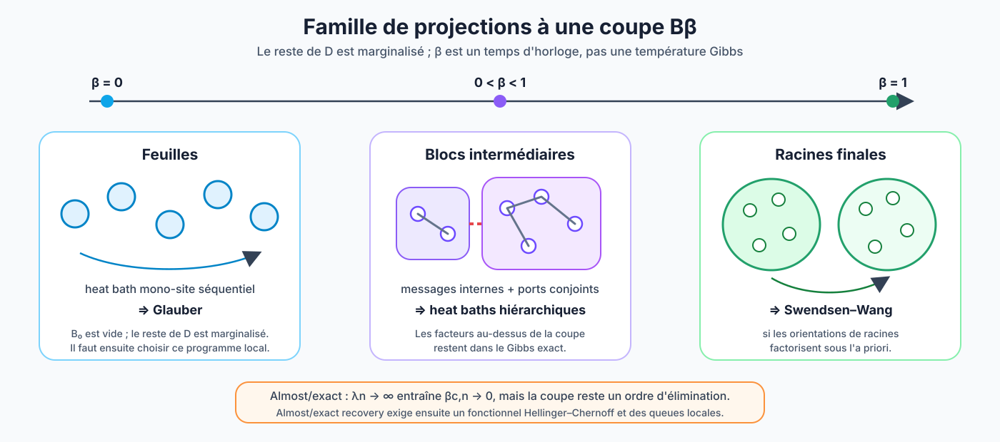

# Dynamique hiérarchique et port global du SBM fini

## 1. Du pas Swendsen--Wang à toute la filtration

Dans le chapitre 11, une arête satisfaite de poids $w$ est gelée avec
probabilité

```math
p_{\mathrm{gel}}=1-e^{-|w|}.
\qquad\text{(1.1)}
```

La dynamique hiérarchique couple tous les niveaux intermédiaires. On tire
une seule horloge

```math
\xi_e\sim\mathrm{Exp}(|w_e|)
\quad\text{si }e\text{ est satisfaite},
\qquad
\xi_e=+\infty
\quad\text{sinon},
\qquad\text{(1.2)}
```

puis

```math
\Pi_\beta
=
\text{composantes de }
\{e:\xi_e\le\beta\},
\qquad 0\le\beta\le1.
\qquad\text{(1.3)}
```

Ainsi $\Pi_1$ est exactement la partition gelée de (1.1), tandis que
$(\Pi_\beta)_{0\le\beta\le1}$ retient aussi les temps et l'ordre des
fusions. Un algorithme de Kruskal construit cette forêt hiérarchique.

Le paramètre $\beta$ est un **temps de filtration**. Il n'est pas
l'inverse de la température de la mesure de Gibbs.

## 2. Deux augmentations à ne pas confondre

Pour une observation $A$, soit $\mu_A$ la vraie postérieure et
$R_A(dD\mid\sigma)$ la loi du dendrogramme complet conditionnel au spin.
Sa projection au seul état de la coupe $\beta$ sera notée
$R_{A,\beta}(dB_\beta\mid\sigma)$.

La **mesure augmentée de coupe** est

```math
\nu_{A,\beta}(d\sigma,dB_\beta)
=
\mu_A(d\sigma)R_{A,\beta}(dB_\beta\mid\sigma).
\qquad\text{(2.1)}
```

Pour tout $\beta$, sa marginale en $\sigma$ est exactement $\mu_A$. On peut
donc conditionner par $B_\beta$, effectuer un heat bath exact de blocs, puis
oublier $B_\beta$ sans changer la postérieure.

La **mesure augmentée complète** est, elle,

```math
\nu_A(d\sigma,dD)
=
\mu_A(d\sigma)R_A(dD\mid\sigma).
\qquad\text{(2.2)}
```

À $D$ fixé, les heat baths doivent préserver $\nu_A(\cdot\mid D)$. Dans la
formulation par fusions, si un nœud
$u:C=C_1\mathbin{\dot\cup}C_2$ a quatre orientations possibles, on note
$\sigma^{ab}$ la configuration obtenue en retournant $C_1$ lorsque $a=1$
et $C_2$ lorsque $b=1$. Le heat bath exact choisit

```math
\mathbb P((a,b)\mid A,D,\sigma,u)
=
\frac{
\nu_A(\sigma^{ab}\mid D)
}{
\sum_{c,d\in\{0,1\}}
\nu_A(\sigma^{cd}\mid D)
}.
\qquad\text{(2.3)}
```

Chaque mise à jour (2.3) satisfait la balance détaillée pour la
conditionnelle full-$D$. Un pas marginal complet est :

1. tirer $D\sim R_A(\cdot\mid\sigma)$ ;
2. appliquer un programme de heat baths conditionnels à $D$ ;
3. oublier $D$.

Le noyau obtenu laisse $\mu_A$ invariante. Le choix des nœuds peut dépendre
de $D$ et des indices déjà visités, mais il ne doit pas dépendre de la
configuration courante sans correction supplémentaire.

Cette construction prolonge exactement le Théorème 9 du chapitre 11 :
balance locale, puis invariance globale.

## 3. Couper l'arbre et calculer des messages exacts

Fixons maintenant le **dendrogramme complet** $D$. Pour rendre les messages
précis, choisissons une factorisation exacte de sa conditionnelle :

```math
\pi_{A,D}(\sigma)
:=
\nu_A(\sigma\mid D)
\propto
\prod_{f\in\mathcal F_D}F_f^D(\sigma).
\qquad\text{(3.1)}
```

Le symbole $F_f^D$ désigne le facteur attaché au nœud ou à l'interaction
$f$ ; son support est noté $\mathrm{supp}(f)$ et son temps d'apparition
$\beta_f$. L'a priori et le port global sont inclus parmi ces facteurs,
quitte à les placer au-dessus de toute coupe. Cette écriture est générique :
elle ne suppose pas que le port factorise.

La [note 02](02_DEUX_DENDROGRAMMES_A_BETA_C.md) définit la coupe
$\beta_c^{\mathrm{geom}}$ par
$q_{\beta_c^{\mathrm{geom}}}=1/d$.

Soit $C\in\Pi_{\beta_c^{\mathrm{geom}}}(D)$. Posons

```math
\mathcal F_C^-
=
\left\{
f\in\mathcal F_D:
\mathrm{supp}(f)\subseteq C,\qquad
\beta_f\le\beta_c^{\mathrm{geom}}
\right\},
\qquad
\mathcal F_D^+
=
\mathcal F_D
\setminus
\bigcup_C\mathcal F_C^-.
\qquad\text{(3.2)}
```

Le port supérieur du bloc est l'ensemble

```math
\partial_D^+C
=
\left\{
i\in C:
i\in\mathrm{supp}(f)
\text{ pour un }f\in\mathcal F_D^+
\right\}.
\qquad\text{(3.3)}
```

Pour un état $s_{\partial_D^+C}$, le message exact du bloc est

```math
Z_{D,C}(s_{\partial_D^+C})
=
\sum_{\sigma_{C\setminus\partial_D^+C}}
\prod_{f\in\mathcal F_C^-}
F_f^D(\sigma_C).
\qquad\text{(3.4)}
```

La loi marginale des ports est alors

```math
\pi_{A,D}^+(s)
\propto
\left[
\prod_{C\in\Pi_{\beta_c^{\mathrm{geom}}}(D)}
Z_{D,C}(s_{\partial_D^+C})
\right]
\left[
\prod_{f\in\mathcal F_D^+}
F_f^D(s)
\right].
\qquad\text{(3.5)}
```

L'équation (3.5) donne le sens précis de « Gibbs des sous-arbres coupés à
$\beta_c^{\mathrm{geom}}$ » :

- les intérieurs sont éliminés en premier ;
- les états de ports sont tirés conjointement ;
- tous les facteurs postcritiques restent dans le second produit ;
- les intérieurs ne sont remplis indépendamment qu'après conditionnement
  par leurs ports.

Supprimer le second produit changerait le modèle et détruirait le seuil
correct.

La valeur de la coupe ne définit ici aucune nouvelle mesure : sous full-$D$,
elle ne change que l'ordre exact des marginalisations de
$\pi_{A,D}$. En particulier, descendre la coupe à zéro ne retire pas les
temps de fusion futurs déjà révélés par $D$.

## 4. Les extrémités de la famille « coupe seule »



Les deux extrémités suivantes concernent $\nu_{A,\beta}$ de (2.1), où
l'on ne conserve que $B_\beta$ et où toutes les autres informations de
$D$ sont marginalisées.

### $\beta=0$ : bain thermique local

À $\beta=0$, $B_0$ est déterministe et vide, donc

```math
\nu_{A,0}(d\sigma\mid B_0=\varnothing)
=
\mu_A(d\sigma).
\qquad\text{(4.1)}
```

Choisir séquentiellement un singleton et le tirer selon sa conditionnelle
sous $\mu_A$ donne exactement le bain thermique de Glauber. Recolorier tous
les singletons en parallèle définit en général un autre noyau. Sous une
bisection exactement équilibrée, une mise à jour mono-site quitte l'espace
d'états : il faut un bain thermique par paires, des swaps ou une dynamique
de Kawasaki.

Ce constat ne vaut pas pour $\nu_A(\cdot\mid D)$ avec $D$ complet fixé :
même à la coupe zéro, les temps et facteurs ancêtres restent conditionnés.
Une feuille full-$D$ n'est donc pas, en général, une mise à jour de
Glauber pour $\mu_A$.

### $\beta=1$ : recoloration de clusters

À l'autre extrémité, $B_1$ est la configuration de liens
Swendsen--Wang. Le heat bath de l'orientation globale de chaque composante
redonne la recoloration Swendsen--Wang lorsque l'a priori est produit
uniforme et que les orientations de racines factorisent.

Après projection au seul $B_\beta$, cette famille de noyaux peut donc
interpoler entre

```math
\text{bains thermiques locaux / Glauber}
\quad\longleftrightarrow\quad
\text{bains thermiques de blocs}
\quad\longleftrightarrow\quad
\text{Swendsen--Wang aux racines}.
\qquad\text{(4.2)}
```

Il ne s'agit pas d'une interpolation des conditionnelles full-$D$ :
une coupe de $D$ complet reste seulement un programme d'élimination.

## 5. Un sweep et deux répliques ne sont pas le même objet

Deux constructions quadratiques interviennent dans l'analyse.

### Carré postérieur

Pour la weak recovery :

```math
(\sigma^{(1)},D^{(1)}),
(\sigma^{(2)},D^{(2)})
\overset{\mathrm{i.i.d.}}{\sim}\nu_A
\quad\text{conditionnellement à }A.
\qquad\text{(5.1)}
```

Les deux environnements augmentés sont indépendants. C'est la cible des
[notes 01–03](01_DU_CHAPITRE_11_AU_SBM.md).

### Second moment d'un sweep

Pour étudier la contraction d'un noyau hiérarchique fixé, on peut garder le
même $(A,\sigma,D)$ et appliquer deux fois le sweep avec deux aléas de mise
à jour indépendants. Cette quantité mesure la variance dynamique
conditionnelle ; elle n'est pas le carré postérieur (5.1).

Confondre ces deux réplications ferait partager $D$ là où il doit être
marginalisé.

## 6. Le port global du SBM fini

Le broadcast local ne contient que le canal le long des arêtes observées.
La postérieure finie (1.3) de la
[note 01](01_DU_CHAPITRE_11_AU_SBM.md#1-même-point-de-départ-bayésien)
contient aussi

```math
\frac{h_0}{2}
\left[
\left(\sum_i\sigma_i\right)^2-n
\right].
\qquad\text{(6.1)}
```

Ce terme recouple toutes les racines d'un dendrogramme construit à partir
des arêtes présentes. Dans la bisection exactement équilibrée, (6.1) est
remplacé par la contrainte

```math
\mathbf1_{\{\sum_i\sigma_i=0\}}.
\qquad\text{(6.2)}
```

Il existe deux formulations exactes :

1. inclure littéralement toutes les non-arêtes comme interactions signées,
   comme dans le chapitre 11 ;
2. construire la hiérarchie clairsemée sur les arêtes présentes et garder
   (6.1) ou (6.2) comme un port global de magnétisation.

La seconde formulation est plus proche du broadcast. Pour une racine $R$,
soit

```math
W_R(m)
=
\sum_{\substack{
\sigma_R:\\
\sum_{i\in R}\sigma_i=m
}}
w_R(\sigma_R)
\qquad\text{(6.3)}
```

son message exact de magnétisation. Si les racines sont
$R_1,\ldots,R_k$, leur convolution est

```math
W_{\mathrm{tot}}
=
W_{R_1}*\cdots*W_{R_k}.
\qquad\text{(6.4)}
```

La fonction de partition se ferme alors par

```math
Z_A
=
\sum_M
W_{\mathrm{tot}}(M)
\exp\left[
\frac{h_0}{2}(M^2-n)
\right]
\qquad\text{(prior produit),}
\qquad\text{(6.5)}
```

ou

```math
Z_A=W_{\mathrm{tot}}(0)
\qquad\text{(bisection équilibrée).}
\qquad\text{(6.6)}
```

Les équations (6.3)–(6.6) éliminent exactement le port ; elles ne disent pas
qu'il est asymptotiquement négligeable. Bien que $h_0=O(1/n)$, le potentiel
agit sur $O(n^2)$ paires et ne peut pas être supprimé par une comparaison
perturbative naïve au seuil.

## 7. Pourquoi le chapitre 11 seul reste trop grossier

Appliquons directement le Corollaire 5 du chapitre 11 au graphe potentiel
complet, avec

```math
f_{\mathrm{in}}=\frac an,
\qquad
f_{\mathrm{out}}=\frac bn.
\qquad\text{(7.1)}
```

Le graphe gelé Swendsen--Wang retient chaque arête potentielle avec
probabilité

```math
f_{\mathrm{in}}-f_{\mathrm{out}}
=
\frac{a-b}{n}.
\qquad\text{(7.2)}
```

Sa percolation est gouvernée par un paramètre linéaire en $a-b$, et non par

```math
\frac{(a-b)^2}{2(a+b)}.
\qquad\text{(7.3)}
```

La taille de la partition gelée oublie donc le bruit du canal. Le
dendrogramme répliqué garde la même invariance postérieure que le chapitre
11, mais transporte en plus la fiabilité $\theta^2$ à travers les ports et
les facteurs postcritiques.

## 8. Algorithme conceptuel

Un échantillonneur hiérarchique exact à l'équilibre suit le cycle :

1. partir d'une configuration $\sigma$ ;
2. rafraîchir $D\mid\sigma$ ;
3. choisir une coupe géométrique, typiquement légèrement sous-critique pour
   contrôler les tailles de blocs en volume fini ;
4. calculer les messages exacts (3.4)–(3.5) ;
5. tirer conjointement les ports sous (3.5) et le port global (6.5) ou
   (6.6) ;
6. remplir les intérieurs conditionnellement aux ports ;
7. répéter en rafraîchissant de nouveau $D$.

L'invariance est exacte. L'indépendance par rapport à l'état initial exige
en plus une preuve de mélange. C'est précisément la partie dynamique encore
ouverte au seuil de Kesten--Stigum.
