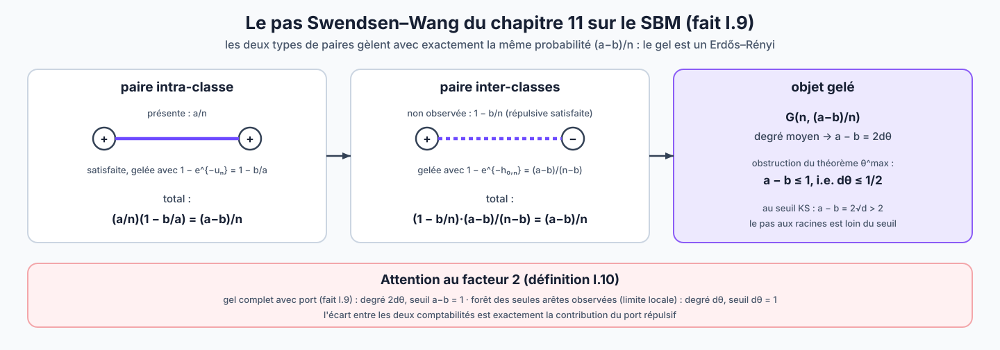
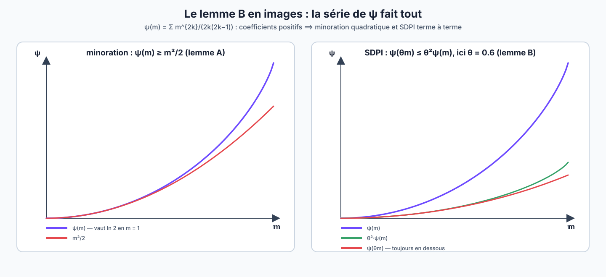
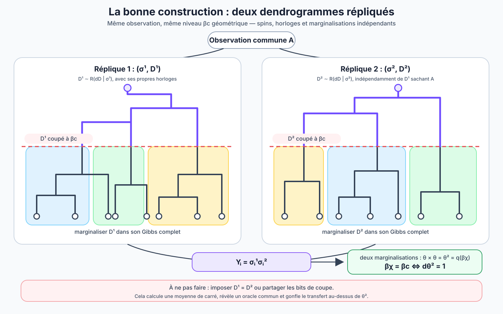
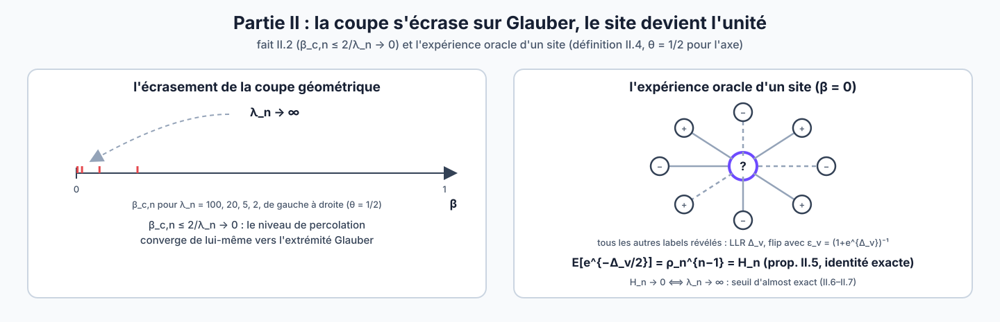

# Démonstrations complètes : weak recovery à la coupe $`\beta_c`$, puis almost exact recovery à $`\beta\to0`$

Cette note donne, pour le SBM binaire symétrique, deux démonstrations
rédigées **depuis zéro** et dans l'esprit du
[chapitre 11 du manuscrit](../../ChapII.tex) : cadre bayésien, identité de
Nishimori, dynamique de clusters invariante, puis lecture du seuil sur la
percolation de la dynamique.

- **Partie I** : le seuil de weak recovery $`d\theta^2=1`$, lu sur la
  coupe $`\beta_c^{\mathrm{geom}}`$ du dendrogramme d'horloges.
- **Partie II** : en faisant tendre le niveau de coupe $`\beta`$ vers
  $`0`$ — où la dynamique dégénère en Glauber — le seuil d'almost exact
  recovery $`\lambda_n\to\infty`$.

> [!IMPORTANT]
> **Périmètre exact.** Conformément à la discipline du
> [statut scientifique](06_STATUT_SCIENTIFIQUE.md), tout est démontré ici
> **sauf quatre emprunts à la littérature**, énoncés précisément là où
> ils servent :
> (E1) la convergence locale du SBM clairsemé vers l'arbre de
> Galton–Watson poissonnien (standard) ; (E2) le cas critique
> $`\lambda=1`$ de la non-reconstruction sur l'arbre
> (Evans–Kenyon–Peres–Schulman ; sandwich d'information-percolation
> d'Abbe–Boix) ; (E3a) le volet **impossibilité sur le graphe fini**
> pour $`\lambda\le1`$ — le transport de la non-reconstruction d'arbre
> aux corrélations de paires du graphe (Mossel–Neeman–Sly,
> [03 §7](03_PREUVE_DU_SEUIL_WEAK_RECOVERY.md)) ; (E3b) les théorèmes
> d'**achievability** sur le graphe fini (Massoulié, Mossel–Neeman–Sly
> pour la weak recovery ; Mossel–Neeman–Sly pour l'almost exact). S'y
> ajoutent deux théorèmes du **chapitre 11** repris tels quels
> (invariance par balance locale, borne $`\theta^{\max}`$ ; le
> rééchantillonnage de Nishimori est, lui, redémontré en I.5). Les deux
> directions du seuil **sur la limite locale** sont démontrées
> intégralement (théorèmes I.17 et I.18), ainsi que le volet
> impossibilité de la partie II (théorème II.6). La comparaison avec la
> voie d'information-percolation d'Abbe–Boix — qui couvre E2 et E3a d'un
> coup — est faite en fin de note.


---

## Partie I — le seuil de weak recovery à la coupe $`\beta_c`$

### I.1 Le modèle dans le cadre bayésien du chapitre 11

#### Définition I.1 — le SBM binaire symétrique

Soit $`V_n=\{1,\ldots,n\}`$, $`E_n=\binom{V_n}2`$ et $`K=2`$ avec
$`\mathcal L_2=\{-1,+1\}`$. L'a priori est i.i.d. uniforme :
$`\mu_{0,n}=\mathrm{Unif}(\{-1,+1\}^{V_n})`$. Le canal d'observation est
produit : pour $`0<b<a<n`$, chaque paire $`e=\{i,j\}`$ est observée
indépendamment,

```math
\mathbb P(W_e=1\mid\Sigma_i\Sigma_j=+1)=\frac an,
\qquad
\mathbb P(W_e=1\mid\Sigma_i\Sigma_j=-1)=\frac bn,
```

et $`W_e=0`$ sinon. L'observation est $`W=(W_e)_{e\in E_n}`$ (il n'y a
pas d'attribut : $`\mathcal X_n`$ est trivial). On pose

```math
d=\frac{a+b}2,
\qquad
\theta=\frac{a-b}{a+b}\in(0,1),
\qquad
\boxed{\lambda=d\theta^2=\frac{(a-b)^2}{2(a+b)}.}
```

Dans la partie I, $`a,b`$ (donc $`d,\theta,\lambda`$) sont fixés.

#### Fait I.2 — la postérieure est une mesure de Gibbs signée

La loi conditionnelle de $`\Sigma`$ sachant $`W=w`$ est

```math
\mu_{n,w}(\sigma)
=
\frac1{Z_n(w)}
\exp\Bigl[
\frac{u_n}2\sum_{e=\{i,j\}:w_e=1}\sigma_i\sigma_j
-\frac{h_{0,n}}2\sum_{e=\{i,j\}:w_e=0}\sigma_i\sigma_j
\Bigr],
```

```math
u_n=\log\frac ab>0,
\qquad
h_{0,n}=\log\frac{1-b/n}{1-a/n}=\frac{a-b}n+O\!\left(\frac1{n^2}\right)>0.
```

Dans le langage du chapitre 11 : chaque paire observée ($`w_e=1`$) est
une arête **attractive** de poids $`u_n`$ ; chaque paire non observée est
une arête **répulsive** de poids $`-h_{0,n}`$, minuscule mais présente
sur $`\Theta(n^2)`$ paires (c'est le « port global » du SBM fini,
[note 04 §6](04_DYNAMIQUE_HIERARCHIQUE.md)).

**Preuve.** Formule de Bayes avec a priori uniforme :
$`\mu_{n,w}(\sigma)\propto\prod_e q(w_e\mid\sigma_i\sigma_j)`$. Pour une
paire observée, le rapport des vraisemblances entre $`\sigma_i\sigma_j=\pm1`$
vaut $`a/b=e^{u_n}`$ ; pour une paire non observée, il vaut
$`(1-a/n)/(1-b/n)=e^{-h_{0,n}}`$. En écrivant chaque facteur comme
$`\exp[\pm\frac{u_n}2\sigma_i\sigma_j]`$ ou
$`\exp[\mp\frac{h_{0,n}}2\sigma_i\sigma_j]`$ à constante près, on obtient
la forme annoncée. $`\square`$

#### Définition I.3 — recouvrement, tirage au hasard, weak recovery

Comme au chapitre 11 (cas $`K=2`$ en spins) : pour
$`\sigma,\tau\in\{-1,+1\}^{V_n}`$,

```math
\mathrm{ov}_n(\sigma,\tau)
=\frac12\Bigl(1+\bigl|m_n(\sigma,\tau)\bigr|\Bigr),
\qquad
m_n(\sigma,\tau)=\frac1n\sum_{i=1}^n\sigma_i\tau_i.
```

Un algorithme est un noyau $`\tau_n=g_n(W,U)`$ ($`U`$ indépendant) ; un
tirage au hasard ne voit pas $`W`$, et l'on pose
$`\mathrm{RG}_n(s)=\sup\{\mathbb P[\mathrm{ov}_n(\Sigma,\tau'_n)\ge s]:
\tau'_n\ \text{tirage au hasard}\}`$ comme au chapitre 11. On dit qu'il
y a **weak recovery (variante à probabilité positive)** s'il existe
$`\varepsilon,\eta>0`$ et des algorithmes avec

```math
\liminf_{n\to\infty}
\mathbb P\bigl[|m_n(\Sigma,\tau_n)|\ge\varepsilon\bigr]\ge\eta.
```

(C'est la **première** forme de la définition de recouvrement partiel du
chapitre 11, équivalente ici à un gain sur tout tirage au hasard puisque
$`\mathrm{RG}_n\to0`$ par le fait I.4 ; la seconde forme — haute
probabilité, définition 2.2 de Sankararaman–Baccelli — est plus forte, et
l'égalité des seuils des deux variantes utilise les deux directions E3a
et E3b. Cette note travaille avec la variante ci-dessus, comme la
[note 01](01_DU_CHAPITRE_11_AU_SBM.md).)

#### Fait I.4 — le tirage au hasard ne dépasse pas $`1/2`$

Pour tout $`\varepsilon>0`$,
$`\mathrm{RG}_n(\tfrac12+\tfrac\varepsilon2)\to0`$ : aucun tirage au
hasard n'atteint $`|m_n|\ge\varepsilon`$ avec probabilité non nulle à la
limite.

**Preuve.** Par le fait « le meilleur tirage au hasard est déterministe »
du chapitre 11 (le supremum d'une fonction affine sur le simplexe est
atteint en un Dirac), il suffit de considérer $`a\in\{-1,+1\}^{V_n}`$
fixé. Alors $`m_n(\Sigma,a)`$ est une moyenne de $`n`$ Rademacher
indépendantes et l'inégalité de Hoeffding donne
$`\mathbb P[|m_n(\Sigma,a)|\ge\varepsilon]\le2e^{-n\varepsilon^2/2}`$,
uniformément en $`a`$. $`\square`$

### I.2 Nishimori et couplages invariants

Les deux énoncés suivants sont ceux du chapitre 11, instanciés ici.

#### Théorème I.5 — rééchantillonnage postérieur (Nishimori)

Soit $`\tau_n`$ un algorithme et, conditionnellement à $`W`$,
$`\Sigma^{(1)}\sim\mu_{n,W}`$ un tirage indépendant de $`\tau_n`$. Alors
pour toute fonction mesurable bornée $`\Psi`$,

```math
\mathbb E\bigl[\Psi(W,\Sigma,\tau_n)\bigr]
=
\mathbb E\bigl[\Psi(W,\Sigma^{(1)},\tau_n)\bigr].
```

**Preuve.** On écrit $`\tau_n=g_n(W,U)`$ avec $`U`$ indépendant de
$`(\Sigma,W)`$. Conditionnellement à $`(W,U)`$, la loi de $`\Sigma`$ est
$`\mu_{n,W}`$ — c'est aussi celle de $`\Sigma^{(1)}`$. Les espérances
conditionnelles coïncident ; on intègre. $`\square`$

#### Corollaire I.6 — couplage par une transition invariante

Si $`M_{n,w}`$ est un noyau de Markov laissant $`\mu_{n,w}`$ invariante
et $`\Sigma^{(1)}\mid(W,\Sigma)\sim M_{n,W}(\Sigma,\cdot)`$, alors la
conclusion du théorème I.5 vaut encore. En particulier tout score de
recouvrement a la même loi pour $`(\Sigma,\tau_n)`$ et
$`(\Sigma^{(1)},\tau_n)`$.

**Preuve.** Conditionnellement à $`W`$, $`\Sigma\sim\mu_{n,W}`$ donc
$`\Sigma^{(1)}\sim\mu_{n,W}`$ par invariance ; on applique le théorème
I.5. $`\square`$

### I.3 Le critère à deux répliques

C'est la quantité que toute la suite cherche à annuler ou à minorer.
Posons, pour une observation $`W`$,

```math
C_W=\mathbb E\bigl[\Sigma\Sigma^{\!\top}\mid W\bigr],
\qquad
Q_n=\frac1{n^2}\,\mathbb E\bigl[\mathrm{tr}(C_W^2)\bigr]
=\frac1{n^2}\sum_{i,j}\mathbb E\bigl[\langle\sigma_i\sigma_j\rangle_W^2\bigr].
```

#### Théorème I.7 — $`Q_n`$ caractérise la weak recovery

Weak recovery (variante à probabilité positive) est possible **si et
seulement si** $`\liminf_nQ_n>0`$.

**Preuve.** *Sens direct.* Soit $`\tau_n`$ avec
$`\mathbb P[|m_n(\Sigma,\tau_n)|\ge\varepsilon]\ge\eta`$ pour $`n`$ grand.
Alors $`\mathbb E[m_n^2]\ge\varepsilon^2\eta`$ pour tout $`n`$ assez
grand. Comme $`\tau_n`$ est indépendant de $`\Sigma`$ conditionnellement
à $`W`$ (définition I.3 : $`\tau_n=g_n(W,U)`$ avec $`U`$ indépendant),

```math
\mathbb E[m_n^2]
=\frac1{n^2}\,\mathbb E\bigl[\tau_n^{\!\top}C_W\,\tau_n\bigr]
\le\frac1n\,\mathbb E\bigl[\lambda_{\max}(C_W)\bigr]
\le\frac1n\,\mathbb E\Bigl[\sqrt{\mathrm{tr}(C_W^2)}\Bigr]
\le\sqrt{Q_n},
```

où l'on a utilisé $`\|\tau_n\|^2=n`$, $`\lambda_{\max}\le\sqrt{\mathrm{tr}(C^2)}`$
(la matrice $`C_W`$ est symétrique positive) et Jensen. Donc
$`Q_n\ge\varepsilon^4\eta^2>0`$.

*Sens réciproque.* Supposons $`\liminf_nQ_n\ge c>0`$, donc
$`Q_n\ge c/2`$ pour tout $`n`$ assez grand. Prenons pour algorithme une
réplique postérieure $`\tau_n=\Sigma^{(1)}\sim\mu_{n,W}`$ — le noyau
postérieur est un algorithme au sens de la définition I.3 ;
l'équivalence est purement informationnelle et ne fournit aucun
algorithme efficace. Par indépendance conditionnelle des deux répliques
$`\Sigma,\Sigma^{(1)}`$ sachant $`W`$ et par Nishimori,

```math
\mathbb E\bigl[m_n(\Sigma,\Sigma^{(1)})^2\bigr]
=\frac1{n^2}\sum_{i,j}\mathbb E\bigl[\langle\sigma_i\sigma_j\rangle_W^2\bigr]
=Q_n\ge \frac c2.
```

Comme $`m_n^2\le1`$, l'inégalité de Markov inversée donne
$`\mathbb P[m_n^2\ge c/4]\ge c/4`$ : weak recovery avec
$`\varepsilon=\sqrt{c/4}`$, $`\eta=c/4`$. $`\square`$

### I.4 La dynamique à horloges, sa coupe, et ce que donne le chapitre 11 tel quel

#### Définition I.8 — horloges exponentielles et dendrogramme

Conditionnellement à $`\sigma`$, chaque arête **satisfaite** du graphe
signé du fait I.2 (paire observée avec $`\sigma_i\sigma_j=+1`$, ou paire non
observée avec $`\sigma_i\sigma_j=-1`$) reçoit une horloge indépendante

```math
\xi_e\sim\mathrm{Exp}(|W_e|)
\qquad
(|W_e|=u_n\ \text{ou}\ h_{0,n}),
\qquad
\xi_e=+\infty\ \text{sinon}.
```

Pour $`0\le\beta\le1`$, $`\Pi_\beta`$ est la partition en composantes
connexes des arêtes $`\{\xi_e\le\beta\}`$. La même famille d'horloges
sert à tous les niveaux : les partitions sont emboîtées et forment le
**dendrogramme**. Une arête satisfaite a sonné avant $`\beta=1`$ avec la
probabilité $`1-e^{-|W_e|}`$ : $`\Pi_1`$ est exactement l'objet gelé du
pas de Swendsen–Wang signé du chapitre 11.

#### Fait I.9 — le pas Swendsen–Wang du chapitre 11 donne $`a-b\le1`$, pas Kesten–Stigum

Conditionnellement à $`\Sigma`$, le graphe gelé $`\Pi_1`$ a la loi d'une
percolation indépendante sur $`\binom{V_n}2`$ de paramètre **exactement**
$`(a-b)/n`$ pour chaque paire, c'est-à-dire d'un Erdős–Rényi
$`G(n,(a-b)/n)`$ de degré moyen $`(n-1)(a-b)/n\to a-b=2d\theta`$. La
borne de percolation du chapitre 11 (théorème $`\theta^{\max}`$)
interdit donc la weak recovery lorsque $`a-b\le1`$, c'est-à-dire
$`d\theta\le1/2`$ — et **ne dit rien** au-delà. Au seuil de
Kesten–Stigum, $`\theta<1`$ force $`d=1/\theta^2>1`$, donc
$`a-b=2\sqrt d>2`$ : le pas aux racines est loin du seuil.

**Preuve.** C'est le calcul du chapitre 11 (réduction à
$`f_{\mathrm{in}}-f_{\mathrm{out}}`$), refait ici. Paire intra-classe :
présente avec probabilité $`a/n`$, alors satisfaite, gelée avec
probabilité $`1-e^{-u_n}=1-b/a`$ ; total
$`\frac an\left(1-\frac ba\right)=\frac{a-b}n`$. Paire inter-classes :
non observée avec probabilité $`1-b/n`$, alors satisfaite (répulsive),
gelée avec probabilité
$`1-e^{-h_{0,n}}=1-\frac{1-a/n}{1-b/n}=\frac{a-b}{n-b}`$ ; total
$`\left(1-\frac bn\right)\frac{a-b}{n-b}=\frac{a-b}n`$. Les gels sont
indépendants entre paires (horloges indépendantes). L'application du
théorème $`\theta^{\max}`$ requiert le recoloriage indépendant uniforme
des clusters gelés — c'est-à-dire, pour $`K=2`$, retourner ou non chaque
bloc avec probabilité $`1/2`$, les deux seules affectations compatibles
avec les contraintes relatives portées par les arêtes gelées signées :
c'est exactement la permutation d'étiquettes par cluster du chapitre 11,
licite au niveau $`\beta=1`$ (théorème I.11 ci-dessous) ;
$`G(n,c/n)`$ n'a pas de composante macroscopique pour $`c\le1`$
(théorème d'Erdős–Rényi, dont la partie sous-critique se redémontre par
domination par un processus de Galton–Watson de moyenne $`c\le1`$),
d'où $`\theta^{\max}=0`$ et l'obstruction. $`\square`$



Le reste de la partie I raffine ce pas unique en une **famille de
coupes** : c'est là que le carré $`\theta^2`$ apparaît.

#### Définition I.10 — la coupe $`\beta`$ sur les arêtes observées, et les seuils

**Convention pour toute la suite de la partie I** (c'est la seconde
formulation exacte de la [note 04 §6](04_DYNAMIQUE_HIERARCHIQUE.md)) :
à partir d'ici, le dendrogramme est construit sur les **seules arêtes
observées** ($`w_e=1`$), le port des non-arêtes restant hors hiérarchie,
dans le Gibbs. C'est l'objet de la limite locale (§I.6). Il diffère du
dendrogramme signé complet de la définition I.8 utilisé par le fait
I.9 : sur le graphe fini, $`\Pi_\beta`$ complet collecte en plus les
gels répulsifs, de degré moyen $`\beta\,d\theta+o(1)`$ par sommet — le
port ne « disparaît » que de la limite locale de la **mesure de Gibbs**,
jamais du graphe gelé complet, et sa négligeabilité au seuil est
précisément **réfutée** ([06 §2](06_STATUT_SCIENTIFIQUE.md),
[03 §7](03_PREUVE_DU_SEUIL_WEAK_RECOVERY.md)).

Sur cette échelle locale (une paire observée–satisfaite), le paramètre
d'ouverture au temps $`\beta`$ vaut

```math
q_\beta=p\bigl(1-e^{-u\beta}\bigr),
\qquad
p=\frac{1+\theta}2,
\qquad
u=\log\frac p{1-p}=\log\frac ab,
\qquad
q_0=0,\ q_1=\theta.
```

La **coupe géométrique** est définie par $`q_{\beta_c^{\mathrm{geom}}}=1/d`$
(les blocs de la coupe ont un nombre de branchement égal à un) :

```math
\beta_c^{\mathrm{geom}}
=-\frac1u\log\Bigl(1-\frac1{dp}\Bigr),
\qquad\text{défini et}\ \le1
\iff d\theta\ge1.
```

Le **temps informationnel** est défini par $`q_{\beta_\chi}=\theta^2`$
(toujours dans $`[0,1]`$ car $`\theta^2\le\theta=q_1`$). Quatre nombres
de branchement cohabitent donc, à distinguer soigneusement :

| phénomène | objet | seuil |
|---|---|---|
| blocs de la coupe géométrique | arêtes observées (limite locale) | $`dq_{\beta_c^{\mathrm{geom}}}=1`$ |
| forêt des arêtes observées à $`\beta=1`$ | arêtes observées (limite locale) | $`dq_1=d\theta=1`$ |
| gel Swendsen–Wang complet à $`\beta=1`$ | graphe fini avec port (fait I.9) | $`a-b=2d\theta=1`$, i.e. $`d\theta=1/2`$ |
| information répliquée (fait I.15) | limite locale, deux répliques | $`d\theta^2=1`$ |

L'écart entre les deux lignes $`\beta=1`$ — un facteur $`2`$ — est
exactement la contribution du port répulsif.

#### Théorème I.11 — invariance de la dynamique coupée à tout niveau $`\beta`$

Fixons $`\beta\in[0,1]`$. Le pas suivant laisse $`\mu_{n,w}`$
invariante : (i) geler chaque arête satisfaite avec la probabilité
$`1-e^{-\beta|W_e|}`$ (c'est-à-dire révéler $`\Pi_\beta`$) ; (ii)
rééchantillonner $`\sigma`$ selon sa loi conditionnelle sachant l'objet
gelé, c'est-à-dire selon la mesure de Gibbs **résiduelle**

```math
\nu_\beta(\sigma\mid\kappa)
\propto
\mathbf 1\{\sigma\ \text{compatible avec}\ \kappa\}
\exp\Bigl[-(1-\beta)\,U_w(\sigma)\Bigr],
```

où $`U_w`$ est l'énergie signée du fait I.2 et « compatible » signifie
que $`\sigma`$ satisfait toutes les arêtes gelées. Le recoloriage
**indépendant uniforme** des blocs n'est en général **pas** invariant
pour $`\beta<1`$ (contre-exemple : une seule arête satisfaite non gelée
— le recoloriage uniforme des deux singletons rend $`\sigma`$ uniforme
et efface le facteur $`e^{-(1-\beta)|W_e|}`$ de désaccord) ; il ne le
devient qu'à $`\beta=1`$, où le poids résiduel s'annule.

**Preuve.** C'est le calcul d'Edwards–Sokal, explicite. La loi jointe de
$`(\sigma,\kappa)`$ produite par l'étape (i) partant de
$`\sigma\sim\mu_{n,w}`$ est

```math
P(\sigma,\kappa)
\propto
e^{-U_w(\sigma)}
\prod_{e\in\kappa}\bigl(1-e^{-\beta|W_e|}\bigr)
\prod_{e\notin\kappa}e^{-\beta|W_e|\mathbf 1\{e\ \text{satisfaite par}\ \sigma\}}
\ \mathbf 1\{\kappa\subseteq\text{satisfaites}(\sigma)\}.
```

En écrivant $`U_w(\sigma)=\sum_e|W_e|\mathbf 1\{e\ \text{non
satisfaite}\}`$ et en regroupant arête par arête, on obtient

```math
P(\sigma,\kappa)
\propto
\Bigl[\prod_{e\in\kappa}\bigl(1-e^{-\beta|W_e|}\bigr)
\prod_{e\notin\kappa}e^{-\beta|W_e|}\Bigr]\,
e^{-(1-\beta)U_w(\sigma)}\,
\mathbf 1\{\kappa\subseteq\text{satisfaites}(\sigma)\} :
```

en effet, pour $`e\notin\kappa`$ satisfaite le facteur vaut
$`e^{-\beta|W_e|}`$ et l'énergie ne contribue rien ; pour $`e`$ non
satisfaite (donc $`e\notin\kappa`$) le facteur d'énergie
$`e^{-|W_e|}`$ se sépare en $`e^{-\beta|W_e|}\cdot e^{-(1-\beta)|W_e|}`$.
Le crochet ne dépend que de $`\kappa`$ : la loi conditionnelle de
$`\sigma`$ sachant $`\kappa`$ est donc exactement
$`\nu_\beta(\cdot\mid\kappa)`$, et le pas composé (révéler $`\kappa`$,
rééchantillonner selon $`\nu_\beta`$, oublier $`\kappa`$) est
réversible pour $`\mu_{n,w}`$ :
$`\mu(\sigma)T(\sigma,\sigma')
=\sum_\kappa P(\sigma,\kappa)P(\sigma',\kappa)/P(\kappa)`$ est
symétrique en $`(\sigma,\sigma')`$. Dans le langage du chapitre 11,
cette décomposition est le transfert d'énergie
$`U_w=U_0'+\sum_e\beta U_e`$ avec pour terme de référence
$`U_0'=(1-\beta)U_w`$ : la règle de gel est celle du chapitre pour les
liens $`\beta U_e`$ (réversibilité locale vérifiée :
$`P^\sigma(\{e\})=1-e^{-\beta|W_e|}`$ si $`e`$ est satisfaite,
$`P^\sigma(\varnothing)>0`$), et l'étape (ii) est un recoloriage « selon
une loi préservant la mesure de référence », ici la Gibbs résiduelle —
et non le recoloriage uniforme. Pour $`\beta=1`$, $`U_0'=0`$ : la
conditionnelle est uniforme sur les recoloriages compatibles, blocs
indépendants — on retrouve le Swendsen–Wang signé du chapitre 11. Pour
$`\beta<1`$, les facteurs résiduels couplent les blocs : « couper ne
signifie pas tronquer ». $`\square`$

### I.5 Deux répliques, deux coupes indépendantes : le carré $`\theta^2`$

Nous travaillons désormais sur le canal d'une arête de la **limite
locale** (paire observée, convention de la définition I.10 ; le port
disparaît de la limite locale de la mesure de Gibbs,
[note 02 §1](02_DEUX_DENDROGRAMMES_A_BETA_C.md), mais reste dans le
Gibbs du graphe fini) : le canal de spin d'une arête d'arbre est
$`P_\theta(t\mid s)`$ avec $`P_\theta(t=s)=p=(1+\theta)/2`$, et le bit
de coupe $`B_e(\beta)=\mathbf 1\{\xi_e\le\beta\}`$ de paramètre
$`q=q_\beta`$.

#### Fait I.12 — canal résiduel d'une coupe, et sa marginalisation

Conditionnellement à $`B_e=1`$, l'arête impose $`s=t`$ (corrélation
$`c_1=1`$). Conditionnellement à $`B_e=0`$, la corrélation résiduelle
vaut

```math
c_0=\frac{\theta-q}{1-q},
\qquad\text{et}\qquad
qc_1+(1-q)c_0=\theta.
```

**Preuve.** $`\mathbb E[st]=\theta`$ et
$`\mathbb E[st\,\mathbf 1_{B=1}]=\mathbb P(B=1)=q`$ (une horloge ne sonne
que si l'arête est satisfaite, et alors $`st=+1`$ ; sa probabilité
annealed est $`q_\beta`$). Donc
$`\mathbb E[st\,\mathbf 1_{B=0}]=\theta-q`$ et
$`c_0=(\theta-q)/(1-q)`$. La seconde identité est la reconstitution
$`q+(1-q)c_0=\theta`$. $`\square`$

*Cohérence avec le théorème I.11* : un calcul direct donne
$`c_0=\tanh\bigl((1-\beta)u/2\bigr)`$ — le canal résiduel d'une arête
fermée coïncide exactement avec le canal de Gibbs résiduel de poids
$`(1-\beta)u`$ que conserve la dynamique coupée.

#### Fait I.13 — la mauvaise construction : partager la coupe gonfle le carré

Si la **même** coupe $`B`$ est révélée aux deux répliques, le transfert
quadratique d'une arête vaut

```math
\eta_{\mathrm{partagée}}
=qc_1^2+(1-q)c_0^2
=\theta^2+\frac{q(1-\theta)^2}{1-q}
>\theta^2
\qquad(0<q<1).
```

À $`d=3`$, $`\theta=1/2`$, $`q=1/d`$ : $`d\theta^2=0.75<1`$ mais
$`d\eta_{\mathrm{partagée}}=1.125>1`$ — une coupe partagée
fabrique un faux régime surcritique sous le vrai seuil.

**Preuve.** Moyenne d'un carré :
$`\mathbb E[c_B^2]=qc_1^2+(1-q)c_0^2`$. Le calcul direct donne
$`q+(1-q)\left(\frac{\theta-q}{1-q}\right)^2-\theta^2
=\frac{q(1-\theta)^2}{1-q}`$ après réduction au même dénominateur
($`q(1-q)+( \theta-q)^2-\theta^2(1-q)=q(1-\theta)^2`$, identité
polynomiale que l'on vérifie en développant). $`\square`$

#### Fait I.14 — la bonne construction : deux broadcasts indépendants, deux marginalisations

Sur la limite locale, **à arbre fixé**, tirons deux broadcasts
indépendants (deux jeux de spins, chacun avec **ses propres horloges**) :
$`(\sigma^{(1)},D^{(1)})`$ et $`(\sigma^{(2)},D^{(2)})`$ i.i.d. Alors le
transfert du secteur overlap d'une arête d'arbre, chaque coupe étant
marginalisée **séparément**, vaut

```math
\Bigl(\textstyle\sum_b\pi_bc_b\Bigr)\times\Bigl(\sum_b\pi_bc_b\Bigr)
=\theta\times\theta=\theta^2,
```

**quel que soit le niveau de coupe marginalisé**. Le carré vient du
produit de deux marginalisations exactes, pas du choix du niveau ; le
niveau $`\beta_c^{\mathrm{geom}}`$ est distingué par la géométrie (blocs
critiques), le seuil est lu par la calibration ci-dessous.

**Preuve.** À arbre fixé, la corrélation d'une arête est déterministe
($`\langle st\rangle=\theta`$ presque sûrement) : l'identité de
marginalisation du fait I.12 vaut pour chaque copie, et l'indépendance
des deux jeux d'horloges et de spins factorise le produit — c'est une
égalité, pas une inégalité de Jensen. $`\square`$

**Mise en garde (graphe fini).** Deux répliques postérieures du SBM fini
partagent l'observation $`W`$ : le transfert quadratique d'une arête y
vaut $`\mathbb E[\langle\sigma_i\sigma_j\rangle_W^2]\ge\theta^2`$ par
Jensen — et cette quantité **est** le $`Q_n`$ du théorème I.7, l'objet
même que le seuil décide. L'égalité $`\theta\times\theta`$ n'est
revendiquée que sur la limite locale à arbre fixé.


#### Fait I.15 — calibration : la coupe géométrique rencontre l'information exactement à Kesten–Stigum

Dès que $`\beta_c^{\mathrm{geom}}`$ est défini ($`d\theta\ge1`$),

```math
\boxed{
\beta_\chi<\beta_c^{\mathrm{geom}}\iff d\theta^2<1,
\qquad
\beta_\chi=\beta_c^{\mathrm{geom}}\iff d\theta^2=1,
\qquad
\beta_\chi>\beta_c^{\mathrm{geom}}\iff d\theta^2>1.
}
```

**Preuve.** $`\beta\mapsto q_\beta`$ est strictement croissante ;
$`q_{\beta_\chi}=\theta^2`$ et $`q_{\beta_c^{\mathrm{geom}}}=1/d`$ ;
comparer $`\theta^2`$ et $`1/d`$ est comparer $`d\theta^2`$ et $`1`$.
$`\square`$

C'est la lecture demandée du seuil **sur la coupe** : la percolation
d'information (rétention $`\theta^2`$ par arête, portée par les deux
répliques) devient surcritique pour les blocs de la coupe géométrique
exactement quand $`d\theta^2`$ franchit $`1`$. Il s'agit d'une égalité de
lois marginales sur la même horloge — ni une température, ni une coupe
révélée à l'estimateur. **Portée** : cette calibration est une identité
de définitions ($`q_{\beta_\chi}=\theta^2`$, $`q_{\beta_c}=1/d`$,
monotonie) ; aucune borne d'impossibilité ni d'atteignabilité n'en est
déduite à $`\beta_c`$ — le seuil lui-même est celui des théorèmes
I.17–I.18 sur la limite locale, transporté par E1 et E3a/E3b.


### I.6 Fermeture sur la limite locale : le théorème de reconstruction

#### Définition I.16 — broadcast sur l'arbre de Galton–Watson poissonnien

Soit $`T\sim\mathrm{PGW}(d)`$ (chaque sommet a un nombre
$`\mathrm{Poisson}(d)`$ d'enfants, indépendamment) et le broadcast : la
racine $`\rho`$ porte $`\sigma_\rho`$ uniforme sur $`\{-1,+1\}`$ et
chaque enfant copie son parent avec probabilité $`p=(1+\theta)/2`$,
indépendamment. Notons $`L_t`$ les sommets à distance $`t`$ de la racine et

```math
q_t=\mathbb E\Bigl[\mathbb E\bigl[\sigma_\rho\mid\sigma_{L_t},T\bigr]^2\Bigr].
```

Il y a **reconstruction** si $`\liminf_tq_t>0`$.

**(E1 — admis, standard.)** Le SBM clairsemé converge localement (au
sens de Benjamini–Schramm, avec les spins) vers ce broadcast : le
voisinage de profondeur $`t`$ d'un sommet uniforme, muni des labels, tend
en loi vers $`(T,\sigma)`$ tronqué à $`t`$. C'est l'unique emprunt
géométrique de cette partie.

#### Théorème I.17 — reconstruction pour $`\lambda>1`$ (second moment, complet)

Si $`\lambda=d\theta^2>1`$, alors pour tout $`t`$,

```math
q_t\ \ge\ \ell_t(\lambda):=\Bigl(\sum_{s=0}^t\lambda^{-s}\Bigr)^{-1}
\ \xrightarrow[t\to\infty]{}\ \frac{\lambda-1}\lambda>0 :
```

il y a reconstruction.

**Preuve.** Posons $`Z_t=\sum_{v\in L_t}\sigma_v`$ ($`Z_t`$ est
mesurable par rapport à $`(\sigma_{L_t},T)`$). *Premier moment croisé* :
chaque sommet de profondeur $`t`$ vérifie
$`\mathbb E[\sigma_v\sigma_\rho\mid T]=\theta^t`$ (télescopage de
$`\mathbb E[\sigma_{\mathrm{enfant}}\mid\sigma_{\mathrm{parent}}]
=\theta\,\sigma_{\mathrm{parent}}`$), donc

```math
m_t:=\mathbb E[\sigma_\rho Z_t]=\mathbb E[|L_t|]\,\theta^t=(d\theta)^t.
```

*Second moment* : posons $`v_t=\mathbb E[Z_t^2]`$. En décomposant
$`Z_t=\sum_{i=1}^NZ_{t-1}^{(i)}`$ sur les $`N\sim\mathrm{Poisson}(d)`$
sous-arbres des enfants, indépendants conditionnellement à
$`\sigma_\rho`$ et $`N`$, avec
$`\mathbb E[Z_{t-1}^{(i)}\mid\sigma_\rho]=\theta(d\theta)^{t-1}\sigma_\rho`$
et — par la symétrie de flip global du broadcast, qui rend la loi de
$`(Z_{t-1}^{(i)})^2`$ identique sous les deux valeurs du spin de
l'enfant — $`\mathbb E[(Z_{t-1}^{(i)})^2\mid\sigma_\rho]=v_{t-1}`$
(le conditionnement ne biaise que le premier moment) :

```math
v_t
=\mathbb E[N]\,v_{t-1}
+\mathbb E[N(N-1)]\,\theta^2(d\theta)^{2(t-1)}
=d\,v_{t-1}+d^2\theta^2(d\theta)^{2t-2},
```

car $`\mathbb E[N(N-1)]=d^2`$ pour une loi de Poisson. Avec $`v_0=1`$,
une récurrence immédiate donne la forme close

```math
v_t=(d\theta)^{2t}\sum_{s=0}^t\lambda^{-s}.
```

*Conclusion.* $`Z_t`$ étant mesurable par rapport aux feuilles et à
l'arbre, Cauchy–Schwarz donne
$`m_t=\mathbb E\bigl[\mathbb E[\sigma_\rho\mid\sigma_{L_t},T]\,Z_t\bigr]
\le\sqrt{q_t}\sqrt{v_t}`$, d'où
$`q_t\ge m_t^2/v_t=\ell_t(\lambda)`$. Pour $`\lambda>1`$ la série
géométrique converge : $`\ell_t\to(\lambda-1)/\lambda>0`$. $`\square`$

#### Théorème I.18 — non-reconstruction pour $`\lambda<1`$ (information, complet)

Si $`\lambda=d\theta^2<1`$, alors $`q_t\le2\ln2\cdot\lambda^t\to0`$ : pas
de reconstruction.

La preuve repose sur deux lemmes, chacun démontré de zéro. Notons, pour
une variable binaire symétrique $`X`$ et une variable $`F`$ quelconque,
$`I(X;F)`$ l'information mutuelle (en nats) et

```math
\psi(m)=\frac{1+m}2\ln(1+m)+\frac{1-m}2\ln(1-m),
\qquad m\in[-1,1].
```

**Lemme A (représentation et minoration).** Si $`X`$ est uniforme sur
$`\{-1,+1\}`$ et $`F`$ quelconque, alors
$`I(X;F)=\mathbb E[\psi(M_F)]`$ avec $`M_F=\mathbb E[X\mid F]`$, et

```math
\psi(m)=\sum_{k\ge1}\frac{m^{2k}}{2k(2k-1)}\ \ge\ \frac{m^2}2 .
```

*Preuve.* $`I(X;F)=\mathbb E_F\bigl[D(\mathbb P(X\in\cdot\mid F)\,\|\,
\mathrm{Unif})\bigr]`$ et, pour une loi de biais $`m`$ sur $`\{-1,+1\}`$,
cette divergence vaut exactement $`\psi(m)`$. La série vient de
$`\psi'(m)=\mathrm{artanh}(m)=\sum_{k\ge1}m^{2k-1}/(2k-1)`$ intégrée
terme à terme ($`\psi(0)=0`$) ; tous les coefficients sont positifs et le
terme $`k=1`$ vaut $`m^2/2`$. $`\square`$

**Lemme B (SDPI binaire symétrique).** Soient
$`X\to Y\to F`$ une chaîne de Markov où $`X`$ est la sortie du canal
binaire symétrique de corrélation $`\theta`$ appliqué à la variable
binaire symétrique $`Y`$ (i.e. $`\mathbb E[X\mid Y]=\theta Y`$, marginales
uniformes). Alors

```math
I(X;F)\ \le\ \theta^2\,I(Y;F).
```

*Preuve.* $`\mathbb P(X=+1\mid F)=\frac{1+\theta M_F}2`$ avec
$`M_F=\mathbb E[Y\mid F]`$ (sommer sur $`Y`$, Markov). Donc
$`I(X;F)=\mathbb E[\psi(\theta M_F)]`$ et
$`I(Y;F)=\mathbb E[\psi(M_F)]`$. Or, par la série du lemme A,

```math
\psi(\theta m)=\sum_{k\ge1}\theta^{2k}\frac{m^{2k}}{2k(2k-1)}
\ \le\ \theta^2\sum_{k\ge1}\frac{m^{2k}}{2k(2k-1)}=\theta^2\psi(m),
```

car $`\theta^{2k}\le\theta^2`$ pour tout $`k\ge1`$. $`\square`$



**Lemme C (sous-additivité sur les branches).** Si $`A`$ et $`B`$ sont
conditionnellement indépendantes sachant $`X`$, alors
$`I(X;A,B)\le I(X;A)+I(X;B)`$.

*Preuve.* $`I(X;A,B)=I(X;A)+I(X;B\mid A)`$ et
$`I(X;B\mid A)=H(B\mid A)-H(B\mid A,X)=H(B\mid A)-H(B\mid X)
\le H(B)-H(B\mid X)=I(X;B)`$, l'égalité centrale utilisant
$`B\perp A\mid X`$. $`\square`$

**Preuve du théorème I.18.** Montrons par récurrence sur $`t`$, pour tout
arbre fixé $`T`$ :

```math
I\bigl(\sigma_\rho;\sigma_{L_t}\mid T\bigr)\ \le\ \ln2\cdot|L_t|\,\theta^{2t}.
```

Pour $`t=0`$ c'est $`I(\sigma_\rho;\sigma_\rho)=\ln2`$. Hérédité : les
feuilles se partitionnent selon les sous-arbres des enfants
$`v_1,\ldots,v_k`$ de la racine, conditionnellement indépendants sachant
$`\sigma_\rho`$ ; le lemme C donne
$`I(\sigma_\rho;\sigma_{L_t})\le\sum_iI(\sigma_\rho;\sigma_{L_t\cap T_{v_i}})`$.
Pour chaque $`i`$, la chaîne
$`\sigma_\rho\to\sigma_{v_i}\to\sigma_{L_t\cap T_{v_i}}`$ relève du
lemme B (le couple $`(\sigma_\rho,\sigma_{v_i})`$ est binaire symétrique
de corrélation $`\theta`$) :
$`I(\sigma_\rho;\cdot)\le\theta^2I(\sigma_{v_i};\cdot)`$, puis
l'hypothèse de récurrence appliquée au sous-arbre conclut :

```math
I(\sigma_\rho;\sigma_{L_t}\mid T)
\le\theta^2\sum_i\ln2\cdot|L_t\cap T_{v_i}|\,\theta^{2(t-1)}
=\ln2\cdot|L_t|\,\theta^{2t}.
```

En prenant l'espérance sur $`T\sim\mathrm{PGW}(d)`$ :
$`\mathbb E[I]\le\ln2\,(d\theta^2)^t=\ln2\cdot\lambda^t`$. Enfin, par le
lemme A, $`q_t=\mathbb E[M^2]\le2\,\mathbb E[\psi(M)]=2\,\mathbb E[I]`$,
d'où $`q_t\le2\ln2\cdot\lambda^t\to0`$ pour $`\lambda<1`$. $`\square`$


**(E2 — cas critique, admis.)** À $`\lambda=1`$ la borne ci-dessus
stagne ; la non-reconstruction critique est établie par
Evans–Kenyon–Peres–Schulman, et le sandwich d'information-percolation
d'Abbe–Boix la retrouve : $`q_t\le r_t`$ avec $`r_{t+1}=1-e^{-\lambda r_t}`$,
et $`r_t\sim2/t\to0`$ à $`\lambda=1`$.

#### Théorème I.19 — le seuil sur le graphe (énoncé, E3a/E3b)

Pour le SBM binaire symétrique : si $`\lambda\le1`$, la weak recovery
est impossible (E3a, Mossel–Neeman–Sly : le théorème I.18 est
l'ingrédient d'arbre, mais le transport aux corrélations de paires du
graphe — à distance $`\Theta(\log n)`$, hors de portée de la seule
convergence locale E1 — est le contenu propre de leur preuve de
contiguïté, [03 §7](03_PREUVE_DU_SEUIL_WEAK_RECOVERY.md)) ; si
$`\lambda>1`$, elle est possible (E3b, Massoulié, Mossel–Neeman–Sly),
le mécanisme positif étant celui du théorème I.17.

#### Corollaire I.20 — le théorème lu sur la coupe $`\beta_c`$

Pour le SBM binaire symétrique avec $`d\theta\ge1`$ :

```math
\boxed{
\text{weak recovery possible}
\iff
d\theta^2>1
\iff
\beta_\chi>\beta_c^{\mathrm{geom}}.
}
```

L'équivalence de droite est la calibration (fait I.15) ; celle de
gauche est le théorème I.19 (E3a/E3b), dont l'ingrédient d'arbre est
démontré ici (théorèmes I.17–I.18). La représentation hiérarchique lit
ce seuil ainsi : sur la limite locale à arbre fixé, deux broadcasts
indépendants coupés au même $`\beta_c^{\mathrm{geom}}`$ puis
marginalisés séparément transmettent exactement $`\theta^2`$ par arête
(fait I.14) ; le nombre de branchement de ce transfert répliqué est
$`d\theta^2`$ — lecture de calibration, dont les théorèmes I.17–I.18
font un seuil démontré sur la limite locale. Sur le graphe fini,
l'observation partagée donne
$`\mathbb E[\langle\sigma_i\sigma_j\rangle_W^2]\ge\theta^2`$ (Jensen) :
c'est $`Q_n`$ lui-même, et aucune égalité par arête n'y est revendiquée.
Le gain sur le chapitre 11 est le passage du gel aux racines (fait I.9 :
obstruction seulement sous $`a-b\le1`$, soit $`d\theta\le1/2`$) à la
coupe répliquée (seuil en $`d\theta^2`$) — le carré est produit par les
**deux** marginalisations indépendantes, jamais par une coupe partagée
(fait I.13).



---

## Partie II — almost exact recovery en faisant $`\beta\to0`$

### II.1 Le régime divergent écrase la coupe sur l'extrémité Glauber

#### Définition II.1 — régime divergent et almost exact recovery

On prend maintenant $`a_n,b_n\to\infty`$ avec $`a_n,b_n=o(n)`$, et

```math
d_n=\frac{a_n+b_n}2,
\qquad
\theta_n=\frac{a_n-b_n}{a_n+b_n},
\qquad
\lambda_n=d_n\theta_n^2,
\qquad
p_n=\frac{1+\theta_n}2=\frac{a_n}{a_n+b_n},
\qquad
u_n=\log\frac{a_n}{b_n}.
```

*(Attention aux conventions voisines : ce $`p_n`$ est le
$`p_n^{=}`$ de la [note 05 §6](05_ALMOST_EXACT_ET_EXACT_RECOVERY.md),
distinct du $`p_n=a_n/n`$ de [05 §2](05_ALMOST_EXACT_ET_EXACT_RECOVERY.md)
et de la [note 07](07_SEUILS_PAR_LA_DYNAMIQUE.md) ; et par rapport à la
[note 01 (1.3)](01_DU_CHAPITRE_11_AU_SBM.md), $`u_n=2h_1`$ et
$`h_{0,n}=-2h_0`$.)*

L'**almost exact recovery** (recouvrement presque parfait du chapitre
11) demande des algorithmes avec
$`\mathrm{ov}_n(\Sigma,\tau_n)\to1`$ en probabilité, c'est-à-dire une
fraction d'erreurs (modulo flip global) $`o_{\mathbb P}(1)`$.

#### Fait II.2 — la coupe géométrique tend vers zéro

Si $`\lambda_n\to\infty`$, alors
$`\beta_{c,n}^{\mathrm{geom}}\to0`$.

**Preuve.** $`d_n\theta_n\ge d_n\theta_n^2=\lambda_n\to\infty`$, donc
$`\beta_{c,n}^{\mathrm{geom}}`$ est défini pour $`n`$ grand ; de plus
$`d_n\ge\lambda_n\to\infty`$ et $`p_n\ge1/2`$ donnent
$`d_np_n\ge d_n/2\ge2`$ pour $`n`$ assez grand, et

```math
\beta_{c,n}^{\mathrm{geom}}
=-\frac1{u_n}\log\Bigl(1-\frac1{d_np_n}\Bigr)
\le\frac2{u_nd_np_n}\qquad(\text{dès que }d_np_n\ge2),
```

par $`-\log(1-x)\le2x`$ sur $`[0,1/2]`$. Avec
$`u_n=\log\frac{1+\theta_n}{1-\theta_n}\ge2\theta_n`$ et
$`p_n\ge1/2`$ :
$`\beta_{c,n}^{\mathrm{geom}}\le\frac2{\theta_nd_n}
=\frac{2\theta_n}{\lambda_n}\le\frac2{\lambda_n}\to0`$. $`\square`$

La demande « weak recovery à la percolation, exact recovery à
$`\beta=0`$ » n'est donc pas un changement de dynamique : quand le signal
diverge, **le niveau de percolation converge de lui-même** vers
l'extrémité $`\beta=0`$ de la famille du théorème I.11.

#### Fait II.3 — à $`\beta=0`$, la dynamique est le bain de Glauber

À $`\beta=0`$, l'objet gelé est vide ($`\Pi_0`$ = singletons,
conditionnelle résiduelle = $`\mu_{n,w}`$ entière) ; la mise à jour
séquentielle d'un site selon sa conditionnelle sous $`\mu_{n,w}`$ est
exactement le bain de Glauber de la postérieure, invariant par le
corollaire I.6.

**Preuve.** Cas $`\beta=0`$ du théorème I.11 : aucun gel, l'étape (ii)
restreinte à un site est le bain thermique mono-site. $`\square`$



### II.2 L'expérience locale à $`\beta=0`$ et son exposant

#### Définition II.4 — l'expérience oracle d'un site

Pour un sommet $`v`$, révélons tous les labels $`\Sigma_{-v}`$ et les
observations. Le log-rapport de vraisemblance du label de $`v`$ est

```math
\Delta_v
=\sum_{u\neq v}\Sigma_u\Sigma_v
\Bigl[W_{uv}\,u_n-(1-W_{uv})\,h_{0,n}\Bigr],
```

et la mise à jour de Glauber au site $`v`$, les autres étant à la vérité,
retourne le label avec la probabilité $`\varepsilon_v=(1+e^{\Delta_v})^{-1}`$.
Posons

```math
\rho_n=\sqrt{\frac{a_nb_n}{n^2}}+\sqrt{\Bigl(1-\frac{a_n}n\Bigr)\Bigl(1-\frac{b_n}n\Bigr)},
\qquad
H_n=\rho_n^{\,n-1}.
```

#### Proposition II.5 — identité d'affinité et exposant

Sous la vérité,

```math
\mathbb E\bigl[e^{-\Delta_v/2}\bigr]=\rho_n^{\,n-1}=H_n,
\qquad
\mathbb E[\varepsilon_v]\le H_n,
```

et, dans tout régime $`a_n,b_n=o(n)`$,

```math
-\log H_n=(1+o(1))\,\frac{\bigl(\sqrt{a_n}-\sqrt{b_n}\bigr)^2}2,
\qquad
\lambda_n\le\bigl(\sqrt{a_n}-\sqrt{b_n}\bigr)^2\le2\lambda_n.
```

**Preuve.** *Identité.* Conditionnellement aux labels, les $`n-1`$
paires incidentes à $`v`$ sont indépendantes et $`e^{-\Delta_v/2}`$ se
factorise par paire. Le facteur d'une paire dont la vraie relation est
$`s\in\{\pm\}`$ vaut

```math
\sum_{w\in\{0,1\}}
\mathbb P(w\mid s)\,
\sqrt{\frac{\mathbb P(w\mid -s)}{\mathbb P(w\mid s)}}
=\sum_{w}\sqrt{\mathbb P(w\mid+)\,\mathbb P(w\mid-)}
=\sqrt{\frac{a_nb_n}{n^2}}
+\sqrt{\Bigl(1-\frac{a_n}n\Bigr)\Bigl(1-\frac{b_n}n\Bigr)}
=\rho_n,
```

le même pour les deux valeurs de $`s`$ (l'affinité est symétrique). D'où
le produit $`\rho_n^{\,n-1}`$. La borne
$`\varepsilon_v\le e^{-\Delta_v/2}`$ vient de
$`(1+e^x)^{-1}\le e^{-x/2}`$ pour tout $`x\in\mathbb R`$.

*Exposant.* Posons $`\alpha=a_n/n`$, $`\beta'=b_n/n`$. L'identité de
Hellinger exacte

```math
1-\rho_n
=\tfrac12\Bigl[(\sqrt\alpha-\sqrt{\beta'})^2
+(\sqrt{1-\alpha}-\sqrt{1-\beta'})^2\Bigr]
```

se vérifie en développant les carrés. Le second terme vaut
$`(\sqrt\alpha+\sqrt{\beta'})^2/(\sqrt{1-\alpha}+\sqrt{1-\beta'})^2`$
fois le premier (écrire chaque différence de racines comme différence
des arguments divisée par la somme des racines) ; ce rapport est
$`O(d_n/n)=o(1)`$ dès que $`a_n,b_n=o(n)`$. Donc
$`1-\rho_n=(1+o(1))\,(\sqrt{a_n}-\sqrt{b_n})^2/(2n)`$, uniformément, et
comme $`1-\rho_n=o(1)`$,
$`-\log\rho_n=(1-\rho_n)(1+O(1-\rho_n))
=(1+o(1))\,(\sqrt{a_n}-\sqrt{b_n})^2/(2n)`$ ; on multiplie par
$`n-1`$.

*Encadrement.* $`(\sqrt a-\sqrt b)^2=\frac{(a-b)^2}{(\sqrt a+\sqrt b)^2}`$
et $`(\sqrt a+\sqrt b)^2=a+b+2\sqrt{ab}`$ avec
$`a+b\le(\sqrt a+\sqrt b)^2\le2(a+b)`$ (AM–GM), tandis que
$`\lambda_n=\frac{(a-b)^2}{2(a+b)}`$. $`\square`$

### II.3 Le théorème : almost exact $`\iff\lambda_n\to\infty`$

#### Théorème II.6 — impossibilité si $`\lambda_n`$ ne diverge pas (complet)

Si $`\liminf_n\lambda_n<\infty`$, l'almost exact recovery est
impossible.

**Preuve.** Le long d'une sous-suite, $`\lambda_n\le C`$, donc
$`(\sqrt{a_n}-\sqrt{b_n})^2\le2C`$ et, par la proposition II.5,
$`H_n\ge e^{-C-o(1)}\ge c_0>0`$.

*Étape 1 : borne de Le Cam par site.* L'expérience oracle devine
$`\Sigma_v`$ en voyant $`(W,\Sigma_{-v})`$. Les deux hypothèses
$`\Sigma_v=\pm1`$ sont équiprobables (a priori i.i.d. :
$`\mathbb P(\Sigma_v=+1\mid\Sigma_{-v})=1/2`$), donc l'erreur de Bayes
vaut $`P_e^{(v)}=\tfrac12(1-\mathrm{TV}_v)`$, où $`\mathrm{TV}_v`$ est
la distance en variation totale entre les lois **jointes** de
$`(W,\Sigma_{-v})`$ sous $`\Sigma_v=+1`$ et sous $`\Sigma_v=-1`$.
Comme $`\Sigma_{-v}`$ a la même loi sous les deux hypothèses et que les
paires non incidentes à $`v`$ ont une loi commune conditionnellement à
$`\Sigma_{-v}`$, cette distance se désintègre :
$`\mathrm{TV}_v=\mathbb E_{\Sigma_{-v}}[\mathrm{TV}(\cdot\mid\Sigma_{-v})]`$,
la TV conditionnelle portant sur les seules $`n-1`$ observations
incidentes. Conditionnellement à $`\Sigma_{-v}`$, l'affinité produit de
ces observations vaut $`\rho_n^{\,n-1}=H_n`$ quel que soit
$`\Sigma_{-v}`$ (le facteur d'une paire est $`\rho_n`$ pour les deux
relations, proposition II.5), et par Cauchy–Schwarz,

```math
\Bigl(\sum_x|p_x-q_x|\Bigr)^2
\le\sum_x\bigl(\sqrt{p_x}-\sqrt{q_x}\bigr)^2\cdot
\sum_x\bigl(\sqrt{p_x}+\sqrt{q_x}\bigr)^2
=(2-2H)(2+2H),
```

d'où, point par point en $`\Sigma_{-v}`$,
$`\mathrm{TV}(\cdot\mid\Sigma_{-v})\le\sqrt{1-H_n^2}`$, donc
$`\mathrm{TV}_v\le\sqrt{1-H_n^2}`$ et

```math
P_e^{(v)}\ \ge\ \frac{1-\sqrt{1-H_n^2}}2\ \ge\ \frac{H_n^2}4\ \ge\ \frac{c_0^2}4>0.
```

*Étape 2 : l'almost exact battrait l'oracle.* Supposons l'almost exact
possible : il existe $`\tau_n`$ avec
$`\mathrm{err}_n:=\min\bigl(d_H(\tau_n,\Sigma),d_H(\tau_n,-\Sigma)\bigr)/n
\to0`$ en probabilité. Construisons un estimateur de l'expérience oracle
du site $`v`$ : exécuter $`\tau_n`$ sur $`W`$, choisir le flip
$`s\in\{\pm1\}`$ qui maximise l'accord de $`s\tau_n`$ avec les labels
révélés $`\Sigma_{-v}`$, et prédire $`(s\tau_n)_v`$. Sur l'événement
$`\{\mathrm{err}_n\le1/4\}`$, le flip choisi est le bon (l'accord du bon
flip est $`\ge\tfrac{3n}4-1`$ sommets, celui du mauvais
$`\le\tfrac n4+1`$). Donc, en moyennant sur $`v`$ uniforme,

```math
\frac1n\sum_vP_e^{(v)}
\ \le\
\mathbb E\bigl[\mathrm{err}_n\bigr]+\mathbb P\bigl[\mathrm{err}_n>1/4\bigr]+\frac1n
\ \longrightarrow\ 0,
```

puisque l'erreur de Bayes de l'oracle est inférieure à celle de tout
estimateur — y compris randomisé : $`U`$ étant indépendant de
$`(\Sigma,W)`$, conditionner sur $`U=u`$ écrit l'erreur de l'estimateur
construit comme une moyenne en $`u`$ d'erreurs d'estimateurs déterministes
de $`(W,\Sigma_{-v})`$, chacune minorée par $`P_e^{(v)}`$. C'est
incompatible avec l'étape 1. $`\square`$

#### Théorème II.7 — achievability (E3b, énoncé) et stabilité de la dynamique (complet)

Si $`\lambda_n\to\infty`$, l'almost exact recovery est possible
(Mossel–Neeman–Sly, E3b). Au niveau de la dynamique elle-même, deux
énoncés de **stabilité de la vérité** sont démontrés ici.

**(a) Stabilité par site (régime almost exact).** La mise à jour de
Glauber d'un site pris à la vérité le retourne avec probabilité

```math
\mathbb E[\varepsilon_v]\ \le\ H_n
=e^{-(1+o(1))(\sqrt{a_n}-\sqrt{b_n})^2/2},
\qquad\text{et}\qquad
H_n\to0\iff\lambda_n\to\infty .
```

**(b) Stabilité du balayage entier (régime du recouvrement parfait).**
La probabilité qu'un balayage séquentiel complet démarré de la vérité
retourne au moins un site est majorée par $`n\,H_n`$ ; si
$`nH_n\to0`$, la vérité est point fixe du balayage entier avec haute
probabilité.

**Preuve.** (a) est la proposition II.5, jointe à son exposant : la
divergence de $`(\sqrt{a_n}-\sqrt{b_n})^2`$ équivaut à celle de
$`\lambda_n`$ par l'encadrement de II.5. Pour (b), soit
$`v_1,\ldots,v_n`$ l'ordre du balayage et $`F_k`$ l'événement
« $`v_k`$ est le premier site retourné ». Sur $`F_k`$, la configuration
au tour de $`v_k`$ est encore $`\Sigma`$, donc
$`\mathbb P(F_k)\le\mathbb E[\varepsilon_{v_k}]\le H_n`$ ; les $`F_k`$
étant disjoints,
$`\mathbb P[\exists\,\text{flip}]=\sum_k\mathbb P(F_k)\le nH_n`$.
$`\square`$

Par l'identité de Nishimori (théorème I.5), les mêmes énoncés valent en
remplaçant la vérité par une réplique postérieure : à $`\beta=0`$ la
dynamique « voit » le seuil $`\lambda_n\to\infty`$ exactement comme, à
$`\beta_c`$, elle voyait $`d\theta^2=1`$.

### II.4 Synthèse : jouer sur $`\beta`$

| | weak recovery | almost exact recovery |
|---|---|---|
| niveau de coupe | $`\beta_c^{\mathrm{geom}}`$ ($`q=1/d`$) | $`\beta\to0`$ (et $`\beta_{c,n}^{\mathrm{geom}}\to0`$ de lui-même, fait II.2) |
| objet gelé | blocs critiques macroscopiques | singletons |
| dynamique | heat bath de blocs sous facteurs résiduels (th. I.11) | Glauber (fait II.3) |
| canal élémentaire | arête coupée, résiduel $`c_0=\frac{\theta-q}{1-q}`$ | site entier, affinité $`\rho_n^{n-1}`$ |
| carré / exposant | $`\theta\times\theta=\theta^2`$ (deux marginalisations) | $`(\sqrt a-\sqrt b)^2/2`$ (log-affinité) |
| seuil | $`d\theta^2=1\iff\beta_\chi=\beta_c^{\mathrm{geom}}`$ | $`\lambda_n\to\infty`$ |
| obstruction chapitre 11 | percolation $`\theta^{\max}`$ du gel complet ($`a-b=2d\theta`$, fait I.9) | vide (pas de gel) → Le Cam par site |
| démontré ici | I.5–I.7, I.9, I.11–I.15, I.17, I.18 | II.2–II.6, stabilité II.7 |
| emprunts | E1, E2, E3a/E3b | E3b (achievability) |

La même architecture de preuve sert deux fois : Nishimori rend la
dynamique invariante utilisable (théorème I.5, corollaire I.6) ; la coupe choisit l'échelle de
l'objet gelé ; l'information qui traverse la coupe fixe le seuil. À
$`\beta_c`$, l'unité d'information est l'arête coupée et le seuil est le
croisement $`\beta_\chi=\beta_c^{\mathrm{geom}}`$ ; à $`\beta=0`$,
l'unité est le site et le seuil est la divergence de l'exposant
d'affinité. Faire tendre $`\beta`$ vers $`0`$ dans la famille du théorème
I.11 fait passer continûment de l'un à l'autre — et le fait II.2 montre
que le régime divergent effectue ce passage tout seul.

## Comparaison avec la preuve d'information-percolation (Abbe–Boix)

La preuve existante la plus proche du volet impossibilité est la borne
d'**information-percolation** $`\chi^2`$ d'Abbe–Boix-Adserà
([REFERENCES](REFERENCES.md)), de la même famille que la méthode
d'information-percolation de Polyanskiy–Wu (les deux articles sont
contemporains et présentés en parallèle dans
[foundations/02](../hierarchical-swendsen-wang/foundations/02_CHAPTER_11_BASELINE.md)) :
pour tout graphe d'observations à canaux indépendants par paire,

```math
\mathbb E\bigl[\langle\sigma_i\sigma_j\rangle_W^2\bigr]
\ \le\
\mathbb P_{\mathrm{perc}}\bigl[i\leftrightarrow j\bigr],
```

où la percolation ouvre chaque paire $`e`$ indépendamment avec le
coefficient de contraction $`\chi^2`$ de son canal, $`\eta_e`$. Pour le
SBM binaire, exactement,

```math
\eta_e
=\frac{(a-b)^2/n^2}{\frac{a+b}n\bigl(2-\frac{a+b}n\bigr)}
=\frac{(a-b)^2}{(a+b)(2n-a-b)}
=\frac\lambda{n-d} :
```

la percolation d'information est un Erdős–Rényi
$`G(n,\tfrac\lambda{n-d})`$ et
$`Q_n\le\tfrac1n+\mathbb E[|C(i)|]/n\to0`$ pour **tout**
$`\lambda\le1`$, point critique compris — à $`\lambda=1`$ le degré
moyen vaut $`(n-1)\lambda/(n-d)=1+O(1/n)`$, à l'intérieur de la fenêtre
critique d'Erdős–Rényi, où $`\mathbb E[|C(i)|]=\Theta(n^{1/3})`$ donc
$`\mathbb E[|C(i)|]/n=\Theta(n^{-2/3})`$ (fait critique classique
d'Erdős–Rényi, non redémontré ici).

### Même moteur informationnel

Le moteur des deux preuves est identique : une SDPI par paire, dont le
coefficient vaut $`\theta^2`$ sur l'arbre (contraction $`\chi^2`$ du
canal binaire symétrique) et $`\eta_e=\lambda/(n-d)`$ sur le graphe —
deux coefficients différents, mais de même **nombre de branchement**
$`\lambda`$ : $`d\cdot\theta^2=\lambda`$ sur l'arbre,
$`(n-1)\eta_e=\lambda(1+o(1))`$ sur le graphe. Notre théorème I.18 est le cas arbre de
cette philosophie (il remonte à Evans–Kenyon–Peres–Schulman, que la
méthode d'Abbe–Boix généralise aux graphes), et notre temps informationnel
**est** leur paramètre de percolation lu sur l'horloge :
$`q_{\beta_\chi}=\theta^2=\eta_e^{\mathrm{arbre}}`$. À ce niveau, la
présente démonstration n'est **pas fondamentalement différente** :
c'est la même famille SDPI/information-percolation.

### Ce que la preuve d'Abbe–Boix fait mieux

Leur borne vit **directement sur le graphe fini**, pour des graphes et
canaux arbitraires, sans limite locale ni argument de contiguïté. La
même méthode, appliquée à l'arbre, redonne E2 (la récursion
$`r_{t+1}=1-e^{-\lambda r_t}`$) ; appliquée directement au graphe fini,
elle rend E3a **inutile** en court-circuitant le transport
arbre$`\to`$graphe — la chaîne se referme alors par le critère I.7.
Pour l'impossibilité **nue**, la voie d'information-percolation est donc
plus courte et plus générale — c'est d'ailleurs elle que le programme
triangulaire utilise comme baseline
([foundations/02](../hierarchical-swendsen-wang/foundations/02_CHAPTER_11_BASELINE.md),
$`p_{\mathrm{info}}=0.794659\ldots`$ ; pour le SBM le graphe est déjà
fini, tandis que sur le réseau triangulaire le passage en volume fini
reste à rédiger, foundations/02 §7).

### Ce que la représentation hiérarchique ajoute

La richesse de la présente construction n'est pas dans la force de la
borne, mais dans sa **représentation** — quatre apports qu'une borne
d'information-percolation n'a pas :

1. **un couplage dynamique réel** : le seuil est lu sur une dynamique de
   Markov invariante pour la postérieure (théorème I.11), dans la
   continuité exacte du chapitre 11 — le pas Swendsen–Wang en est le cas
   $`\beta=1`$ (fait I.9) et la famille interpole Glauber $`\leftrightarrow`$
   Swendsen–Wang ; Abbe–Boix n'ont ni dynamique, ni couplage, ni
   échantillonneur ;
2. **la provenance structurelle du carré** : $`\theta^2`$ n'y est pas un
   coefficient calculé mais le produit de **deux marginalisations
   indépendantes** (fait I.14), et le contre-exemple de la coupe
   partagée (fait I.13) montre précisément quel couplage fautif gonfle le
   transfert — c'est le garde-fou central du programme répliqué ;
3. **la même molette donne le second seuil** : en poussant $`\beta\to0`$
   la construction dégénère en Glauber et produit le seuil d'almost
   exact recovery $`\lambda_n\to\infty`$ (partie II), avec l'écrasement
   spontané $`\beta_{c,n}\to0`$ (fait II.2) ; le régime divergent est
   hors de portée d'un simple changement de paramètre dans l'argument de
   percolation d'information ;
4. **des identités finies exactes** (gel $`(a-b)/n`$ sur les deux types
   de paires, canal résiduel $`c_0=\tanh((1-\beta)u/2)`$, calibration
   I.15) qui font de la note une plateforme pour le programme
   géométrique (chaîne des $`\Lambda_v`$,
   [note 42](../hierarchical-swendsen-wang/foundations/ancestral/42_PROBLEME_CENTRAL_FUSION_CRITIQUE.md)).

### Verdict

| question | réponse |
|---|---|
| fondamentalement différente ? | **non** pour le moteur (SDPI par paire, même nombre de branchement $`\lambda`$, information-percolation) ; **oui** pour la représentation (dynamique invariante, Nishimori, répliques, horloge) |
| plus forte pour l'impossibilité ? | **non** : Abbe–Boix est plus directe et plus générale (couvre E2 et E3a sans limite locale) |
| plus riche ? | **oui** en portée : deux seuils par la même construction, couplages exploitables, contre-exemples de couplage, identités finies, plateforme GSBM |

## Vérifications reproductibles

Les inégalités et identités clefs de cette note sont certifiées par
[computations/sbm_tree_threshold_proofs.py](../hierarchical-swendsen-wang/computations/sbm_tree_threshold_proofs.py)
(énumération exacte, sans Monte-Carlo) : série de $`\psi`$ et SDPI du
lemme B, minoration $`\psi(m)\ge m^2/2`$ ; la borne inductive du
théorème I.18 (énoncé à arbre fixé) instanciée sur des arbres
$`d`$-aires énumérés exactement ; la récursion poissonienne du théorème
I.17 certifiée en **arithmétique rationnelle exacte** (récursion
$`\equiv`$ forme close, $`t\le12`$), plus son corollaire affaibli sur
arbres réguliers ; identités des faits I.9, I.12, I.13 et de la
proposition II.5. Tests :
[test_sbm_tree_threshold_proofs.py](../hierarchical-swendsen-wang/computations/test_sbm_tree_threshold_proofs.py).

## Références

Voir [REFERENCES.md](REFERENCES.md) : Nishimori (identité), chapitre 11
du manuscrit (cadre, dynamique de clusters, borne $`\theta^{\max}`$),
Evans–Kenyon–Peres–Schulman (reconstruction sur arbres, cas critique),
Abbe–Boix-Adserà (information-percolation), Mossel–Neeman–Sly et
Massoulié (seuils sur le graphe), Mossel–Neeman–Sly (almost exact).
