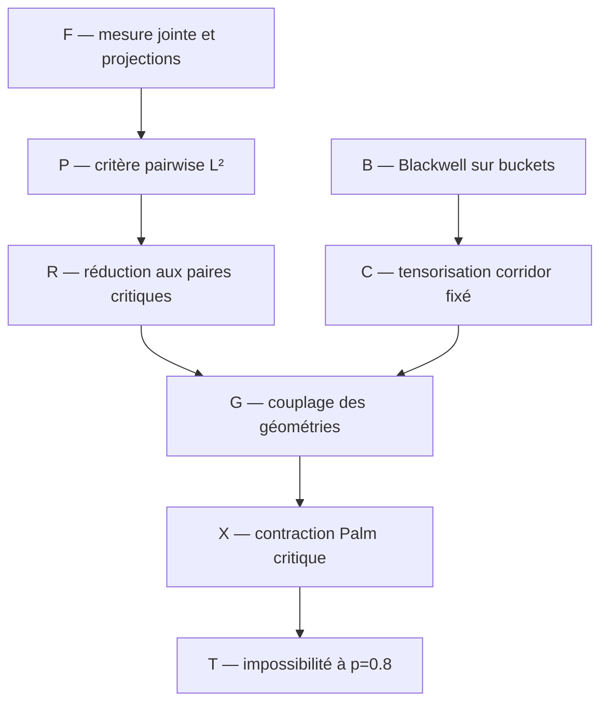

# Feuille de route des preuves

Cette feuille de route remplace l'ancien inventaire chronologique. Elle ne
contient que les dépendances nécessaires à la voie privilégiée : corridor
collapsed, comparaison favorable et contraction critique à $`p=4/5`$.

## Théorème cible intermédiaire

Pour le GSBM binaire homogène sur les tores triangulaires, montrer qu'à

```math
p_0=\frac45
```

la weak recovery est impossible. Par dégradation BSC des observations, le
même résultat vaudrait alors pour tout $`p\le p_0`$.

Le critère à établir est

```math
\mathbb E[H_{\mathcal C}(I_L,J_L)^2]\longrightarrow0,
\tag{T}
```

où $`P_{\mathcal C}`$ est le heat bath collapsed du corridor pair-spécifique.
Le théorème 2.2 du fichier 20 transforme (T) en impossibilité de weak
recovery par Jensen paire par paire.

## Graphe de dépendances



## Bloc F — fondations finies

### F1. Loi jointe

**Énoncé.** Pour le dendrogramme non marqué,

```math
\nu_O(\sigma\mid D)
\propto
\mu_0(\sigma)
\prod_{u\in D}
\Lambda_u(\sigma)e^{(1-\beta_u)\Lambda_u(\sigma)}.
```

**Statut.** Dérivé dans le fichier 01 et vérifié sur les petits graphes. Une
rédaction autonome avec toutes les masses censurées doit rester attachée à
tout théorème final.

### F2. Heat baths

**Énoncé.** Les quatre poids d'un nœud sont sa conditionnelle exacte ; les
updates à $`D`$ fixé sont des projections orthogonales de $`L^2(\pi_D)`$.

**Statut.** Établi en volume fini.

### F3. Bloc collapsed

**Énoncé.** Pour le corridor $`\mathcal C`$,

```math
\|K g\|_2^2
=
\|P_{\mathcal C}g\|_2^2
+\|K(I-P_{\mathcal C})g\|_2^2.
```

**Statut.** Établi dans le fichier 20.

## Bloc P — critère informationnel

### P1. Second moment pairwise

**Énoncé.** Si $`I_L,J_L`$ sont uniformes,

```math
\mathbb E[H(I_L,J_L)^2]\to0
\quad\Longrightarrow\quad
\text{pas de weak recovery}.
```

**Statut.** Établi dans les fichiers 03 et 18. Le couplage peut être choisi
séparément pour chaque paire dans le cas collapsed par le théorème 2.2 du
fichier 20 ; cette extension utilise Jensen paire par paire, et non la matrice
de Gram d'un sweep commun.

### P2. Transfert répliqué

**Énoncé.** Le second moment partage le même $`(O,D,\sigma)`$ entre deux
copies et seulement les aléas de heat bath sont indépendants.

**Statut.** Établi. Deux hiérarchies indépendantes calculeraient une autre
quantité.

## Bloc R — réduction favorable

### R0. Racines distinctes

```math
\beta_{ij}>1
\quad\Longrightarrow\quad
H_{\rm TD}(i,j)=H_{\rm BU}(i,j)=0.
```

**Statut.** Établi exactement.

### R1. Paires précoces

Pour tout $`\delta>0`$ fixé, une paire à distance macroscopique est connectée
sous $`q_c-\delta`$ avec probabilité tendant vers zéro.

**Statut.** Établi par décroissance sous-critique ; l'ordre des limites est
d'abord $`L\to\infty`$, puis $`\delta\downarrow0`$.

### R2. Décomposition

Les paires se partagent en : précoce, fenêtre critique gauche, postcritique
et racines distinctes. Après R0--R1, il reste à dominer la classe
postcritique par l'expérience critique favorable.

**Statut.** Décomposition établie ; domination géométrique ouverte.

## Bloc B — ordre favorable local

### B1. Canal d'un bucket

Pour $`s=s_p(t)`$,

```math
K\mid X=+1\sim1+\mathrm{Bin}(m-1,s),
\qquad
K\mid X=-1\sim\mathrm{Bin}(m-1,1-s).
```

### B2. Blackwell

À taille $`m`$ fixée, si $`t_1\le t_2`$, alors

```math
\mathcal E_{m,s_p(t_1)}
\succeq_{\rm Blackwell}
\mathcal E_{m,s_p(t_2)}.
```

**Statut.** Établi dans le fichier 19 par domination des courbes ROC.

### B3. Contre-audit pointwise

La fiabilité à $`K,B`$ fixés n'est pas monotone : un ancêtre opposé peut
rendre la fusion tardive plus persistante. Ce contre-exemple interdit les
preuves par comparaison réalisation par réalisation, mais pas l'ordre de
Blackwell sous la loi complète.

### B4. Contre-audit des tailles

L'ordre du bloc B2 n'est pas total lorsque $`m`$ change. À $`p=4/5`$, le
bucket critique $`m=4`$ et le bucket tardif $`m=2,t=4/5`$ sont incomparables
au sens de Blackwell. Deux écarts de fonctions call strictement négatifs sont
certifiés par intervalles rationnels dans le fichier 20.

**Conséquence.** Un couplage favorable doit préserver la taille des buckets,
ou vérifier explicitement la domination entre les deux expériences de
tailles différentes. Comparer seulement leurs niveaux est insuffisant.

## Bloc C — corridor fixé

### C1. Tensorisation

À squelette et tailles fixés, les dégradations de buckets se tensorisent.
Pour tout prior corrélé des parités et toute cible $`F`$,

```math
\mathbb E[
\mathbb E(F\mid K^{\rm late})^2
]
\le
\mathbb E[
\mathbb E(F\mid K^{\rm crit})^2
].
```

**Statut.** Établi dans le fichier 20.

### C2. Corridor factorisé

Sous parités indépendantes uniformes,

```math
\mathscr R
=
\prod_r\Gamma_{m_r}(t_r;p).
```

**Statut.** Établi dans l'expérience annoncée. Ne pas l'utiliser sur la
grille sans théorème de compression du bord.

## Bloc G — géométrie Palm, ouvert

### G0. Séparation en coordonnée $`q`$

Sous la loi jointe annealed, les rangs

```math
q_p(T_e)=p(1-e^{-u_pT_e})
```

ont une densité uniforme jusqu'à la censure. La forêt non marquée sous
$`q_\triangle`$ et tout conditionnement de paire mesurable à ce niveau ne
dépendent donc pas de $`p`$. Le canal résiduel dépend de
$`p`$ par $`s_c(p)=(p-q_\triangle)/(1-q_\triangle)`$.

**Statut.** Établi dans le fichier 20. Cette réduction ne traite ni les
ancêtres postcritiques, ni l'état de bord du transfert.

### G1. Variable à faire converger

Sous le biais d'une paire lointaine critique, étudier la loi de

```math
\left(
m_r,\beta_r,
m_{r,0},m_{r,1},m_{r,2},
Z_r
\right)_{r\in\mathcal C_{I_LJ_L}},
```

où $`Z_r`$ est l'état de bord minimal du transfert collapsed.

### G2. Couplage critique/postcritique

Construire un couplage qui aligne un corridor postcritique sur un corridor
critique plus informatif, puis payer explicitement :

```math
\varepsilon_L^{\rm géom}
+\varepsilon_L^{\rm bord}
+\varepsilon_L^{\rm Palm}.
```

La somme doit tendre vers zéro. Blackwell traite les marques une fois les
squelettes alignés ; il ne fournit pas ce couplage. En raison de B4,
« aligné » signifie ici mêmes tailles ou domination cross-size certifiée,
pas seulement mêmes incidences approximatives.

### G3. Premier modèle

Commencer par un cactus de triangles : incidence arborescente, état de bord
fini et énumération exacte. Passer ensuite aux bandes de largeur fixée. La
grille bidimensionnelle entière vient seulement après ces deux certificats.

## Bloc X — contraction critique à $`p=0.8`$, ouvert

### X1. Bloc élémentaire

Pour $`m=2`$ et message $`|B|\le b`$,

```math
\kappa_2(b)
=
s_c+(1-s_c)\tanh^2(b/2)<1,
\qquad
s_c=0.693582222752\ldots.
```

**Statut.** Établi.

### X2. Abondance

Extraire $`N_L\to\infty`$ blocs dont le coefficient répliqué est uniformément
inférieur à un. Les blocs peuvent être :

- des coupes $`m=2`$ screenées ;
- des blocs cactus plus grands avec coefficient certifié ;
- des blocs de bande admis par un programme linéaire de dégradation.

**Statut.** Ouvert sur la grille.

### X3. Composition

Construire un transfert fini tel que

```math
\mathbb E[H_{\mathcal C}(I_L,J_L)^2\mid\mathrm{Palm\ critique}]
\le
\mathbb E[\kappa^{N_L}]+o(1).
```

**Statut.** Prochaine cible mathématique.

## Prochain calcul certifié

Sur un cactus de deux puis trois triangles :

1. énumérer le squelette non marqué et toutes les marques ;
2. construire la conditionnelle collapsed des parités du corridor ;
3. calculer son transfert répliqué par sommation directe ;
4. le recalculer comme produit matriciel indépendant ;
5. chercher une dégradation critique/postcritique par programme linéaire ;
6. certifier les inégalités à $`p=4/5`$ par intervalles.

Un résultat n'est accepté que si les deux implémentations donnent les mêmes
probabilités avant l'arrondi d'intervalle.

## Pistes reléguées

Les pistes suivantes restent des audits, mais ne doivent plus détourner le
programme principal :

- majorité scalaire globale d'une coupe ;
- seuil du canal de triangle isolé ;
- calibration Nishimori utilisée comme preuve ;
- chemin physique marqué de la MSF ;
- formule PATH-FAC appliquée sans factorisation ;
- nouveaux diagnostics de grands tores avant le certificat cactus.

## Critère de clôture à $`p=0.8`$

Le jalon est atteint seulement lorsque les quatre lignes suivantes sont
simultanément prouvées :

```math
\begin{aligned}
\text{précoce}_L&=o(1),\\
\text{racines distinctes}_L&=0,\\
A_L^{\rm late}&\le A_L^{\rm crit}+o(1),\\
A_L^{\rm crit}&=o(1).
\end{aligned}
```

Avant cela, $`p=0.8`$ reste une cible et non une nouvelle borne annoncée.
