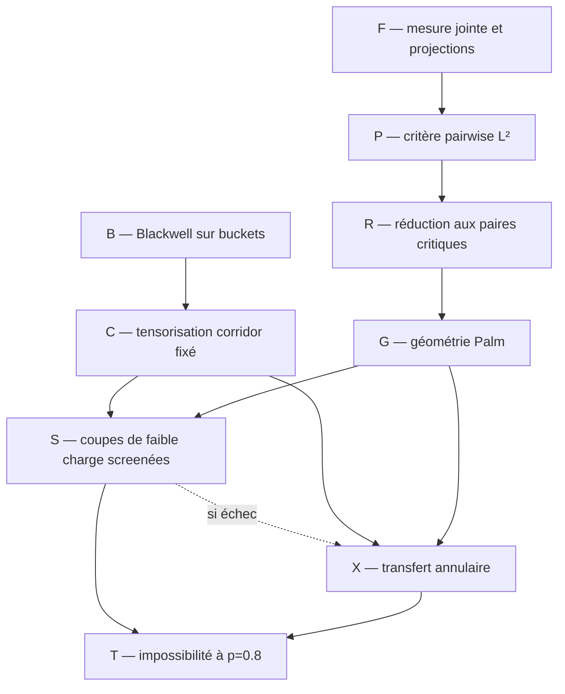

# Feuille de route des preuves

> [!IMPORTANT]
> Le [programme prioritaire](00_RESEARCH_PROGRAM.md) donne l'exposé
> pédagogique et le statut des lemmes. Cette page conserve le graphe technique
> détaillé des dépendances.

Cette feuille de route remplace l'ancien inventaire chronologique. Elle ne
contient que les dépendances nécessaires à la voie privilégiée : corridor
collapsed, criticalisation à squelette fixé et contraction multiscale à
$`p=4/5`$. Le fichier 24 teste d'abord la réduction plus simple aux buckets
bornés. Le fichier 25 corrige cette réduction au niveau géométrique en
introduisant la charge $`m h_p(\beta)^2`$ et la repondération LCA-Palm
$`mN_\rho`$ ; la synthèse générale et le théorème annulaire sont dans le
fichier 23.

## Théorème cible intermédiaire

Pour le GSBM binaire homogène sur les tores triangulaires, montrer qu'à

```math
p_0=\frac45
```

la weak recovery est impossible. Par dégradation BSC des observations, le
même résultat vaudrait alors pour tout $`p\le p_0`$.

Le critère à établir est

```math
\mathbb E[H_{\mathcal C}(I_L,J_L)^2]\longrightarrow0,
\tag{T}
```

où $`P_{\mathcal C}`$ est le heat bath collapsed du corridor pair-spécifique.
Le théorème 2.2 du fichier 20 transforme (T) en impossibilité de weak
recovery par Jensen paire par paire.

## Graphe de dépendances



## Bloc F — fondations finies

### F1. Loi jointe

**Énoncé.** Pour le dendrogramme non marqué,

```math
\nu_O(\sigma\mid D)
\propto
\mu_0(\sigma)
\prod_{u\in D}
\Lambda_u(\sigma)e^{(1-\beta_u)\Lambda_u(\sigma)}.
```

**Statut.** Dérivé dans le fichier 01 et vérifié sur les petits graphes. Une
rédaction autonome avec toutes les masses censurées doit rester attachée à
tout théorème final.

### F2. Heat baths

**Énoncé.** Les quatre poids d'un nœud sont sa conditionnelle exacte ; les
updates à $`D`$ fixé sont des projections orthogonales de $`L^2(\pi_D)`$.

**Statut.** Établi en volume fini.

### F3. Bloc collapsed

**Énoncé.** Pour le corridor $`\mathcal C`$,

```math
\|K g\|_2^2
=
\|P_{\mathcal C}g\|_2^2
+\|K(I-P_{\mathcal C})g\|_2^2.
```

**Statut.** Établi dans le fichier 20.

### F4. Profondeur de la dynamique

Si $`P_u`$ est le heat bath du LCA seul et $`P_{\downarrow}`$ le heat bath
collapsed des deux bras jusqu'aux feuilles, alors

```math
\|P_uf_{ij}\|_2^2
=
\|P_{\downarrow}f_{ij}\|_2^2
+\|(P_u-P_{\downarrow})f_{ij}\|_2^2.
```

**Statut.** Établi dans le fichier 22. Pour un seul sweep, bottom-up est au
plus persistant que le LCA seul ; aucune comparaison top-down analogue ne
découle des seules projections.

## Bloc P — critère informationnel

### P1. Second moment pairwise

**Énoncé.** Si $`I_L,J_L`$ sont uniformes,

```math
\mathbb E[H(I_L,J_L)^2]\to0
\quad\Longrightarrow\quad
\text{pas de weak recovery}.
```

**Statut.** Établi dans les fichiers 03 et 18. Le couplage peut être choisi
séparément pour chaque paire dans le cas collapsed par le théorème 2.2 du
fichier 20 ; cette extension utilise Jensen paire par paire, et non la matrice
de Gram d'un sweep commun.

### P2. Transfert répliqué

**Énoncé.** Le second moment partage le même $`(O,D,\sigma)`$ entre deux
copies et seulement les aléas de heat bath sont indépendants.

**Statut.** Établi. Deux hiérarchies indépendantes calculeraient une autre
quantité.

## Bloc R — réduction favorable

### R0. Racines distinctes

```math
\beta_{ij}>1
\quad\Longrightarrow\quad
H_{\rm TD}(i,j)=H_{\rm BU}(i,j)=0.
```

**Statut.** Établi exactement.

### R1. Paires précoces

Pour tout $`\delta>0`$ fixé, une paire à distance macroscopique est connectée
sous $`q_c-\delta`$ avec probabilité tendant vers zéro.

**Statut.** Établi par décroissance sous-critique ; l'ordre des limites est
d'abord $`L\to\infty`$, puis $`\delta\downarrow0`$.

### R2. Décomposition

Les paires se partagent en : précoce, fenêtre critique gauche, postcritique
et racines distinctes. Après R0--R1, il reste à dominer la classe
postcritique par l'expérience critique favorable.

**Statut.** Décomposition établie ; domination géométrique ouverte.

## Bloc B — ordre favorable local

### B1. Canal d'un bucket

Pour $`s=s_p(t)`$,

```math
K\mid X=+1\sim1+\mathrm{Bin}(m-1,s),
\qquad
K\mid X=-1\sim\mathrm{Bin}(m-1,1-s).
```

### B2. Blackwell

À taille $`m`$ fixée, si $`t_1\le t_2`$, alors

```math
\mathcal E_{m,s_p(t_1)}
\succeq_{\rm Blackwell}
\mathcal E_{m,s_p(t_2)}.
```

**Statut.** Établi dans le fichier 19 par domination des courbes ROC.

### B3. Contre-audit pointwise

La fiabilité à $`K,B`$ fixés n'est pas monotone : un ancêtre opposé peut
rendre la fusion tardive plus persistante. Ce contre-exemple interdit les
preuves par comparaison réalisation par réalisation, mais pas l'ordre de
Blackwell sous la loi complète.

### B4. Contre-audit des tailles

L'ordre du bloc B2 n'est pas total lorsque $`m`$ change. À $`p=4/5`$, le
bucket critique $`m=4`$ et le bucket tardif $`m=2,t=4/5`$ sont incomparables
au sens de Blackwell. Deux écarts de fonctions call strictement négatifs sont
certifiés par intervalles rationnels dans le fichier 20.

**Conséquence.** Un couplage favorable doit préserver la taille des buckets,
ou vérifier explicitement la domination entre les deux expériences de
tailles différentes. Comparer seulement leurs niveaux est insuffisant.

## Bloc C — corridor fixé

### C1. Tensorisation

À squelette et tailles fixés, les dégradations de buckets se tensorisent.
Pour tout prior corrélé des parités et toute cible $`F`$,

```math
\mathbb E[
\mathbb E(F\mid K^{\rm late})^2
]
\le
\mathbb E[
\mathbb E(F\mid K^{\rm crit})^2
].
```

**Statut.** Établi dans le fichier 20.

### C2. Corridor factorisé

Sous parités indépendantes uniformes,

```math
\mathscr R
=
\prod_r\Gamma_{m_r}(t_r;p).
```

**Statut.** Établi dans l'expérience annoncée. Ne pas l'utiliser sur la
grille sans théorème de compression du bord.

## Bloc G — géométrie Palm, partiellement résolu sur cactus

### G0. Séparation en coordonnée $`q`$

Sous la loi jointe annealed, les rangs

```math
q_p(T_e)=p(1-e^{-u_pT_e})
```

ont une densité uniforme jusqu'à la censure. La forêt non marquée sous
$`q_\triangle`$ et tout conditionnement de paire mesurable à ce niveau ne
dépendent donc pas de $`p`$. Le canal résiduel dépend de
$`p`$ par $`s_c(p)=(p-q_\triangle)/(1-q_\triangle)`$.

**Statut.** Établi dans le fichier 20. Cette réduction ne traite ni les
ancêtres postcritiques, ni l'état de bord du transfert.

### G1. Variable à faire converger

Sous le biais d'une paire lointaine critique, étudier la loi de

```math
\left(
m_r,\beta_r,
m_{r,0},m_{r,1},m_{r,2},
Z_r,B_r,
\mathcal J_r
\right)_{r\in\mathcal C_{I_LJ_L}},
```

où $`Z_r`$ est l'état de bord minimal du transfert collapsed et

```math
\mathcal J_r=m_rh_p(\beta_r)^2.
```

### G1 bis. Intensité Palm exacte

Conditionnellement à la partition au niveau $`\beta`$, une coupe de taille
$`m`$ fusionne à taux $`m u_ps_p(\beta)`$. Le LCA d'une paire lointaine
repondère encore cette coupe par le nombre $`N_\rho`$ de paires séparées par
ses enfants. À niveau fixé, la densité Palm porte donc le facteur exact

```math
mN_\rho.
```

**Statut.** Établi dans le fichier 25 par la formule de compensation des
sauts. La loi asymptotique de $`mN_\rho`$ sur la grille reste ouverte.

### G2. Porte critique/postcritique

La première opération est déjà rigoureuse : sur chaque squelette réel,
remplacer tout niveau $`t_r>\beta_c`$ par $`\beta_c`$ sans changer sa taille.
La tensorisation du bloc C fournit alors un oracle plus informatif.

Il reste deux options, par ordre de robustesse :

1. prouver l'abondance et la contraction directement, uniformément sur les
   corridors Palm de rang $`q\ge q_c`$ après cette criticalisation ;
2. construire un couplage qui aligne un corridor postcritique sur un corridor
   véritablement critique plus informatif, puis payer explicitement :

```math
\varepsilon_L^{\rm géom}
+\varepsilon_L^{\rm bord}
+\varepsilon_L^{\rm Palm}.
```

La somme doit tendre vers zéro. Blackwell traite les marques à squelette
fixé ; il ne fournit pas le second couplage. En raison de B4, « aligné »
signifie ici mêmes tailles ou domination cross-size certifiée, pas seulement
mêmes incidences approximatives. La première option évite ce verrou et doit
être tentée d'abord.

### G3. Premier modèle

Sur une chaîne de cactus triangulaires à bord libre, l'incidence
arborescente réduit l'état de bord à la parité répliquée. Le fichier 21
établit exactement

```math
A_h^{\rm LCA\ only}(p,q)=\kappa_{\rm flux}(p,q),
\qquad
A_h^{\rm LCA}(p,q)
=
\kappa_{\rm flux}(p,q)\kappa_{\rm conn}(p,q)^{h-1},
```

contre-audité par énumération globale, transfert local, quadrature et
intervalles rationnels. Les deux coefficients décroissent avec $`q`$ : le
rang critique est bien le cas postcritique le plus favorable sur ce modèle.

**Statut.** Établi sur le cactus. La prochaine étape est une bande
triangulaire de largeur deux ; la grille bidimensionnelle entière vient
seulement après ce certificat. Ni le cactus ni une bande de largeur fixée ne
possèdent une géante à $`q_\triangle`$ : ce sont des certificats de canal et
d'état de bord, pas des substituts à la loi Palm bidimensionnelle.

## Bloc X — contraction critique à $`p=0.8`$, ouvert

### X1. Bloc élémentaire

Pour $`m=2`$ et message $`|B|\le b`$,

```math
\kappa_2(b)
=
s_c+(1-s_c)\tanh^2(b/2)<1,
\qquad
s_c=0.693582222752\ldots.
```

**Statut.** Établi.

### X1 bis. Réduction simple par buckets bornés

Pour $`m=2`$ et tout niveau $`0\le\beta\le1`$,

```math
\Gamma_2(\beta;p)=s_p(\beta)\le p<1.
```

Avec $`|B|\le B_0`$,

```math
\kappa_2(B;\beta,p)
\le
p+(1-p)\tanh^2(B_0/2)<1.
```

Par conséquent, si un corridor exact contient $`N_L\to\infty`$ buckets
`m=2`$ disjoints et screenés dont les contractions se composent
conditionnellement, alors sa persistance tend vers zéro. La même conclusion
vaut pour $`2\le m\le M`$ dès qu'une borne uniforme strictement inférieure à
un est certifiée sur l'espace fini correspondant.

**Statut.** Établi pour le corridor factorisé ; implication globale
conditionnelle au screening et à l'abondance. Voir le fichier 24.

### X2. Bon bloc annulaire

Un bloc doit avoir un nombre borné de ports, un screening latéral, au moins
deux routes ou arêtes candidates dans une coupe pertinente, et un transfert
répliqué exact dont le coefficient sur le secteur impair vérifie

```math
\eta_{\chi^2}(\mathscr U_{p,k}\mid Z_k)\le\kappa(p)<1
```

pour tout état de bord admis. Une arête pivotale isolée, donc un bucket
$`m=1`$, est un canal parfait et ne compte pas comme bloc contractant.

**Statut.** Ouvert sur la bande et la grille ; le cactus donne le premier
exemple physique exact.

### X3. Abondance

Extraire $`N_L\to\infty`$ blocs dont le coefficient répliqué est uniformément
inférieur à un. Les blocs peuvent être :

- des coupes $`m=2`$ screenées ;
- des blocs cactus, dont le coefficient est maintenant certifié dans le
  fichier 21 ;
- des blocs de bande admis par un programme linéaire de dégradation.

La cible forte, sur des annuli séparés, est

```math
\mathbb P(G_k\mid\mathcal F_{k-1},\mathrm{Palm})\ge a(p)>0.
```

Elle doit être obtenue sous la loi Palm à deux points, et non par une simple
application de RSW non conditionnée.

**Statut.** Ouvert sur la grille.

### X4. Composition

Construire un transfert fini tel que

```math
\mathbb E[H_{\mathcal C}(I_L,J_L)^2\mid\mathrm{Palm\ critique}]
\le
\mathbb E[\kappa^{N_L}]+o(1).
```

**Statut.** Établi sur le cactus par le fichier 21 ; ouvert sur les bandes et
la grille.

Sous une minoration conditionnelle uniforme de probabilité $`a(p)`$ sur
$`K_L\asymp\log L`$ annuli, la borne quantitative devient

```math
\mathbb E[H_{\mathcal C}^2]
\le
\bigl(1-a(p)(1-\kappa(p))\bigr)^{K_L}+o(1).
```

## Prochain lemme simple

Avant tout nouveau transfert de bande, tenter de prouver sous Palm critique :

```math
N_L^{(J_0,B_0)}
:=
\#\{r:m_rh_p(\beta_r)^2\le J_0,\ |B_r|\le B_0,
\text{ bloc }r\text{ screené}\}
\longrightarrow\infty.
```

La version $`2\le m_r\le M`$ reste un sous-cas suffisant, mais la charge
autorise aussi une grande coupe assez tardive. Il faut ensuite vérifier que
des sous-blocs disjoints peuvent être choisis de façon que leurs coefficients
$`\chi^2`$ exacts, correction gagnante incluse, se composent. Une preuve de
ces deux lignes ferme le bloc X sans calculer tout l'état de bord de la bande.

## Plan B : calcul certifié de bande

Sur une bande triangulaire de largeur deux :

1. encoder la partition non marquée des sommets de coupe ;
2. ajouter les deux bras descendants, les deux parités répliquées et le
   statut du bloc pivotal ;
3. construire la matrice de transfert collapsed $`\mathscr U_{p,2}`$ ;
4. la recalculer par une énumération globale indépendante sur deux cellules ;
5. certifier $`r(\mathscr U_{0.8,2})<1`$ par intervalles ;
6. extraire les configurations finies de ports qui réalisent cette
   contraction ;
7. chercher d'abord une borne uniforme postcritique sur le même squelette,
   puis seulement une comparaison entre géométries si elle est nécessaire.

Un résultat n'est accepté que si les deux implémentations donnent les mêmes
poids avant l'arrondi d'intervalle. Le rayon spectral ne doit jamais être
calculé après projection prématurée sur une seule majorité.

## Pistes reléguées

Les pistes suivantes restent des audits, mais ne doivent plus détourner le
programme principal :

- majorité scalaire globale d'une coupe ;
- seuil du canal de triangle isolé ;
- calibration Nishimori utilisée comme preuve ;
- chemin physique marqué de la MSF ;
- formule PATH-FAC appliquée sans factorisation ;
- nouveaux diagnostics de grands tores avant le certificat de largeur deux.

Les exposants exacts de la percolation de sites sur le réseau triangulaire ne
doivent pas être transférés sans preuve à la percolation par arêtes utilisée
ici. La première version du lemme annulaire doit s'appuyer seulement sur les
outils planaires robustes réellement disponibles pour le modèle considéré.

## Critère de clôture à $`p=0.8`$

Le jalon est atteint seulement lorsque les quatre lignes suivantes sont
simultanément prouvées :

```math
\begin{aligned}
\text{précoce}_L&=o(1),\\
\text{racines distinctes}_L&=0,\\
A_L^{\rm late}&\le A_L^{\rm crit}+o(1),\\
A_L^{\rm crit}&=o(1).
\end{aligned}
```

Avant cela, $`p=0.8`$ reste une cible et non une nouvelle borne annoncée.
