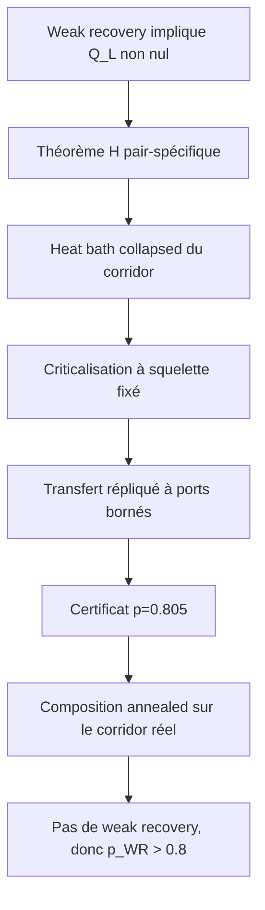

# Feuille de route réaliste vers une borne $`p_{\mathrm{WR}}>0.8`$

> [!IMPORTANT]
> Le premier objectif strict doit être une impossibilité de weak recovery à
> un point rationnel $`p_0>0.8`$, par exemple $`p_0=0.805`$. Une preuve au
> seul point $`p=0.8`$ donnerait $`p_{\mathrm{WR}}\ge0.8`$, mais pas une
> borne strictement supérieure à $`0.8`$.

Cette note resserre le
[programme prioritaire](00_RESEARCH_PROGRAM.md) et la
[feuille de route technique](05_PROOF_ROADMAP.md). Elle conserve l'idée
centrale — paire lointaine, corridor réel criticalisé et dynamique
hiérarchique — tout en retirant trois objectifs qui ne doivent pas être des
prérequis :

1. un temps de mélange global uniforme à criticité ;
2. la loi asymptotique complète du dendrogramme sous une Palm à deux points ;
3. une domination de toute géométrie postcritique par une géométrie critique
   abstraite.

Le noyau recommandé est le **heat bath collapsed du corridor**. La réduction
favorable doit **criticaliser les temps sur le squelette réel**, sans
supprimer ses attaches postcritiques. Le calcul quantitatif recommandé est un
**transfert répliqué à nombre borné de ports**, certifié par arithmétique
d'intervalles.

## 1. Cible et positionnement

Sur le tore triangulaire $`G_L`$, notons $`p_{\mathrm{WR}}`$ le seuil
informationnel de weak recovery pour le modèle binaire homogène, par exemple

```math
p_{\mathrm{WR}}
:=
\inf\left\{
p:\liminf_{L\to\infty}Q_L(p)>0
\right\}
\tag{1.0}
```

pour la notion d'avantage de probabilité positif. La borne
d'information-percolation actuellement disponible est

```math
p_{\mathrm{WR}}
\ge
p_{\mathrm{info}}
:=
\frac{1+\sqrt{2\sin(\pi/18)}}2
=0.794659275831\ldots.
\tag{1.1}
```

Elle combine la borne $`\chi^2`$ d'Abbe--Boix-Adserà avec le seuil exact de
percolation par arêtes triangulaire ; voir
[Abbe--Boix-Adserà](https://arxiv.org/abs/1806.03227) et
[Wierman](https://doi.org/10.2307/1426685).

La progression quantitative doit être :

| jalon | conclusion recherchée | rôle |
|---|---|---|
| $`p_0=0.805`$ | pas de weak recovery | première borne rigoureuse strictement supérieure à $`0.8`$ |
| $`p_1=0.81`$ | pas de weak recovery | validation que le gain n'est pas un artefact infinitésimal |
| $`p_2\in[0.82,0.83]`$ | pas de weak recovery | test réel de la profondeur hiérarchique |
| $`0.8358\ldots`$ | calibration seulement | cible physique de long terme |

La valeur $`0.835805792367\ldots`$ provient de la condition principale de
Nishimori--Ohzeki. Elle est conjecturale ; la première correction par amas
donne déjà $`0.835985\ldots`$. Il ne faut donc pas annoncer cette constante
comme un seuil exact à démontrer par simple identification numérique.
Voir [Nishimori--Ohzeki](https://arxiv.org/abs/cond-mat/0601356) et
[Ohzeki](https://arxiv.org/abs/0811.0464).

Par dégradation du BSC, une preuve d'impossibilité à un seul $`p_0`$ vaut
automatiquement pour tout $`p\le p_0`$.

## 2. La quantité maître : une paire, puis toutes les paires

Pour

```math
f_{ij}(\sigma)=\sigma_i\sigma_j,
\qquad
c_{ij}(O)=\langle f_{ij}\rangle_{\mu_O},
\tag{2.1}
```

posons

```math
Q_L
=
\frac1{|V_L|^2}
\sum_{i,j}
\mathbb E[c_{ij}(O)^2]
=
\mathbb E\left\langle
\left(
\frac1{|V_L|}\sum_i
\sigma_i^{(1)}\sigma_i^{(2)}
\right)^2
\right\rangle.
\tag{2.2}
```

Si un estimateur obtient un overlap signé au moins $`\varepsilon`$ avec
probabilité au moins $`\eta`$, alors

```math
Q_L\ge \varepsilon^4\eta^2.
\tag{2.3}
```

Ainsi $`Q_L\to0`$ interdit la weak recovery, y compris dans sa version avec
succès avec haute probabilité. La réciproque directe par une réplique
postérieure donne un avantage de probabilité positif ; obtenir la version
avec haute probabilité demande en plus une amplification ou une
concentration.

Les paires proches sont négligeables dans (2.2). On peut prendre $`I_L,J_L`$
uniformes, retirer les paires telles que $`d(I_L,J_L)\le r_L`$, avec

```math
r_L\longrightarrow\infty,
\qquad
\frac{r_L}{L}\longrightarrow0,
\tag{2.4}
```

puis étudier seulement une paire lointaine.

## 3. Théorème hiérarchique remplaçant le théorème du chapitre 11

Soit $`D`$ le dendrogramme non marqué tiré conditionnellement à une réplique
postérieure et

```math
\pi_D(d\sigma)=\nu_O(d\sigma\mid D).
```

Pour chaque paire $`i,j`$, soit $`\mathcal C_{ij}`$ son corridor et
$`P_{ij}`$ un heat bath conjoint exact de certaines orientations de ce
corridor. Les facteurs des ancêtres restent présents, même lorsqu'ils ne
sont pas rééchantillonnés. Posons

```math
A_{ij}(O,D)
=
\|P_{ij}f_{ij}\|_{L^2(\pi_D)}^2.
\tag{3.1}
```

### Théorème H — obstruction hiérarchique pair-spécifique

Si $`I_L,J_L`$ sont uniformes et indépendants, alors

```math
\boxed{
Q_L
\le
\mathbb E[A_{I_LJ_L}(O,D)].
}
\tag{3.2}
```

Par conséquent,

```math
\mathbb E[A_{I_LJ_L}]\longrightarrow0
\quad\Longrightarrow\quad
\text{pas de weak recovery}.
\tag{3.3}
```

Ce théorème est le bon analogue du théorème principal du chapitre 11.
Lorsque $`P_{ij}`$ ne fait que recolorer indépendamment les racines de
$`\Pi_1`$,

```math
A_{ij}
=
\mathbf1_{\{i,j\text{ dans la même racine}\}},
```

et l'on retrouve la borne de Swendsen--Wang. La hiérarchie remplace cette
indicatrice grossière par la persistance exacte de la parité de la paire.

Le point de départ précis est le théorème 10 du
[manuscrit, pages PDF 151--152](../../Manuscrit_de_thèse.pdf#page=151). Son
mécanisme utile est l'invariance jointe et le recoloriage i.i.d. uniforme des
racines, pas un résultat de mélange. Dans le passage thermodynamique, la
fluctuation des petits amas est $`O_{\mathbb P}(\sqrt\delta)`$ : il faut
d'abord faire tendre $`L`$ vers l'infini, puis $`\delta`$ vers zéro. Une
simple hypothèse « équilibrée et invariante par permutation » ne remplacerait
pas le recoloriage uniforme.

La preuve de (3.2) est finie. Pour $`m_D=\pi_D(f_{ij})`$,

```math
c_{ij}(O)^2
\le
\mathbb E_{D\mid O}[m_D^2]
=
\mathbb E_{D\mid O}[\pi_D(P_{ij}f_{ij})^2]
\le
\mathbb E_{D\mid O}[\pi_D((P_{ij}f_{ij})^2)].
\tag{3.4}
```

C'est la désintégration selon $`D`$, puis deux applications de Jensen. Elle
n'exige ni noyau commun à toutes les paires, ni mélange uniforme en volume.
Elle est déjà établie dans le
[théorème 2.2 du fichier 20](20_COLLAPSED_CORRIDOR_BLACKWELL.md).

## 4. Dynamique à employer

### 4.1 Loi auxiliaire exacte

Une arête satisfaite reçoit une horloge
$`\xi_e\sim\mathrm{Exp}(|W_e|)`$ ; une arête insatisfaite reçoit
$`+\infty`$. Pour le dendrogramme de partitions non marqué,

```math
\nu_O(\sigma\mid D)
\propto
\mu_0(\sigma)
\prod_{u\in D}
\Lambda_u(\sigma)
e^{(1-\beta_u)\Lambda_u(\sigma)}.
\tag{4.1}
```

Au nœud $`u`$, les quatre orientations de ses deux enfants sont tirées avec
leurs poids exacts, contenant tous les $`\Lambda_v^{ab}`$ pour
$`v\succeq u`$. La forêt de Kruskal calcule le dendrogramme, mais la coupe du
heat bath utilise toutes les arêtes physiques entre les deux enfants.

### 4.2 Bloc collapsed descendant

Pour une paire dans une même racine, prendre les deux bras de $`i,j`$ à leur
LCA et rééchantillonner conjointement toutes leurs orientations,
conditionnellement à l'extérieur. L'opérateur est

```math
P_{ij}g
=
\mathbb E_{\pi_D}[g\mid\mathcal A_{ij}],
\tag{4.2}
```

où $`\mathcal A_{ij}`$ conserve l'extérieur du bloc.

Le noyau pair-spécifique complet est donc explicite.

1. Partir de $`\sigma\sim\mu_O`$ et tirer $`D\mid\sigma`$.
2. Si $`i,j`$ appartiennent à deux racines de $`\Pi_1`$ distinctes,
   rééchantillonner indépendamment les deux orientations de racine.
3. Sinon, tirer en un bloc toutes les orientations du corridor selon
   $`\nu_O(\cdot\mid D,\mathcal A_{ij})`$.
4. Oublier $`D`$.

Chaque étape est un heat bath de la loi jointe ; la marginale finale reste
$`\mu_O`$. Le mot « mélangé » signifie ici que le corridor est exactement à
l'équilibre conditionnel après l'étape 3, et non que toute la chaîne globale
a un temps de mélange polynomial.

Ce choix a trois avantages rigoureux.

1. Aux racines, il redonne les flips indépendants de Swendsen--Wang.
2. Aux feuilles, ses coordonnées élémentaires sont des heat baths de
   Glauber.
3. Il est moins persistant en $`L^2`$ que tout sweep des mêmes nœuds.

Le bloc est pair-spécifique et éventuellement coûteux à échantillonner. Ce
n'est pas un problème pour une preuve d'impossibilité. Pour une
implémentation, une programmation dynamique à nombre borné de ports ou des
sweeps bottom-up répétés peuvent l'approcher en volume fini.

### 4.3 Ce qu'il ne faut pas chercher

Il ne faut pas demander en première étape un gap spectral uniforme de la
chaîne alternant $`D\mid\sigma`$ et $`\sigma\mid D`$ près de la criticité
d'un spin glass frustré. Le théorème H utilise une projection conditionnelle
exacte en un bloc ; l'invariance suffit.

## 5. Rendre rigoureuse l'idée « fusion à $`\beta_c`$ »

Dans le GSBM homogène, posons

```math
q_p(\beta)=p(1-e^{-u_p\beta}),
\qquad
u_p=\log\frac p{1-p},
\qquad
q_c=2\sin(\pi/18),
\tag{5.1}
```

et $`\beta_c=q_p^{-1}(q_c)`$.

L'événement $`\beta_{ij}=\beta_c`$ a probabilité nulle en volume fini. Plus
important, le LCA **ponctuel** de deux sommets connectés à $`\beta=1`$ ne se
concentre pas en général à $`\beta_c`$ : chaque endpoint peut conserver une
attache locale tardive.

### 5.1 Décomposition qui reste exacte

Pour tout $`\delta>0`$ fixé, poser
$`\beta_c(\delta)=q_p^{-1}(q_c-\delta)`$ et séparer :

1. $`\beta_{ij}<\beta_c(\delta)`$ : contribution $`o_L(1)`$ pour une paire
   lointaine par décroissance sous-critique ;
2. $`\beta_c(\delta)\le\beta_{ij}\le1`$ : corridor réel à traiter ;
3. $`\beta_{ij}>1`$, avec la convention $`\beta_{ij}=+\infty`$ en l'absence
   de fusion : deux racines distinctes, donc persistance exactement nulle.

L'ordre est d'abord $`L\to\infty`$ à $`\delta`$ fixé, puis
$`\delta\downarrow0`$. La deuxième classe conserve les LCA critiques, les
LCA tardifs et toutes leurs attaches.

### 5.2 Criticaliser les canaux sur le squelette réel

Conditionnellement au squelette, à ses incidences, à ses tailles de coupes et
à son état de bord, remplacer

```math
\beta_v
\quad\text{par}\quad
\beta_v^{\mathrm{fav}}=\min(\beta_v,\beta_c)
\tag{5.2}
```

rend chaque canal de bucket plus informatif au sens de Blackwell. Cette
domination se tensorise même si les parités latentes sont corrélées.

Il faut conserver les tailles de coupes. Deux buckets de tailles différentes
peuvent être incomparables au sens de Blackwell. La feuille de route ne
demande donc jamais de remplacer un corridor postcritique par un corridor
critique indépendant ayant une autre géométrie.

Cette opération est la version rigoureuse de « supposer la fusion à
$`\beta_c`$ » : elle place chaque canal tardif au seuil **sur son squelette
réel**, attaches comprises. Le transfert de la section 6 doit ensuite être
uniforme, ou moyenné avec contrôle des queues, sur la loi de ces squelettes.

### 5.3 Pourquoi l'élagage naïf n'est pas un raccourci

Dans un dendrogramme en peigne, une grande composante absorbe successivement
de petits enfants. Élaguer tout nœud ayant un petit enfant puis révéler sa
parité peut déterminer exactement $`f_{ij}`$ ; la majoration obtenue vaut
alors $`1`$ et aucun cœur ne subsiste. Or cette géométrie est naturelle après
l'apparition de la composante supercritique.

Une réduction par ancres resterait envisageable : révéler une relation
d'attache, choisir un port dans le grand enfant, puis rerouter l'observable
vers deux ancres internes. Elle demanderait toutefois une loi contrôlée des
ancres sous le biais LCA-Palm, proche des questions d'invasion-percolation.
Elle est conservée comme piste secondaire, pas comme maillon de la preuve.

## 6. Le calcul local qui peut réellement donner $`p_0>0.8`$

Une coupe critique de grande taille est très informative. À $`p=0.805`$,
avec $`s_c=(p-q_c)/(1-q_c)`$ et $`h_c=2s_c-1`$,

```math
\beta_c=0.398224964786\ldots,
\qquad
s_c=0.701242667184\ldots,
\qquad
h_c=0.402485334367\ldots,
\qquad
h_c^2=0.161994444381\ldots.
\tag{6.1}
```

La perte ne viendra donc pas du LCA seul, mais de blocs ambigus répétés sur
les deux bras descendants.

### 6.1 État de bord suffisant à tester

Un état suffisant, sans prétendre qu'il soit minimal, est :

```math
z_B
=
(\mathcal G_B,\Pi_B,\Psi_B,x_B^{(1)},x_B^{(2)}),
\tag{6.2}
```

où $`\mathcal G_B`$ contient le squelette non marqué, les temps, tailles et
groupes d'incidence, ainsi que les données de Palm et de censure nécessaires ;
$`\Pi_B`$ est le câblage signé des $`b`$ ports ; et
$`x_B^{(a)}\in\{\pm1\}^b/\{\text{flip global}\}`$ est l'orientation relative
de la réplique $`a`$. Enfin, $`\Psi_B`$ est le potentiel extérieur complet
sur les $`2^{b-1}`$ orientations relatives, modulo l'échelle. Les ancêtres et
branches latérales sont marginalisés dans ce potentiel projectif. Un seul
log-likelihood ratio scalaire n'est suffisant que pour $`b=2`$, après preuve
de fermeture.

Le même environnement $`(O,D,\sigma_{\rm ext})`$ doit être partagé par les
deux copies ; seules leurs orientations internes tirées par le heat bath sont
conditionnellement indépendantes. Deux dendrogrammes indépendants
calculeraient la mauvaise quantité.

### 6.2 Transfert de masse et secteur de parité répliqué

Pour un bloc à nombre borné de ports, soit
$`\mathsf T_{B,p}(z,dz',d\epsilon)`$ le transfert positif levé, où
$`\epsilon=\chi_B^{(1)}\chi_B^{(2)}\in\{\pm1\}`$ est le produit des
incréments de la parité cible dans les deux tirages conditionnels. Définir

```math
\mathscr T_B^{(0)}(z,dz')
=
\sum_{\epsilon}\mathsf T_{B,p}(z,dz',d\epsilon),
\qquad
(\mathscr U_{B,p}g)(z)
=
\sum_{\epsilon}\int \epsilon g(z')
\mathsf T_{B,p}(z,dz',d\epsilon).
\tag{6.3}
```

Le premier est le transfert non tordu de masse ; le second est le transfert
signé dans le secteur de Walsh $`\chi\otimes\chi`$. Sur le lift
$`(z,s)`$ avec $`s'=s\epsilon`$, ce secteur est simplement formé des
fonctions $`F(z,s)=s g(z)`$.

Il ne faut pas tenter de contracter le transfert positif complet : son mode
constant transporte la masse et garde valeur propre $`1`$ après
normalisation. Seul le secteur $`\chi\otimes\chi`$ porte
$`\|P_{ij}f_{ij}\|_2^2`$.

Dans une concaténation homogène et primitive, le premier diagnostic est le
rapport de croissances

```math
\kappa_B^{\mathrm{diag}}(p)
=
\frac{\rho(|\mathscr U_{B,p}|)}
{\rho(\mathscr T_B^{(0)})}.
\tag{6.4}
```

Ce quotient ne suffit pas pour des bords arbitraires ni pour des produits de
blocs inhomogènes ou non commutatifs. Le certificat rigoureux doit être une
inégalité uniforme sur un espace d'états commun. Après normalisation de
$`\mathscr T_B^{(0)}`$ par sa transformée de Doob avec son vecteur de
Perron--Frobenius, appliquer la même normalisation à $`\mathscr U`$, puis
chercher une fonction poids $`w>0`$ telle que, pour tout paramètre de bord
admissible $`\theta`$,

```math
\boxed{
|\widehat{\mathscr U}_{B,0.805,\theta}|w
\le
(1-\varepsilon_B)w.
}
\tag{6.5}
```

avec $`\varepsilon_B>0`$ explicite et arithmétique d'intervalles.
Pour une seule matrice homogène, une inégalité de Collatz--Wielandt avec un
vecteur strictement positif peut certifier (6.5). Pour une famille de blocs,
il faut le même poids $`w`$, ou une borne de rayon spectral joint. Les jauges
de Doob doivent alors être communes ou se composer en un cocycle dont les
rapports de bord sont explicitement bornés ; normaliser séparément chaque
matrice puis multiplier les rapports ne serait pas valide.

Pour comparer des blocs de profondeurs différentes, suivre le taux par
couche $`\mathrm{depth}(B)^{-1}\log\kappa_B`$, jamais la marge brute
$`1-\kappa_B`$ : bloquer deux couches remplace naturellement $`\kappa`$ par
$`\kappa^2`$.

Si le nombre de ports dépasse la troncature, un état `overflow` absorbant de
persistance $`1`$ recréerait un mode spectral non contractant. Il faut soit
sortir sa contribution comme une erreur additive $`\varepsilon_{\rm tr}`$
dont la somme sur le corridor est $`o(1)`$, soit prouver un drift pondéré qui
ramène explicitement l'overflow vers les états finis. Il ne faut pas
conditionner gratuitement sur un message borné ou sur un nombre borné de
ports.

Le message projectif $`\Psi_B`$ est continu. Deux méthodes réalistes
sont :

1. des boîtes rationnelles dans le simplexe projectif, avec majoration
   matricielle par intervalles et subdivision adaptative ;
2. une quantification par dégradation/amélioration de canaux BMS, uniquement
   dans les sous-familles où cet ordre a été démontré, puis un certificat de
   type population dynamics rigoureuse.

Une partition scalaire avec « bornes monotones » n'est pas valable en
général : la frustration peut faire alterner alignement et anti-alignement
entre coordonnées du message.

Le récent schéma de population dynamics certifiée pour des canaux BMS sur
hypertrees constitue un modèle technique utile, même si la géométrie présente
n'est pas un hypertree ; voir
[Gu](https://arxiv.org/abs/2606.21699).

### 6.3 Ordre des blocs tests

1. cactus de triangles, déjà résolu et utilisé comme test unitaire ;
2. bande triangulaire de largeur deux ;
3. cellule triangulaire hiérarchique à trois ports et profondeur deux ;
4. même cellule à profondeur trois seulement si la marge (6.5) reste
   positive.

Chaque calcul doit avoir deux implémentations indépendantes avant la
certification d'intervalles.

Ces objets de largeur fixe sont des tests unitaires du transfert et de son
état de bord, pas des certificats bidimensionnels : une bande peut contracter
pour tout $`p<1`$ uniquement parce qu'elle est quasi unidimensionnelle. La
conclusion sur le tore exige toujours le théorème de composition de la
section 7.

## 7. Globaliser sans classifier toute la Palm critique

Trois voies sont distinguées. A0 est le plan de secours court, B est la voie
hiérarchique principale, et A1 ne mérite un investissement lourd qu'après
fermeture exacte de sa loi cellulaire.

### Voie A0 — certificat de triangle, plan de secours non hiérarchique

Le canal physique d'un triangle peut être comparé directement à une
expérience de connectivité multi-état, puis traité par
information-percolation. Le candidat conditionnel est

```math
p=0.809909289251\ldots.
```

Pour le premier point strict, le candidat rationnel à certifier est

```math
p_0=\frac{161}{200},
\qquad q_0=2p_0-1=\frac{61}{100},
\qquad
(a,s,e)=\left(\frac{13}{40},\frac9{80},\frac{27}{80}\right).
\tag{7.0}
```

Il vérifie exactement
$`a+3s+e=1`$, $`2a+3s=79/80<1`$,
$`ae-2s^2=27/320>0`$ et
$`a+e=53/80>6\sqrt2-8`$. Le secteur des a priori non polarisés est déjà
réduit à un polynôme cubique dont les coefficients de Bernstein sont
strictement positifs après subdivision en deux intervalles.

Il reste une certification finie : pour les a priori polarisés
$`\mu_0>1/2`$, prouver la positivité semi-définie d'une matrice rationnelle
$`M(\mu)`$. Après traitement symbolique des faces, cela revient à la
positivité uniforme de sept polynômes rationnels — trois diagonales, trois
mineurs principaux d'ordre deux et un déterminant — sur un simplexe compact.
La bonne méthode est une subdivision adaptative de Bernstein en arithmétique
rationnelle ; un certificat SOS rationalisé est le plan de repli. Les audits
numériques n'ont trouvé aucun contre-exemple, mais ils ne remplacent pas ce
dernier certificat.

Cette tâche est finie et constitue le chemin le plus court vers une borne
strictement supérieure à $`0.8`$. Elle n'utilise cependant pas le
dendrogramme hiérarchique ni les $`\Lambda_v`$ ancestraux. Elle doit être
présentée comme benchmark ou résultat auxiliaire, pas comme résolution du
programme demandé ici.

### Voie A1 — supercellules : embranchement à ne pas confondre

La première étape est d'exhiber un pavage **edge-disjoint**, de lister tous
les ports de chaque cellule et d'identifier le graphe facteur obtenu. Une
cellule profonde a en général plus de trois ports ; toute compression à trois
ports doit être prouvée favorable à la récupération. Il faut ensuite choisir
entre deux programmes, et non les cumuler.

**A1 brute.** Garder seulement les observations des arêtes internes. Définir
leur canal $`W_{B,p}`$ conditionnellement aux spins des ports, puis :

1. prouver $`E_{a,s,e}\succeq_{\rm ln}W_{B,p}`$ pour tout a priori sur les
   états relatifs et toute information latérale ;
2. vérifier l'indépendance conditionnelle entre cellules, les états isotropes
   $`a,s,s,s,e`$, l'association $`ae\ge2s^2`$ et toutes les hypothèses du
   régime de Chayes--Lei ;
3. appliquer le théorème multi-terminal puis mettre le modèle auxiliaire dans
   son régime sous-critique.

Cette voie étend A0 mais n'utilise plus la dynamique hiérarchique. Les
références sont [Chayes--Lei](https://arxiv.org/abs/cond-mat/0508254) et
[Polyanskiy--Wu](https://arxiv.org/abs/1806.04195).

**A1 hiérarchique.** Conserver le dendrogramme global, le potentiel
$`\Psi_B`$ et les $`\Lambda_v`$ ancestraux, appliquer le heat bath collapsed
interne, puis prouver directement un majorant local de la projection qui se
compose jusqu'à

```math
\mathbb E[A_{I_LJ_L}]
\le
\mathbb P_{\rm aux}(I_L\leftrightarrow J_L)+o(1).
```

Les sorties cellulaires partagent alors un environnement et ne sont pas
indépendantes : Chayes--Lei ne s'applique pas directement. Un « dendrogramme
interne » obtenu en supprimant les chemins extérieurs n'est pas la restriction
du dendrogramme global, car les temps de fusion et les facteurs ancestraux
changent. Si le lemme de composition des projections ne se ferme pas avec
l'état exact de bord, cette branche se confond avec la voie B et doit y être
traitée.

### Voie B — transfert annealed sur le corridor réel, voie hiérarchique principale

Sur le corridor réel criticalisé à squelette fixé, choisir des blocs disjoints
et noter $`A_{ij}^{\rm fav}`$ la persistance après cette expérience favorable,
qui majore la persistance originale. La cible est une
quasi-multiplicativité **marquée** :

```math
\mathbb E[
A_{ij}^{\rm fav}\mid i\stackrel{\Pi_1}{\leftrightarrow}j
]
\le
C\,\mathbb E[
\kappa(p)^{N_{ij}}
\mid i\stackrel{\Pi_1}{\leftrightarrow}j
]
+\varepsilon_{\rm tr}(L)+o(1),
\qquad
\kappa(p)<1.
\tag{7.1}
```

Le transfert doit intégrer les bons blocs, les mauvais blocs et les états de
bord rares, y compris les histoires en peigne et les attaches tardives. Ici
$`i\stackrel{\Pi_1}{\leftrightarrow}j`$ signifie que les
deux sommets sont dans la même racine à $`\beta=1`$, et
$`N_{ij}`$ désigne le nombre de blocs effectivement traversés ; l'opérateur
doit contrôler conjointement sa loi et leur contraction. Il faudra en outre
établir séparément $`N_{ij}\to\infty`$ en probabilité sous la loi
conditionnelle marquée et $`\varepsilon_{\rm tr}(L)\to0`$.
Il est inutile d'exiger une minoration conditionnelle uniforme de la
probabilité d'un bon bloc pour toute histoire Palm. Une borne moyennée comme
(7.1) est la cible.

La voie B est la réalisation la plus fidèle de l'idée de paire fusionnée au
seuil. Son premier sous-problème n'est pas une limite d'échelle complète :
c'est un transfert de largeur deux qui inclut explicitement un état
`attache/peigne`, puis une preuve de composition pour la loi annealed réelle.

## 8. Paquets de travail et critères d'arrêt

### WP0 — fermer les fondations finies

- rédiger le théorème H de façon autonome ;
- inclure les masses d'horloges censurées dans la loi jointe ;
- corriger l'ordre $`L\to\infty`$, puis $`\delta\downarrow0`$ dans le
  théorème du chapitre 11 ;
- conserver l'a priori i.i.d. uniforme pour les flips de racines.

**Critère de sortie :** preuve finie sans hypothèse de mélange.

### WP1 — fermer la porte critique/postcritique

- éliminer les paires uniformément sous-critiques ;
- annuler exactement les racines distinctes ;
- criticaliser les temps tardifs sans changer tailles ni incidences ;
- faire entrer les attaches postcritiques et le biais $`mN_\rho`$ dans
  l'état du transfert.

**Critère d'arrêt :** si une réduction exige de rerouter les endpoints vers
des ancres dont la loi complète est inconnue, revenir au transfert direct sur
le corridor réel.

### WP2 — construire le transfert fini

- commencer par largeur deux et trois ports ;
- conserver les quatre $`\Lambda_v^{ab}`$ et le message extérieur ;
- construire le transfert répliqué avant toute projection scalaire ;
- vérifier cactus et petits graphes par énumération exhaustive.

**Critère d'arrêt :** si la contraction n'apparaît qu'après avoir imposé
$`|B|\le B_0`$, ajouter la polarisation au transfert au lieu de postuler un
screening uniforme.

### WP3 — certificat strict à $`p_0=0.805`$

- obtenir une marge numérique avant toute preuve symbolique ;
- remplacer les constantes optimales par des rationnels avec marge ;
- certifier tous les signes par intervalles ;
- répéter le calcul à $`p=0.81`$ seulement après la globalisation.

**Critère d'arrêt :** si les largeurs deux et trois n'admettent aucun poids
commun satisfaisant (6.5) à $`p=0.805`$ dans le secteur de parité, ne pas
investir dans une preuve Palm lourde avant d'avoir identifié le mode
persistant.

### WP4 — théorème de composition

- voie A0 : tensorisation less-noisy du canal physique, explicitement
  séparée du résultat hiérarchique ;
- voie A1 brute : théorème multi-terminal seulement après preuve de la loi
  auxiliaire cellulaire et de son indépendance conditionnelle ;
- voie A1 hiérarchique : pas de tensorisation indépendante ; prouver un lemme
  de composition des projections et l'intégrer à la voie B ;
- voie B : rapport marqué (7.1) sur le corridor réel, attaches comprises ;
- intégrer explicitement le biais LCA-Palm de taille de coupe multipliée par
  nombre de paires séparées.

**Critère de sortie :** une borne sur
$`\mathbb E[A_{I_LJ_L}]`$, et non seulement une corrélation conditionnelle
sur un événement rare.

### WP5 — optimisation du seuil

Après le premier $`p_0>0.8`$ :

1. augmenter la profondeur du bloc, pas sa largeur sans diagnostic ;
2. suivre la marge spectrale et l'état propre presque persistant ;
3. certifier successivement $`0.81`$, $`0.82`$, puis une borne près de la
   calibration Nishimori ;
4. publier chaque amélioration rigoureuse sans attendre une formule exacte.

## 9. Ce qu'un « seuil exact » demanderait en plus

La cible intermédiaire réaliste est un **exposant de certificat
hiérarchique**, pas encore une capacité opérationnelle. Si les transferts
multiscales normalisés peuvent être définis de façon cohérente, poser par
exemple

```math
\lambda_{\mathrm{cert}}(p)
=
\limsup_{k\to\infty}
\frac1k
\log
\sup_{\theta\ \mathrm{admissible}}
\|\widehat{\mathscr U}_{k,p,\theta}\|_w,
\qquad
p_{\mathrm{cert}}
=
\sup\{p:\lambda_{\mathrm{cert}}(p)<0\}.
\tag{9.1}
```

Après preuve du théorème de composition,
$`\lambda_{\mathrm{cert}}(p)<0`$ implique $`Q_L\to0`$. Le cas
$`\lambda_{\mathrm{cert}}(p)=0`$ est inconclusif : il peut cacher une
décroissance polynomiale comme une corrélation positive. Une valeur positive
ne construit pas davantage un estimateur ; pour une persistance exactement
normalisée, elle signalerait même d'abord un artefact du majorant ou de la
norme.

Il faut aussi prouver la monotonie en $`p`$ avant d'interpréter
$`p_{\mathrm{cert}}`$ comme une borne d'obstruction. Un seuil exact exige en
plus une minoration indépendante et un décodeur construit à partir de
l'observation seule, par exemple une belief propagation de blocs. Identifier
ce seuil à la constante de Nishimori--Ohzeki demanderait encore un argument
de dualité ou de renormalisation. Ce n'est pas un prérequis raisonnable pour
le premier gain au-dessus de $`0.8`$.

## 10. Raccourcis interdits

| raccourci | raison de l'écarter |
|---|---|
| « le LCA ponctuel est à $`\beta_c`$ » | faux à cause des attaches locales tardives |
| « même composante critique » est typique | faux pour deux points uniformes à criticité |
| « critique domine postcritique » sans condition | établi seulement à squelette et tailles fixés |
| utiliser uniquement le LCA | ne transforme pas la distance en contraction accumulée |
| multiplier des fiabilités locales | faux sans état de bord ou transfert répliqué |
| imposer un message extérieur borné | peut supprimer précisément le mode reconstructible |
| prouver le mélange global | inutile pour le théorème H et probablement hors de portée |
| importer les exposants de percolation de sites | le modèle géométrique est ici une percolation par arêtes |
| annoncer $`0.8358058`$ comme seuil exact | cette valeur est conjecturale |

## Conclusion opérationnelle

La chaîne de preuve recommandée est



Chaque flèche après le théorème H est un lemme à établir. En particulier, un
bloc local contractant, le diagnostic spectral (6.4) ou le seul lemme M ne
suffit pas : la conclusion exige la globalisation complète
$`\mathbb E[A_{I_LJ_L}]\to0`$.

Le premier résultat publiable ne doit pas être « le seuil de Nishimori est
exact ». Il doit être : un théorème hiérarchique pairwise propre, un bloc
répliqué certifié avec tous les messages ancestraux, et une borne
$`p_{\mathrm{WR}}\ge0.805`$ obtenue sans hypothèse géométrique cachée.
