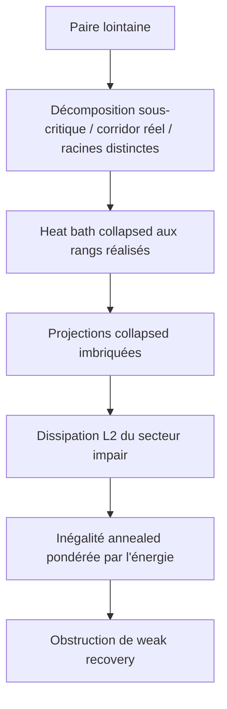

# Swendsen--Wang hiérarchique et weak recovery

Ce dossier développe une généralisation hiérarchique du couplage de
Swendsen--Wang par horloges exponentielles. Le but est d'obtenir des
obstructions de weak recovery plus fortes que la seule borne de percolation
du chapitre 11. Le point

```math
p=\frac45.
```

est le pré-certificat naturel. Les jalons $`p_0=0.805`$ et $`p_1=0.809`$ ont
été dépassés par le certificat rationnel exact $`p_2=0.809439`$. L'[audit à
froid](29_AUDIT_FROID_PIVOT_RANGS_REELS.md) donne la stratégie hiérarchique
actuelle et corrige les feuilles de route antérieures.

> [!IMPORTANT]
> **Piste hiérarchique sous probation.** Suivre une paire $`i,j`$
> macroscopiquement éloignée
> sur son corridor hiérarchique réel, puis rééchantillonner ce corridor par
> heat bath collapsed. Les fusions multiports doivent rester à leurs rangs
> réalisés. Un contre-exemple exact montre que les criticaliser n'est pas une
> domination de Blackwell, même à squelette et tailles fixés. Un second no-go
> montre que l'état fidèle donne un déficit Feynman--Kac local nul. La voie
> active mesure donc directement la dissipation $`L^2`$ du secteur impair
> sous des projections collapsed imbriquées. Le diagnostic exact $`L=4`$
> montre toutefois une dissipation concentrée dans une queue rare : une seule
> cellule à deux updates a confirmé que le mécanisme existe, mais sa marge
> uniforme s'annule sur les potentiels de bord. L'audit non sélectionné de
> 302 cellules confirme cette concentration, mais découvre que les cellules
> dans $`|q-q_c|\le0.02`$ portent $`34.1\%`$ de la perte pour seulement
> $`4.13\%`$ de l'énergie entrante. La voie large est abandonnée ; seule une
> route étroite par cellules critiques énergétiquement actives reste ouverte.

> [!NOTE]
> **Borne rationnelle établie.** Indépendamment de la hiérarchie, le canal
> triangulaire multi-état du fichier 11 donne un certificat less-noisy exact
> à $`p=0.809439`$ avec
> $`(a,s,e)=(166642280,55571811,166642287)/(5\times10^8)`$. Quatre certificats de
> Sturm, la dominance diagonale, information-percolation et Chayes--Lei
> donnent $`p_{\mathrm{WR}}\ge0.809439`$. Cette borne ne doit pas être présentée
> comme un succès de la dynamique hiérarchique.

**Commencer ici :**
[programme prioritaire](00_RESEARCH_PROGRAM.md) ·
[feuille de route](05_PROOF_ROADMAP.md) ·
[feuille de route vers une borne strictement supérieure à 0,8](26_FEUILLE_DE_ROUTE_PSTAR.md) ·
[sous-feuille de route à p0 = 0,805](27_SUBROADMAP_CORRIDOR_P0805.md) ·
[premiers résultats à p0 = 0,805](28_FIRST_CORRIDOR_P0805_RESULTS.md) ·
[audit à froid et pivot vers les rangs réels](29_AUDIT_FROID_PIVOT_RANGS_REELS.md) ·
[pivot vers la dissipation L2 du secteur impair](30_PIVOT_DISSIPATION_L2_SECTEUR_IMPAIR.md) ·
[certificat rationnel à p = 0,809](32_CERTIFICAT_RATIONNEL_P809.md) ·
[sous-feuille des cellules critiques](33_SOUS_FEUILLE_ROUTE_CELLULES_CRITIQUES_L2.md) ·
[certificat rationnel à p = 0,809439](34_CERTIFICAT_RATIONNEL_P809439.md) ·
[calculs reproductibles](computations/README.md) ·
[slides du 16 juillet](../../beamer-presentation-reunion-2026-07-16/Presentation_2026-07-16_LouisHauseux_ReunionLouisNahuelKonstantin.pdf)

> [!NOTE]
> Le contre-audit à $`p_0=0.805`$ donne deux décisions. Les petites attaches
> en peigne ont des comptes croissants aux tailles testées, mais borner le
> nombre total de ports est une impasse probable. Une cellule quotient
> T2-Kruskal à facteurs exacts réfute la criticalisation uniforme sous bord
> polarisé. L'état complet rend ensuite le twist mesurable et donne
> $`|U|=K`$, tandis que la projection contractante testée n'est pas
> Markov-fermée. La fermeture locale bornée est donc une impasse probable.
> Le pivot $`L^2`$ conserve les cancellations globales, mais D2 montre
> qu'elles sont dominées par peu de paquets et une queue rare. D1-pop localise
> une part disproportionnée de cette queue près de $`q_c`$ ; c'est un signal
> exploratoire, sans extrapolation en volume. Aucune borne hiérarchique
> nouvelle n'est revendiquée.

## 1. L'idée en une page

### La hiérarchie

Une arête satisfaite par la réplique de référence reçoit une horloge
$`\xi_e\sim\mathrm{Exp}(u_p)`$. Les arêtes sonnées avant $`\beta`$ forment
une partition $`\Pi_\beta`$. Chaque fusion de deux clusters
$`C_1,C_2`$ crée un nœud $`u`$ de niveau $`\beta_u`$.

La dynamique ne regarde pas seulement l'arête gagnante. Elle utilise toute
la coupe physique

```math
E_u
=
\{\{x,y\}\in E:x\in C_1,\ y\in C_2\}.
\qquad\text{(1.1)}
```

Au nœud $`u`$, les deux enfants peuvent être conservés ou retournés. Leurs
quatre poids contiennent le nœud courant et tous ses ancêtres :

```math
q_u^{ab}
\propto
\mu_0(\sigma^{ab})
\prod_{v\succeq u}
\Lambda_v(\sigma^{ab})
e^{(1-\beta_v)\Lambda_v(\sigma^{ab})}.
\qquad\text{(1.2)}
```

La difficulté centrale est donc d'estimer les quatre
$`\Lambda_v^{ab}`$ pour $`v\succ u`$, avec leur géométrie d'incidence et
leurs messages de bord.

### L'oracle critique comme benchmark

Pour $`\beta_{ij}`$ le niveau du LCA, l'expérience canonique est

```math
\mathcal F_{L,\rho,\varepsilon}
=
\left\{
d_L(i,j)\ge\rho L,
\ \beta_c-\varepsilon
\le\beta_{ij}\le\beta_c
\right\}.
\qquad\text{(1.3)}
```

Elle représente deux points lointains qui se retrouvent dans la même
composante critique aussi tôt que la percolation macroscopique le permet.
Cet événement est un benchmark utile pour tester un bloc ; ce n'est
pas une description typique du LCA ponctuel des paires connectées à
$`\beta=1`$, qui peuvent avoir des attaches tardives.

Les faits utilisables sont plus restreints :

- les fusions uniformément sous-critiques d'une paire lointaine ont une masse
  asymptotiquement nulle ;
- les racines encore distinctes à $`\beta=1`$ sont effacées exactement ;
- pour un bucket **scalaire** dont toutes les arêtes codent le même bit,
  déplacer le niveau vers $`\beta_c`$ améliore le canal au sens de Blackwell ;
- cette monotonie est fausse pour une fusion multiport dont les relations
  varient séparément sous les flips descendants ;
- remplacer aussi la géométrie réelle par une géométrie critique est établi
  sur le cactus et reste ouvert sur la grille.

> [!NOTE]
> En volume infini, la percolation critique bidimensionnelle n'a pas de
> composante infinie de densité positive. Ici, « composante géante au seuil »
> signifie une composante critique macroscopique ou traversante sur le tore
> fini.

### Pourquoi parcourir toute la hiérarchie

Le LCA seul est très favorable à la conservation de la parité, surtout si sa
coupe est grande. Descendre jusqu'aux feuilles introduit des occasions
répétées de contraction. Le heat bath collapsed du corridor est la dynamique
prioritaire parce qu'il est au plus persistant en $`L^2`$ que tout sweep des
mêmes nœuds.



## 2. Les quantités à retenir

### Qualité d'une arête de frontière

Conditionnellement à la partition complète au temps $`\beta`$, les marques
des arêtes de frontière sont indépendantes et

```math
s_p(\beta)
=
\frac{pe^{-u_p\beta}}{1-p+pe^{-u_p\beta}},
\qquad
h_p(\beta)
=
2s_p(\beta)-1.
\qquad\text{(2.1)}
```

Les arêtes vraies déjà ouvertes sont internes aux clusters, mais cela ne
modifie pas le paramètre résiduel d'une frontière une fois la partition
fixée.

### Charge géométrique d'une coupe

Pour une coupe instantanée de taille $`m`$,

```math
\boxed{
\mathcal J=m h_p(\beta)^2.
}
\qquad\text{(2.2)}
```

La coupe perd son information si $`\mathcal J\to0`$ et devient presque
parfaite si $`\mathcal J\to\infty`$. Il n'existe donc pas de seuil universel
en $`\beta`$ sans estimation de la taille géométrique $`m`$.

### Correction de la fusion

Une coupe qui fusionne possède une arête gagnante conforme :

```math
K\mid X=+1
\sim
1+\mathrm{Bin}(m-1,s_p(\beta)).
\qquad\text{(2.3)}
```

À la censure $`\beta=1`$, sa fiabilité locale vaut exactement $`1/m`$. En
particulier, $`m=1`$ est un canal parfait, pas un bloc contractant.

### Biais LCA-Palm

Le LCA d'une paire lointaine ne voit pas une coupe typique. Pour une paire
fixée avant la course de Kruskal, l'intensité pré-saut est repondérée par

```math
\boxed{
m(A,B)N_\rho(A,B),
}
\qquad\text{(2.4)}
```

où $`N_\rho(A,B)`$ compte les paires lointaines séparées par les deux
enfants. Une fois le nœud de fusion déjà réalisé, la taille $`m`$ a été
absorbée par la course et la Palm d'événement utilise $`N_\rho`$ seulement.

## 3. Résultats établis

| résultat | statut | note |
|---|---|---|
| mesure jointe du dendrogramme non marqué et heat baths exacts | établi en volume fini | [01](01_MATHEMATICAL_FRAMEWORK.md) |
| critère pairwise $`L^2`$ impliquant l'absence de weak recovery | établi | [03](03_HIERARCHICAL_WEAK_RECOVERY.md), [20](20_COLLAPSED_CORRIDOR_BLACKWELL.md) |
| calcul des quatre taux ancestraux et décomposition par incidences | établi | [08](08_ANCESTRAL_LAMBDA_CHAIN.md), [10](10_ANCESTRAL_LAMBDA_ESTIMATION.md) |
| localisation critique du LCA sous l'événement macroscopique favorable | établie sous les hypothèses indiquées | [12](12_FAVORABLE_HIERARCHICAL_REDUCTION.md), [14](14_CRITICAL_COMPONENT_BOUNDARY.md) |
| loi conditionnelle exacte des frontières | établie | [14](14_CRITICAL_COMPONENT_BOUNDARY.md), [25](25_GEOMETRY_CONDITIONED_CUT_INFORMATION.md) |
| canal de fusion, correction gagnante et fenêtre $`m h^2`$ | établis | [09](09_CRITICAL_MERGER_ORACLE.md), [25](25_GEOMETRY_CONDITIONED_CUT_INFORMATION.md) |
| ordre de Blackwell critique/tardif pour un bucket mono-bit | établi | [19](19_FAVORABLE_SWEEP_PROJECTIONS.md) |
| tensorisation dans le surrogate produit mono-bit | établie abstraitement, non applicable au corridor multiport général | [20](20_COLLAPSED_CORRIDOR_BLACKWELL.md), [29](29_AUDIT_FROID_PIVOT_RANGS_REELS.md) |
| non-domination multiport et inversion sous bord polarisé | contre-exemples exacts | [29](29_AUDIT_FROID_PIVOT_RANGS_REELS.md), [calculs](computations/README.md) |
| corridor complet au plus persistant que le LCA seul | établi | [22](22_LCA_VS_FULL_HIERARCHY.md) |
| perte exponentielle sur un cactus triangulaire LCA-Palm | établie exactement | [21](21_CACTUS_COLLAPSED_CERTIFICATE.md) |
| obstruction par une abondance de blocs screenés contractants | conditionnelle | [23](23_OPTIMAL_WEAK_RECOVERY_OBSTRUCTION.md), [24](24_SIMPLE_RESIDUAL_BALANCE_OBSTRUCTION.md) |
| conventions Campbell $`mN_\rho`$ pré-saut / $`N_\rho`$ événement réalisé | établies et contre-auditées | [27](27_SUBROADMAP_CORRIDOR_P0805.md), [28](28_FIRST_CORRIDOR_P0805_RESULTS.md) |
| secteur $`\chi\otimes\chi`$ E1+ neutre à $`p=0.805`$, coefficient inférieur à $`0.3`$ | certifié sur la cellule finie seulement | [28](28_FIRST_CORRIDOR_P0805_RESULTS.md) |
| transformé de Doob rétrograde et domination de Feynman--Kac pour des transferts non normalisés | établis en dimension finie | [29](29_AUDIT_FROID_PIVOT_RANGS_REELS.md), [calculs](computations/README.md) |
| croissance du proxy de petites coupes sur le corridor réel | diagnostic fini, sans screening | [28](28_FIRST_CORRIDOR_P0805_RESULTS.md) |
| coexistence rang réel, petite attache et message ancestral modéré | diagnostic fini sur les mêmes nœuds, sans déficit | [29](29_AUDIT_FROID_PIVOT_RANGS_REELS.md), [calculs](computations/README.md) |
| déficit nul lorsque l'état complet rend le twist mesurable | no-go exact en un update | [29](29_AUDIT_FROID_PIVOT_RANGS_REELS.md), [calculs](computations/README.md) |
| dernière incidence globale presque toujours à la racine aux tailles testées | diagnostic fini conservateur, sans extrapolation | [29](29_AUDIT_FROID_PIVOT_RANGS_REELS.md), [calculs](computations/README.md) |
| identité pythagoricienne et critère annealed de dissipation du secteur impair | établis en volume fini ; borne multiscalaire ouverte | [30](30_PIVOT_DISSIPATION_L2_SECTEUR_IMPAIR.md) |
| projections collapsed imbriquées sur le tore $`L=4`$ à $`p=0.805`$ | diagnostic exact ; dissipation dominée par environ un niveau effectif | [30](30_PIVOT_DISSIPATION_L2_SECTEUR_IMPAIR.md), [calculs](computations/README.md) |
| cellule D1 à deux projections sur potentiels atteints | mécanisme exact non vide sur un witness ; marge globale nulle au bord | [30](30_PIVOT_DISSIPATION_L2_SECTEUR_IMPAIR.md), [calculs](computations/README.md) |
| population D1 de paires non sélectionnées | diagnostic $`L=4`$ ; queue rare mais enrichissement critique d'environ un facteur huit | [30](30_PIVOT_DISSIPATION_L2_SECTEUR_IMPAIR.md), [33](33_SOUS_FEUILLE_ROUTE_CELLULES_CRITIQUES_L2.md) |
| canal rationnel P809439 à $`p=0.809439`$ | less-noisy exact pour tous les a priori, marge $`\mathrm{Var}/(5\times10^7)`$ ; borne $`p_{\mathrm{WR}}\ge0.809439`$ | [11](11_TRIANGLE_BLOCK_SDPI.md), [34](34_CERTIFICAT_RATIONNEL_P809439.md) |

## 4. Verrous prioritaires

1. **Borne rationnelle, fermée à $`p=0.809439`$.** Conserver le certificat exact,
   la preuve globale et leurs tests comme nouvelle baseline. Le point tangent
   $`0.809909\ldots`$ reste ouvert et ne doit pas être confondu avec cette
   borne.
2. **Cellule critique pondérée.** L'audit de population est effectué. Dériver
   la formule locale de variance et certifier une marge sur une famille
   near-critical blindée, sous la mesure inclinée par l'énergie.
3. **Occupation sur plusieurs échelles.** Ne réactiver les annuli que pour
   démontrer un nombre divergent de cellules critiques actives ; les annuli
   génériques restent gelés.
4. **Dernier contre-test local.** Ne reprendre T2/Feynman--Kac que si une
   compression spéciale Markov-fermée des potentiels atteignables apparaît.

À $`p=0.8`$,

```math
h_c=0.387164445505\ldots,
\qquad
\mathcal J_{m,\beta_c}
=
0.149896307863\ldots\,m.
\qquad\text{(4.1)}
```

Une grande coupe critique est donc très informative. L'obstruction doit
exploiter la profondeur du corridor et non le seul bucket du LCA.

## 5. Organisation du dossier

### À lire en premier

| fichier | rôle |
|---|---|
| [00_RESEARCH_PROGRAM.md](00_RESEARCH_PROGRAM.md) | programme canonique, lemmes et priorités |
| [01_MATHEMATICAL_FRAMEWORK.md](01_MATHEMATICAL_FRAMEWORK.md) | mesure jointe et dynamique exacte |
| [03_HIERARCHICAL_WEAK_RECOVERY.md](03_HIERARCHICAL_WEAK_RECOVERY.md) | lien avec la weak recovery |
| [25_GEOMETRY_CONDITIONED_CUT_INFORMATION.md](25_GEOMETRY_CONDITIONED_CUT_INFORMATION.md) | coupes, charge et Palm géométrique |
| [05_PROOF_ROADMAP.md](05_PROOF_ROADMAP.md) | dépendances techniques de la preuve |
| [27_SUBROADMAP_CORRIDOR_P0805.md](27_SUBROADMAP_CORRIDOR_P0805.md) | chantier falsifiable et portes go/no-go à $`p_0=0.805`$ |
| [28_FIRST_CORRIDOR_P0805_RESULTS.md](28_FIRST_CORRIDOR_P0805_RESULTS.md) | résultats Palm, cellule E1+ et ordre de travail révisé |
| [29_AUDIT_FROID_PIVOT_RANGS_REELS.md](29_AUDIT_FROID_PIVOT_RANGS_REELS.md) | double no-go et verdict stratégique |
| [30_PIVOT_DISSIPATION_L2_SECTEUR_IMPAIR.md](30_PIVOT_DISSIPATION_L2_SECTEUR_IMPAIR.md) | voie prioritaire par projections collapsed et dissipation $`L^2`$ |
| [31_CERTIFICAT_RATIONNEL_A0.md](31_CERTIFICAT_RATIONNEL_A0.md) | certificat less-noisy rationnel exact au point A0 |
| [32_CERTIFICAT_RATIONNEL_P809.md](32_CERTIFICAT_RATIONNEL_P809.md) | certificat renforcé et borne globale $`p_{\mathrm{WR}}\ge0.809`$ |
| [33_SOUS_FEUILLE_ROUTE_CELLULES_CRITIQUES_L2.md](33_SOUS_FEUILLE_ROUTE_CELLULES_CRITIQUES_L2.md) | dernière voie hiérarchique plausible, centrée sur la fenêtre critique |
| [34_CERTIFICAT_RATIONNEL_P809439.md](34_CERTIFICAT_RATIONNEL_P809439.md) | meilleure borne rationnelle du dossier : $`p_{\mathrm{WR}}\ge0.809439`$ |

### Voie active

| fichiers | contenu |
|---|---|
| [08](08_ANCESTRAL_LAMBDA_CHAIN.md), [10](10_ANCESTRAL_LAMBDA_ESTIMATION.md), [14](14_CRITICAL_COMPONENT_BOUNDARY.md) | $`\Lambda_v`$ ancestraux et frontières |
| [18](18_CRITICAL_PALM_REPLICATED_TRANSFER.md), [19](19_FAVORABLE_SWEEP_PROJECTIONS.md), [20](20_COLLAPSED_CORRIDOR_BLACKWELL.md) | Palm, projections et corridor collapsed |
| [21](21_CACTUS_COLLAPSED_CERTIFICATE.md), [22](22_LCA_VS_FULL_HIERARCHY.md) | certificat cactus et profondeur optimale |
| [23](23_OPTIMAL_WEAK_RECOVERY_OBSTRUCTION.md), [24](24_SIMPLE_RESIDUAL_BALANCE_OBSTRUCTION.md), [25](25_GEOMETRY_CONDITIONED_CUT_INFORMATION.md) | stratégie d'obstruction et réduction géométrique |
| [29](29_AUDIT_FROID_PIVOT_RANGS_REELS.md), [30](30_PIVOT_DISSIPATION_L2_SECTEUR_IMPAIR.md), [33](33_SOUS_FEUILLE_ROUTE_CELLULES_CRITIQUES_L2.md) | no-go du transfert local borné, pivot opératoriel et programme critique resserré |

### Fondations et calculs locaux

- [02](02_CHAPTER_11_BASELINE.md) : théorème du chapitre 11 ;
- [04](04_TRIANGULAR_GSBM.md) : géométrie triangulaire ;
- [06](06_LCA_SPIN_CORRELATION.md), [07](07_CRITICAL_BAND_CRITERION.md),
  [09](09_CRITICAL_MERGER_ORACLE.md) : oracles LCA ;
- [12](12_FAVORABLE_HIERARCHICAL_REDUCTION.md),
  [15](15_CRITICAL_GIANT_PAIR_FLIP.md),
  [16](16_FLIP_PROBABILITIES_DESCENDANT_PATH.md) : réduction favorable et
  flips descendants.

### Audits secondaires conservés

- [11](11_TRIANGLE_BLOCK_SDPI.md) : canal de triangle isolé ;
- [13](13_NISHIMORI_HIERARCHICAL_CLOCKS.md) : calibration Nishimori ;
- [17](17_PATH_DECORRELATION_THRESHOLD.md) : oracle de chemin factorisé ;
- [LITERATURE.md](LITERATURE.md) : littérature primaire et limites de
  transfert.

Ces notes restent disponibles comme contre-audits, mais ne déterminent plus
l'ordre du programme.

## 6. Reproductibilité

Depuis la racine du dépôt :

```bash
python3 .agents/check_math.py
python3 .agents/check_markdown_links.py
python3 -m unittest discover \
  -s research/hierarchical-swendsen-wang/computations \
  -p 'test_*.py'
python3 -m compileall -q \
  research/hierarchical-swendsen-wang/computations
```

Les scripts sont décrits dans
[computations/README.md](computations/README.md). Toute nouvelle formule
difficile doit être contre-auditée par une seconde représentation, une
énumération indépendante ou un certificat d'intervalles.

## 7. Statut honnête

> [!WARNING]
> Le dossier ne prouve pas encore l'impossibilité à $`p=0.8`$ ni le seuil de
> Nishimori--Ohzeki. Il établit le lemme scalaire, réfute sa généralisation
> multiport, conserve le critère pairwise et un certificat cactus exact, puis
> formule une feuille de route falsifiable aux rangs réels.

Les résultats sont étiquetés **établi**, **conditionnel**, **diagnostic** ou
**conjecture**. Aucune conclusion conditionnelle n'est utilisée comme un fait
global.
