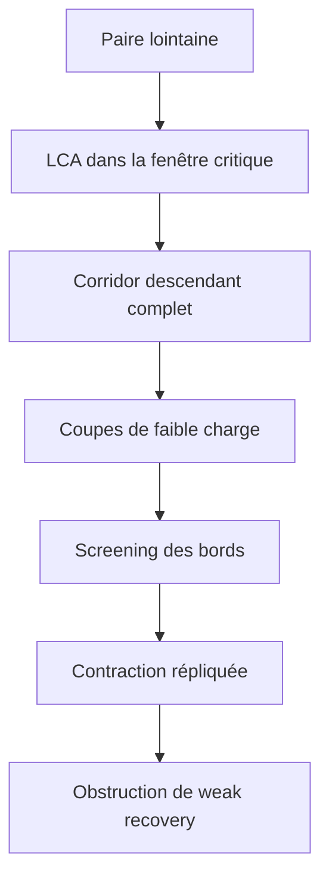

# Swendsen--Wang hiérarchique et weak recovery

Ce dossier développe une généralisation hiérarchique du couplage de
Swendsen--Wang par horloges exponentielles. Le but est d'obtenir des
obstructions de weak recovery plus fortes que la seule borne de percolation
du chapitre 11, d'abord sur le GSBM binaire homogène triangulaire au point

```math
p=\frac45.
```

> [!IMPORTANT]
> **Piste prioritaire.** Suivre une paire $`i,j`$ macroscopiquement éloignée
> dont le LCA apparaît juste à la percolation, puis rééchantillonner tout son
> corridor hiérarchique. À squelette fixé, cette expérience critique est
> rigoureusement la plus favorable parmi les expériences postcritiques. La
> domination de la géométrie critique complète reste ouverte sur la grille.

**Commencer ici :**
[programme prioritaire](00_RESEARCH_PROGRAM.md) ·
[feuille de route](05_PROOF_ROADMAP.md) ·
[calculs reproductibles](computations/README.md) ·
[slides du 16 juillet](../../beamer-presentation-reunion-2026-07-16/Presentation_2026-07-16_LouisHauseux_ReunionLouisNahuelKonstantin.pdf)

## 1. L'idée en une page

### La hiérarchie

Une arête satisfaite par la réplique de référence reçoit une horloge
$`\xi_e\sim\mathrm{Exp}(u_p)`$. Les arêtes sonnées avant $`\beta`$ forment
une partition $`\Pi_\beta`$. Chaque fusion de deux clusters
$`C_1,C_2`$ crée un nœud $`u`$ de niveau $`\beta_u`$.

La dynamique ne regarde pas seulement l'arête gagnante. Elle utilise toute
la coupe physique

```math
E_u
=
\{\{x,y\}\in E:x\in C_1,\ y\in C_2\}.
\tag{1.1}
```

Au nœud $`u`$, les deux enfants peuvent être conservés ou retournés. Leurs
quatre poids contiennent le nœud courant et tous ses ancêtres :

```math
q_u^{ab}
\propto
\mu_0(\sigma^{ab})
\prod_{v\succeq u}
\Lambda_v(\sigma^{ab})
e^{(1-\beta_v)\Lambda_v(\sigma^{ab})}.
\tag{1.2}
```

La difficulté centrale est donc d'estimer les quatre
$`\Lambda_v^{ab}`$ pour $`v\succ u`$, avec leur géométrie d'incidence et
leurs messages de bord.

### La paire lointaine favorable

Pour $`\beta_{ij}`$ le niveau du LCA, l'expérience canonique est

```math
\mathcal F_{L,\rho,\varepsilon}
=
\left\{
d_L(i,j)\ge\rho L,
\ \beta_c-\varepsilon
\le\beta_{ij}\le\beta_c
\right\}.
\tag{1.3}
```

Elle représente deux points lointains qui se retrouvent dans la même
composante critique aussi tôt que la percolation macroscopique le permet.

Le mot « favorable » possède un statut précis :

- les fusions uniformément sous-critiques d'une paire lointaine ont une masse
  asymptotiquement nulle ;
- les racines encore distinctes à $`\beta=1`$ sont effacées exactement ;
- à tailles, incidences et états de bord fixés, déplacer toute fusion
  postcritique vers $`\beta_c`$ améliore le canal au sens de Blackwell ;
- remplacer aussi la géométrie réelle par une géométrie critique est établi
  sur le cactus et reste ouvert sur la grille.

> [!NOTE]
> En volume infini, la percolation critique bidimensionnelle n'a pas de
> composante infinie de densité positive. Ici, « composante géante au seuil »
> signifie une composante critique macroscopique ou traversante sur le tore
> fini.

### Pourquoi parcourir toute la hiérarchie

Le LCA seul est très favorable à la conservation de la parité, surtout si sa
coupe est grande. Descendre jusqu'aux feuilles introduit des occasions
répétées de contraction. Le heat bath collapsed du corridor est la dynamique
prioritaire parce qu'il est au plus persistant en $`L^2`$ que tout sweep des
mêmes nœuds.



## 2. Les quantités à retenir

### Qualité d'une arête de frontière

Conditionnellement à la partition complète au temps $`\beta`$, les marques
des arêtes de frontière sont indépendantes et

```math
s_p(\beta)
=
\frac{pe^{-u_p\beta}}{1-p+pe^{-u_p\beta}},
\qquad
h_p(\beta)
=
2s_p(\beta)-1.
\tag{2.1}
```

Les arêtes vraies déjà ouvertes sont internes aux clusters, mais cela ne
modifie pas le paramètre résiduel d'une frontière une fois la partition
fixée.

### Charge géométrique d'une coupe

Pour une coupe instantanée de taille $`m`$,

```math
\boxed{
\mathcal J=m h_p(\beta)^2.
}
\tag{2.2}
```

La coupe perd son information si $`\mathcal J\to0`$ et devient presque
parfaite si $`\mathcal J\to\infty`$. Il n'existe donc pas de seuil universel
en $`\beta`$ sans estimation de la taille géométrique $`m`$.

### Correction de la fusion

Une coupe qui fusionne possède une arête gagnante conforme :

```math
K\mid X=+1
\sim
1+\mathrm{Bin}(m-1,s_p(\beta)).
\tag{2.3}
```

À la censure $`\beta=1`$, sa fiabilité locale vaut exactement $`1/m`$. En
particulier, $`m=1`$ est un canal parfait, pas un bloc contractant.

### Biais LCA-Palm

Le LCA d'une paire lointaine ne voit pas une coupe typique. À niveau fixé, la
loi de la coupe est repondérée par

```math
\boxed{
m(A,B)N_\rho(A,B),
}
\tag{2.4}
```

où $`N_\rho(A,B)`$ compte les paires lointaines séparées par les deux
enfants. Toute analyse géométrique doit inclure ce facteur.

## 3. Résultats établis

| résultat | statut | note |
|---|---|---|
| mesure jointe du dendrogramme non marqué et heat baths exacts | établi en volume fini | [01](01_MATHEMATICAL_FRAMEWORK.md) |
| critère pairwise $`L^2`$ impliquant l'absence de weak recovery | établi | [03](03_HIERARCHICAL_WEAK_RECOVERY.md), [20](20_COLLAPSED_CORRIDOR_BLACKWELL.md) |
| calcul des quatre taux ancestraux et décomposition par incidences | établi | [08](08_ANCESTRAL_LAMBDA_CHAIN.md), [10](10_ANCESTRAL_LAMBDA_ESTIMATION.md) |
| localisation critique des LCA lointains, à fenêtre fixe | établie | [12](12_FAVORABLE_HIERARCHICAL_REDUCTION.md), [14](14_CRITICAL_COMPONENT_BOUNDARY.md) |
| loi conditionnelle exacte des frontières | établie | [14](14_CRITICAL_COMPONENT_BOUNDARY.md), [25](25_GEOMETRY_CONDITIONED_CUT_INFORMATION.md) |
| canal de fusion, correction gagnante et fenêtre $`m h^2`$ | établis | [09](09_CRITICAL_MERGER_ORACLE.md), [25](25_GEOMETRY_CONDITIONED_CUT_INFORMATION.md) |
| ordre de Blackwell critique/tardif à taille fixée | établi | [19](19_FAVORABLE_SWEEP_PROJECTIONS.md) |
| tensorisation sur un corridor fixé avec parités corrélées | établie | [20](20_COLLAPSED_CORRIDOR_BLACKWELL.md) |
| corridor complet au plus persistant que le LCA seul | établi | [22](22_LCA_VS_FULL_HIERARCHY.md) |
| perte exponentielle sur un cactus triangulaire LCA-Palm | établie exactement | [21](21_CACTUS_COLLAPSED_CERTIFICATE.md) |
| obstruction par une abondance de blocs screenés contractants | conditionnelle | [23](23_OPTIMAL_WEAK_RECOVERY_OBSTRUCTION.md), [24](24_SIMPLE_RESIDUAL_BALANCE_OBSTRUCTION.md) |

## 4. Verrous prioritaires

1. **Géométrie Palm.** Déterminer la loi jointe de
   $`(m_v,\beta_v,Z_v,B_v)`$ le long du corridor critique, avec la
   repondération $`m_vN_\rho`$.
2. **$`\Lambda_v`$ ancestraux.** Contrôler les trois groupes d'incidence et
   le message extérieur dans la non-linéarité
   $`F_v(x)=xe^{(1-\beta_v)x}`$.
3. **Screening.** Extraire un nombre divergent de coupes ou blocs dont les
   routes latérales sont neutralisées.
4. **Composition.** Prouver que leurs coefficients répliqués se composent
   jusqu'à donner un second moment pairwise nul.
5. **Porte postcritique.** Uniformiser le résultat sur les corridors réels
   criticalisés ou démontrer la domination géométrique favorable.

À $`p=0.8`$,

```math
h_c=0.387164445505\ldots,
\qquad
\mathcal J_{m,\beta_c}
=
0.149896307863\ldots\,m.
\tag{4.1}
```

Une grande coupe critique est donc très informative. L'obstruction doit
exploiter la profondeur du corridor et non le seul bucket du LCA.

## 5. Organisation du dossier

### À lire en premier

| fichier | rôle |
|---|---|
| [00_RESEARCH_PROGRAM.md](00_RESEARCH_PROGRAM.md) | programme canonique, lemmes et priorités |
| [01_MATHEMATICAL_FRAMEWORK.md](01_MATHEMATICAL_FRAMEWORK.md) | mesure jointe et dynamique exacte |
| [03_HIERARCHICAL_WEAK_RECOVERY.md](03_HIERARCHICAL_WEAK_RECOVERY.md) | lien avec la weak recovery |
| [25_GEOMETRY_CONDITIONED_CUT_INFORMATION.md](25_GEOMETRY_CONDITIONED_CUT_INFORMATION.md) | coupes, charge et Palm géométrique |
| [05_PROOF_ROADMAP.md](05_PROOF_ROADMAP.md) | dépendances techniques de la preuve |

### Voie active

| fichiers | contenu |
|---|---|
| [08](08_ANCESTRAL_LAMBDA_CHAIN.md), [10](10_ANCESTRAL_LAMBDA_ESTIMATION.md), [14](14_CRITICAL_COMPONENT_BOUNDARY.md) | $`\Lambda_v`$ ancestraux et frontières |
| [18](18_CRITICAL_PALM_REPLICATED_TRANSFER.md), [19](19_FAVORABLE_SWEEP_PROJECTIONS.md), [20](20_COLLAPSED_CORRIDOR_BLACKWELL.md) | Palm, projections et corridor collapsed |
| [21](21_CACTUS_COLLAPSED_CERTIFICATE.md), [22](22_LCA_VS_FULL_HIERARCHY.md) | certificat cactus et profondeur optimale |
| [23](23_OPTIMAL_WEAK_RECOVERY_OBSTRUCTION.md), [24](24_SIMPLE_RESIDUAL_BALANCE_OBSTRUCTION.md), [25](25_GEOMETRY_CONDITIONED_CUT_INFORMATION.md) | stratégie d'obstruction et réduction géométrique |

### Fondations et calculs locaux

- [02](02_CHAPTER_11_BASELINE.md) : théorème du chapitre 11 ;
- [04](04_TRIANGULAR_GSBM.md) : géométrie triangulaire ;
- [06](06_LCA_SPIN_CORRELATION.md), [07](07_CRITICAL_BAND_CRITERION.md),
  [09](09_CRITICAL_MERGER_ORACLE.md) : oracles LCA ;
- [12](12_FAVORABLE_HIERARCHICAL_REDUCTION.md),
  [15](15_CRITICAL_GIANT_PAIR_FLIP.md),
  [16](16_FLIP_PROBABILITIES_DESCENDANT_PATH.md) : réduction favorable et
  flips descendants.

### Audits secondaires conservés

- [11](11_TRIANGLE_BLOCK_SDPI.md) : canal de triangle isolé ;
- [13](13_NISHIMORI_HIERARCHICAL_CLOCKS.md) : calibration Nishimori ;
- [17](17_PATH_DECORRELATION_THRESHOLD.md) : oracle de chemin factorisé ;
- [LITERATURE.md](LITERATURE.md) : littérature primaire et limites de
  transfert.

Ces notes restent disponibles comme contre-audits, mais ne déterminent plus
l'ordre du programme.

## 6. Reproductibilité

Depuis la racine du dépôt :

```bash
python3 .agents/check_math.py
python3 .agents/check_markdown_links.py
python3 -m unittest discover \
  -s research/hierarchical-swendsen-wang/computations \
  -p 'test_*.py'
python3 -m compileall -q \
  research/hierarchical-swendsen-wang/computations
```

Les scripts sont décrits dans
[computations/README.md](computations/README.md). Toute nouvelle formule
difficile doit être contre-auditée par une seconde représentation, une
énumération indépendante ou un certificat d'intervalles.

## 7. Statut honnête

> [!WARNING]
> Le dossier ne prouve pas encore l'impossibilité à $`p=0.8`$ ni le seuil de
> Nishimori--Ohzeki. Il établit les canaux locaux, la criticalisation à
> squelette fixé, le critère pairwise, un certificat cactus exact et une
> feuille de route falsifiable pour la grille triangulaire.

Les résultats sont étiquetés **établi**, **conditionnel**, **diagnostic** ou
**conjecture**. Aucune conclusion conditionnelle n'est utilisée comme un fait
global.
