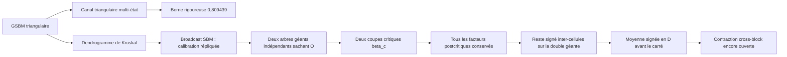

# Weak recovery et dynamique hiérarchique

Ce projet étudie le GSBM binaire homogène sur la grille triangulaire. Son
objectif est de transformer une dynamique de clusters hiérarchique en une
obstruction rigoureuse de weak recovery.

> [!IMPORTANT]
> **Ce qui est déjà prouvé.** Le dépôt établit
> $`p_{\mathrm{WR}}\ge0.809439`$ grâce à un canal triangulaire multi-état.
> Cette borne est rigoureuse, mais non hiérarchique.

> [!WARNING]
> **Ce qui reste ouvert.** La dynamique hiérarchique n'a pas encore produit
> de seuil supplémentaire sur la grille triangulaire. Le broadcast SBM
> calibre exactement le bookkeeping à deux répliques et le port global du
> SBM fini est maintenant écrit exactement. Une comparaison perturbative
> uniforme au broadcast est même réfutée à KS par les deux racines ER
> géantes. Sur la grille, le reste signé de la double géante est désormais
> réduit à un carré cross-block positif, après moyenne signée en
> dendrogramme. La cible prioritaire est de factoriser et contracter cet
> opérateur dans un espace commun de ports. À $`L=4,p=0.81`$, le reste
> signé brut est encore positif en moyenne ; aucune nouvelle borne n'est
> prouvée.

Pour une photographie exacte et datée, consulter
[`CURRENT_STATUS.md`](CURRENT_STATUS.md). Pour retrouver une note précise,
utiliser l'[`INDEX.md`](INDEX.md).

## 1. La question en langage simple

Les spins cachés sont $`X_i\in\{-1,+1\}`$. Les observations donnent des
relations locales bruitées entre spins voisins. La weak recovery est possible
si un estimateur conserve un recouvrement macroscopique avec les spins
cachés, à un flip global près.

Une obstruction naturelle consiste à tirer $`I_L`$ et $`J_L`$
indépendamment et uniformément sur le tore. On peut écarter le voisinage
microscopique en conditionnant par $`d(I_L,J_L)\ge r_L`$, avec
$`r_L\to\infty`$ et $`r_L/L\to0`$ : les paires écartées représentent alors
$`o(|V_L|^2)`$ paires. Il suffit de montrer que la parité de la paire restante
devient asymptotiquement imprévisible en moyenne :

```math
\mathbb E\left[
\mathbb E[X_{I_L}X_{J_L}\mid O,I_L,J_L]^2
\right]
\longrightarrow 0.
\qquad\text{(1.1)}
```

Le [critère pairwise](foundations/03_HIERARCHICAL_WEAK_RECOVERY.md) explique
rigoureusement comment une telle décorrélation interdit la weak recovery.

## 2. À quoi sert le dendrogramme ?

Une réplique postérieure sert de référence. Chaque arête satisfaite reçoit
une horloge exponentielle ; les arêtes ouvertes avant le temps $`\beta`$
forment une partition $`\Pi_\beta`$. Quand deux composantes fusionnent, elles
créent un nœud du dendrogramme.

La dynamique interpole entre deux mécanismes familiers :

- près des feuilles, elle rééchantillonne de petites orientations comme une
  dynamique de Glauber ;
- près des racines, elle retourne des composantes entières comme
  Swendsen--Wang ;
- entre les deux, elle utilise le heat bath exact associé au dendrogramme.

Une fusion $`u`$ de deux enfants $`C_1,C_2`$ dépend de toute leur coupe
physique, et pas seulement de l'arête qui a sonné la première :

```math
E_u
=
\{\{x,y\}\in E:x\in C_1,\ y\in C_2\}.
\qquad\text{(2.1)}
```

Les quatre orientations relatives des deux enfants reçoivent des poids qui
intègrent le nœud courant, ses ancêtres et le potentiel extérieur. C'est ce
qui rend la dynamique exacte, mais aussi ce qui interdit une réduction naïve
à des canaux indépendants.

## 3. La séparation essentielle : résultat et programme



### Résultat établi

Le [certificat rationnel P809439](results/non_hierarchical/34_CERTIFICAT_RATIONNEL_P809439.md)
prouve, pour tout $`p\in[1/2,0.809439]`$, que le recouvrement quadratique de
tout estimateur tend vers zéro. Le canal local, les certificats de Sturm et
la fermeture par information-percolation sont tous exacts.

### Programme hiérarchique

Le [pilote SBM](active/37_PILOTE_SBM_GIBBS_HIERARCHIQUE.md) donne le test
décisif. Figer tout le dendrogramme postcritique verrouille les parités sur
ses buckets unitaires et produit le transfert Swendsen--Wang. À l'inverse,
deux Gibbs postérieurs exacts, avec deux hiérarchies indépendantes
conditionnellement à l'observation, ont un Jacobien overlap égal à
$`\theta^2`$ par branche. La densité d'évolution du broadcast retrouve alors
$`d\theta^2=1`$. Cette identité vaut pour toute coupe exactement
marginalisée : elle ne vient pas de $`\beta_c`$. Ce benchmark ne prouve
encore ni le mélange temporel du noyau ni le transfert au graphe SBM, où la
balance ou les non-arêtes constituent un port global. La
[note 39](active/39_PORT_GLOBAL_SBM_RECOVERY.md) écrit exactement ce port et
son élimination par convolution. Elle montre en outre que la comparaison
perturbative uniforme au broadcast est fausse à KS : les racines full-$D$
sont les composantes de deux graphes d'Erdős--Rényi de degré limite
$`d\theta`$, donc deux géantes opposées subsistent lorsque
$`d\theta^2=1`$ et $`0<\theta<1`$. Une approximation locale du port reste
seulement conjecturale dans le régime strictement subcritique
$`d\theta<1`$.

La [cible prioritaire](active/38_DOUBLE_GEANTE_GIBBS_REPLIQUE.md) porte cette
version sans perte sur deux arbres géants triangulaires. Chaque arbre est
coupé à $`\beta_c`$ comme ordre d'élimination, mais son Gibbs conserve tous
les facteurs supérieurs. Les racines finales se factorisent à dendrogramme
fixé ; les sous-arbres d'une même racine ne le font que conditionnellement à
leurs ports. Les intersections hors double géante et les cellules diagonales
ont une masse quadratique négligeable. La
[note 41](active/41_DESINTEGRATION_PALM_RESTE_SIGNE.md) désintègre ensuite
l'énergie **signée** entre cellules distinctes en un carré cross-block
moyenné en dendrogramme. Le verrou restant est opératoriel : transporter les
espaces de ports variables dans des coordonnées communes et prouver une
contraction.

## 4. Du pilote SBM à la double géante

Le niveau de coupe est explicite :

```math
\beta_c(p)
=
-\frac{
\log(1-q_c/p)
}{
\log(p/(1-p))
}.
\qquad\text{(4.1)}
```

La coupe triangulaire appartient au dendrogramme dès
$`p\ge p_{\mathrm{SW}}=(1+q_c)/2`$. La
[note 38](active/38_DOUBLE_GEANTE_GIBBS_REPLIQUE.md) tire deux Gibbs
postérieurs exacts avec deux dendrogrammes complets
$`D^{(1)},D^{(2)}`$, indépendants conditionnellement à l'observation. Si
$`R_{r,\star}`$ est la racine géante de la réplique $r$, l'objet
macroscopique exact est

```math
G_{12}^\star
=
R_{1,\star}\cap R_{2,\star}.
\qquad\text{(4.2)}
```

Chaque arbre est coupé à $`\beta_c`$. Les cellules critiques sont les
intersections $`A_1\cap A_2\cap G_{12}^\star`$, tandis que tous les facteurs
postcritiques restent présents dans chacun des deux Gibbs. La cible pairwise
est l'énergie overlap entre cellules distinctes de la double géante.

La [note 36](active/36_ARBRE_GEANT_GIBBS_CRITIQUE.md) établit encore, pour la
variante diagnostique à un dendrogramme fixé,

```math
Q_L
\le
F_L^{\mathrm{fin}}(p)
+
S_L^c
+
\Xi_L^\star(p),
\qquad\text{(4.3)}
```

où les deux premiers termes sont les masses quadratiques des racines finales
non géantes et des blocs critiques, tandis que

```math
\Xi_L^\star(p)
=
\frac1{n_L^2}
\mathbb E
\sum_{\substack{
i,j\in R_L^\star\\
A(i)\ne A(j)
}}
\pi_D(\sigma_i\sigma_j)^2
\qquad\text{(4.4)}
```

est l'unique terme Gibbs nouveau de cette enveloppe quenched. Partager ce
dendrogramme entre les deux copies produit une borne de Jensen, pas le carré
postérieur exact.

1. **Respecter le no-go SBM fini.** À KS, le port global couple à ordre un
   les deux racines ER géantes ; seule la moyenne signée de deux
   dendrogrammes indépendants peut retrouver le mode overlap.
2. **Utiliser la désintégration exacte.** À observation et endpoints fixés,
   moyenner le transfert cross-block en $D$, puis seulement prendre son
   carré.
3. **Construire l'embedding commun.** Conserver les endpoints physiques,
   les deux systèmes de ports, les rangs réels, les buckets postcritiques et
   les messages extérieurs.
4. **Définir l'opérateur overlap.** Employer la Palm cross--cross positive
   et garder les produits de Jacobiennes signés, sans valeur absolue
   prématurée.
5. **Certifier une contraction inhomogène.** Contrôler les produits
   d'opérateurs sur une profondeur source-free divergente ; un rayon
   spectral scalaire ne suffit pas sans opérateur limite uniforme.
6. **Fermer le régime non linéaire.** Construire ensuite une enveloppe de
   percolation d'information ou une contraction par macroblocs ; employer
   distance–entropie seulement à cette étape.

Le heat bath collectif des seules orientations à la coupe critique est un
diagnostic exact conditionnellement à un dendrogramme. La cible prioritaire
est le Gibbs joint de chaque arbre entier, sans canal intermédiaire
contracté. Le
[programme distance–entropie](active/35_DISTANCE_ENTROPIE_ERGODICITE.md)
reste un moteur possible après le test spectral, pas un substitut à celui-ci.

## 5. Ce qui est établi dans la voie hiérarchique

| brique | statut | référence |
|---|---|---|
| mesure jointe du dendrogramme non marqué et heat baths | établi en volume fini | [01](foundations/01_MATHEMATICAL_FRAMEWORK.md) |
| réduction pairwise de la weak recovery | établie | [03](foundations/03_HIERARCHICAL_WEAK_RECOVERY.md) |
| chaîne ancestrale des taux | établie exactement | [08](foundations/ancestral/08_ANCESTRAL_LAMBDA_CHAIN.md), [10](foundations/ancestral/10_ANCESTRAL_LAMBDA_ESTIMATION.md) |
| loi des marques de frontière et biais de Palm | établie sous les conditionnements annoncés | [14](foundations/ancestral/14_CRITICAL_COMPONENT_BOUNDARY.md), [25](foundations/25_GEOMETRY_CONDITIONED_CUT_INFORMATION.md) |
| projections de heat bath et projection collapsed | établies en volume fini | [19](foundations/19_FAVORABLE_SWEEP_PROJECTIONS.md), [20](foundations/20_COLLAPSED_CORRIDOR_BLACKWELL.md) |
| corridor au plus persistant que le LCA seul | établi | [22](results/hierarchical/22_LCA_VS_FULL_HIERARCHY.md) |
| perte exponentielle sur un cactus triangulaire | établie dans ce modèle | [21](results/hierarchical/21_CACTUS_COLLAPSED_CERTIFICATE.md) |
| identité pythagoricienne de dissipation | établie en volume fini | [30](active/30_PIVOT_DISSIPATION_L2_SECTEUR_IMPAIR.md) |
| factorisation par racines et réduction inter-blocs d'un $D$ fixé | établie en volume fini, diagnostic oracle | [36](active/36_ARBRE_GEANT_GIBBS_CRITIQUE.md) |
| compression du SBM fini en un port global de magnétisation | établie exactement ; approximation perturbative réfutée à KS | [39](active/39_PORT_GLOBAL_SBM_RECOVERY.md) |
| identité à deux Gibbs entiers et réduction au reste inter-cellules signé | établie algébriquement et géométriquement ; contrôle du reste ouvert | [38](active/38_DOUBLE_GEANTE_GIBBS_REPLIQUE.md) |
| désintégration du reste signé et Palm cross--cross | établie en volume fini ; contraction de l'opérateur moyenné ouverte | [41](active/41_DESINTEGRATION_PALM_RESTE_SIGNE.md) |

Ces briques ne composent pas encore une preuve sur la grille triangulaire.

## 6. Trois no-go et quatre avertissements

| raccourci | nature | verdict |
|---|---|---|
| remplacer toutes les fusions par leur version critique | no-go démontré | faux pour une fusion multiport sous bord polarisé |
| garder un état local fini assez riche et obtenir un déficit Feynman--Kac | no-go démontré | l'état fidèle rend le twist mesurable et le déficit nul |
| traiter le port SBM comme une petite correction à KS | no-go démontré | les deux racines ER géantes restent anticorrélées à ordre un |
| accumuler une contraction uniforme sur tous les annuli | diagnostic fini | la dissipation observée se concentre dans une queue rare |
| utiliser seulement le LCA critique | avertissement structurel | sa coupe peut rester grande et informative |
| invoquer seulement Birkhoff | avertissement méthodologique | une fréquence asymptotique ne fournit pas la grande déviation nécessaire sous le tilt énergétique |
| appliquer Kingman à un coût critique linéaire | avertissement d'échelle | l'analogie FPP suggère plutôt une échelle logarithmique ou multiscalaire |

Les deux premiers sont des réfutations exactes démontrées dans
[l'audit aux rangs réels](diagnostics/29_AUDIT_FROID_PIVOT_RANGS_REELS.md) ;
le troisième est démontré dans la
[note SBM finie](active/39_PORT_GLOBAL_SBM_RECOVERY.md).
Les quatre autres sont des diagnostics ou des portes de sécurité : ils
n'interdisent pas à eux seuls une preuve en volume infini.

## 7. Parcours de lecture

### Parcours A — le résultat quantitatif, 30 minutes

1. [Baseline du chapitre 11](foundations/02_CHAPTER_11_BASELINE.md)
2. [Canal triangulaire](results/non_hierarchical/11_TRIANGLE_BLOCK_SDPI.md)
3. [Théorème P809439](results/non_hierarchical/34_CERTIFICAT_RATIONNEL_P809439.md)

### Parcours B — la voie hiérarchique, lecture principale

1. [Cadre mathématique](foundations/01_MATHEMATICAL_FRAMEWORK.md)
2. [Critère pairwise](foundations/03_HIERARCHICAL_WEAK_RECOVERY.md)
3. [**Problème central : fusion critique et chaîne des Λ_v**](foundations/ancestral/42_PROBLEME_CENTRAL_FUSION_CRITIQUE.md)
4. [Information des coupes](foundations/25_GEOMETRY_CONDITIONED_CUT_INFORMATION.md)
5. [Projections](foundations/19_FAVORABLE_SWEEP_PROJECTIONS.md)
6. [Corridor collapsed](foundations/20_COLLAPSED_CORRIDOR_BLACKWELL.md)
7. [Audit et no-go](diagnostics/29_AUDIT_FROID_PIVOT_RANGS_REELS.md)
8. [Porte de calibration SBM : seuils par la dynamique](../SBM/07_SEUILS_PAR_LA_DYNAMIQUE.md)
9. [Pilote SBM à deux répliques](active/37_PILOTE_SBM_GIBBS_HIERARCHIQUE.md)
10. [Port global du SBM fini](active/39_PORT_GLOBAL_SBM_RECOVERY.md)
11. [Double géante et Gibbs exact](active/38_DOUBLE_GEANTE_GIBBS_REPLIQUE.md)
12. [Désintégration Palm et carré cross-block](active/41_DESINTEGRATION_PALM_RESTE_SIGNE.md)
13. [Tests spectraux et signés](diagnostics/finite_volume/40_GIBBS_CRITIQUE_RESTE_SIGNE_P081.md)
14. [Diagnostic à un arbre fixé](active/36_ARBRE_GEANT_GIBBS_CRITIQUE.md)
15. [Moteur distance–entropie](active/35_DISTANCE_ENTROPIE_ERGODICITE.md)

### Parcours C — détails avancés

Lire la trilogie ancestrale, précédée de sa préface
[42](foundations/ancestral/42_PROBLEME_CENTRAL_FUSION_CRITIQUE.md) :
[08](foundations/ancestral/08_ANCESTRAL_LAMBDA_CHAIN.md) →
[10](foundations/ancestral/10_ANCESTRAL_LAMBDA_ESTIMATION.md) →
[14](foundations/ancestral/14_CRITICAL_COMPONENT_BOUNDARY.md), puis les
transferts répliqués [18](foundations/18_CRITICAL_PALM_REPLICATED_TRANSFER.md)
et les résultats hiérarchiques [21](results/hierarchical/21_CACTUS_COLLAPSED_CERTIFICATE.md),
[22](results/hierarchical/22_LCA_VS_FULL_HIERARCHY.md).

## 8. Organisation et statuts

- [`foundations/`](foundations/) : définitions, identités et outils durables ;
- [`results/`](results/) : théorèmes prouvés dans leur domaine annoncé ;
- [`active/`](active/) : programme actuellement poursuivi ;
- [`diagnostics/`](diagnostics/) : calculs exploratoires, benchmarks et no-go ;
- [`archive/`](archive/) : anciennes routes conservées pour traçabilité ;
- [`computations/`](computations/) : scripts, certificats et tests ;
- [`references/`](references/) : bibliographie commentée et fichier BibTeX.

L'[`INDEX.md`](INDEX.md) donne le rôle exact des notes numérotées de `00`
à `42`.

## 9. Reproductibilité

Depuis la racine du dépôt :

```bash
python3 .agents/check_math.py
python3 .agents/check_markdown_links.py
python3 -m unittest discover \
  -s research/hierarchical-swendsen-wang/computations \
  -p 'test_*.py'
python3 -m compileall -q \
  research/hierarchical-swendsen-wang/computations
```

Le [guide des calculs](computations/README.md) relie chaque famille de scripts
à l'énoncé qu'elle certifie ou au raccourci qu'elle contre-audite.
