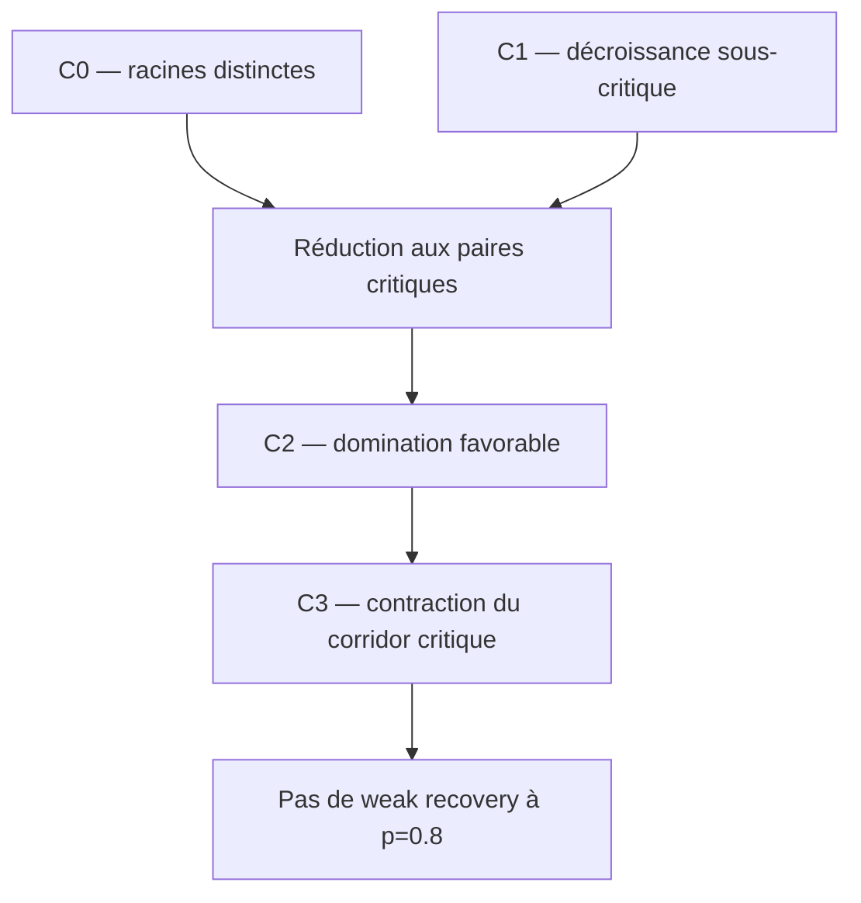

# Swendsen–Wang hiérarchique et weak recovery

Ce dossier étudie un couplage hiérarchique de répliques postérieures construit
avec des horloges exponentielles. L'objectif est de prouver des bornes
d'impossibilité de weak recovery plus fortes que la seule obstruction de
percolation du chapitre 11, d'abord au point cible

```math
p=\frac45=0.8
```

sur le GSBM triangulaire.

La voie privilégiée est désormais précise : **conditionner une paire
lointaine par sa composante critique, remplacer son corridor par un heat bath
conjoint exact, puis montrer que le transfert répliqué perd toute sa
corrélation**.

## 1. L'idée en cinq minutes

### Le modèle

Les spins inconnus sont $`\sigma_i\in\{-1,+1\}`$. Une arête observée est
conforme à la vérité avec probabilité $`p>1/2`$. Si son poids est $`u_p`$,
une arête satisfaite par la configuration courante reçoit une horloge

```math
\xi_e\sim\mathrm{Exp}(u_p),
```

tandis qu'une arête non satisfaite reçoit $`+\infty`$.

### La hiérarchie

À chaque temps $`t`$, on ouvre les arêtes $`\xi_e\le t`$. Kruskal construit
ainsi un dendrogramme de composantes. Un nœud

```math
u:C_1\mathbin{\dot\cup}C_2=C
```

enregistre la fusion de deux clusters au niveau $`\beta_u`$. Pour calculer
les probabilités de flip, on utilise toutes les arêtes de la coupe
$`E_u=C_1\times C_2`$ présentes dans le graphe, pas seulement l'arête
gagnante de Kruskal.

### La dynamique

Au nœud $`u`$, les deux enfants peuvent être conservés ou retournés. Les
quatre poids exacts sont

```math
q_u^{ab}
=
\mu_0(\sigma^{ab})
\prod_{v\succeq u}
\Lambda_v(\sigma^{ab})
e^{(1-\beta_v)\Lambda_v(\sigma^{ab})},
\qquad a,b\in\{0,1\}.
```

La difficulté centrale des slides est bien visible : un flip à $`u`$ change
les taux $`\Lambda_v`$ de **tous les ancêtres** $`v\succ u`$.

Aux deux extrémités :

- une racine finale possède un flip global équitable sous a priori uniforme ;
- une feuille donne le heat bath mono-site de Glauber ;
- un nœud interne est un heat bath exact à quatre états.

### La paire lointaine

Pour $`f_{ij}(\sigma)=\sigma_i\sigma_j`$, un sweep $`S`$ définit une
persistance conditionnelle $`H_S(i,j)`$. Le critère utile n'est pas son seul
premier moment, mais

```math
\mathbb E[H_S(I_L,J_L)^2].
```

Si cette quantité tend vers zéro pour une paire uniforme lointaine, la weak
recovery est impossible.

### Pourquoi le seuil critique est favorable

Une paire qui n'est pas connectée à $`t=1`$ est effacée exactement par les
recolorations indépendantes des racines. Une paire fusionnant bien avant la
percolation a une probabilité sous-critique négligeable d'être lointaine. Il
reste donc à comparer :

1. une paire fusionnant dans la fenêtre gauche de $`\beta_c`$ ;
2. une paire fusionnant après $`\beta_c`$.

À taille de bucket fixée, l'expérience complète au seuil critique domine
toute expérience postcritique au sens de Blackwell. Cette domination se
tensorise sur un corridor fixé, même si ses parités latentes sont corrélées.
Elle ne survit pas à tout changement de taille : à $`p=t=4/5`$, le bucket
critique $`m=4`$ et le bucket tardif $`m=2`$ sont rigoureusement
incomparables. La réduction favorable doit donc coupler la géométrie, pas
seulement avancer les niveaux.

## 2. La dynamique privilégiée

Deux dynamiques sont conservées, avec des rôles différents.

| dynamique | rôle | statut |
|---|---|---|
| Sweep top-down | dynamique séquentielle naturelle ; diagnostic du feedback ancestral | exacte, mais sa comparaison globale reste ouverte |
| Corridor collapsed | heat bath conjoint des orientations sur les deux bras de la paire | exacte et $`L^2`$-optimale parmi les sweeps des mêmes nœuds |

Si $`P_{\mathcal C}`$ est la projection collapsed et
$`K=P_{u_1}\cdots P_{u_M}`$ un sweep du même corridor, alors

```math
\|Kg\|_2^2
=
\|P_{\mathcal C}g\|_2^2
+\|K(I-P_{\mathcal C})g\|_2^2.
```

Le corridor collapsed est donc la meilleure dynamique hiérarchique actuelle
pour obtenir une obstruction pairwise calculable. Le sweep top-down reste le
contre-audit algorithmique principal.

## 3. Arbre de preuve actuel



| certificat | contenu | statut |
|---|---|---|
| C0 | $`\beta_{ij}>1\Rightarrow H(i,j)=0`$ pour top-down et bottom-up | démontré |
| C1 | une paire lointaine ne fusionne pas à distance fixe sous $`q_c-\delta`$ | démontré à fenêtre fixe |
| C2-local | le bucket critique Blackwell-domine tout bucket tardif de même taille | démontré |
| C2-corridor | la domination se tensorise sur un corridor fixé, pour tout prior corrélé des parités | démontré pour le bloc collapsed |
| C2-tailles | remplacer arbitrairement un bucket tardif par un bucket critique d'une autre taille | faux en général ; contre-certificat rationnel |
| C2-géométrie | coupler les corridors Palm critique et postcritique | ouvert |
| C3-bloc | un bucket critique $`m=2`$ screené contracte strictement à $`p=0.8`$ | démontré localement |
| C3-global | extraire un nombre divergent de blocs contractants avec erreur totale $`o(1)`$ | ouvert |
| Globalisation | la disparition du second moment pairwise interdit la weak recovery | démontré |

## 4. Résultats exacts à retenir

### Projection du sweep

À dendrogramme fixé, chaque heat bath est une projection orthogonale et

```math
\mathbb E[H_S(i,j)^2\mid O,D]
=
\|K_Sf_{ij}\|_2^2
=
\langle f_{ij},K_S^*K_Sf_{ij}\rangle.
```

### Loi d'un bucket

Avec $`s=s_p(t)`$ et une taille $`m`$,

```math
K\mid X=+1\ \overset{\mathrm d}=\ 1+\mathrm{Bin}(m-1,s),
\qquad
K\mid X=-1\ \overset{\mathrm d}=\ \mathrm{Bin}(m-1,1-s).
```

Comme $`s_p(t)`$ décroît avec $`t`$, le canal critique est une expérience plus
informative que le canal tardif. Une monotonie réalisation par réalisation
est pourtant fausse : un message ancestral opposé peut annuler presque
exactement le message critique. L'ordre correct est bayésien, pas pointwise.
Il est établi ici à taille fixée ; pour deux tailles différentes, l'ordre de
Blackwell est seulement partiel.

### Séparation critique de la géométrie et du canal

Avec

```math
q_p(t)=p(1-e^{-u_pt}),
```

le rang transformé d'une arête a une densité uniforme en coordonnée $`q`$
jusqu'à la censure. À $`q=q_\triangle`$, la forêt non marquée sous le seuil
est donc celle d'une percolation critique et ne dépend pas de $`p`$ sous la
loi jointe annealed. En revanche, la qualité d'une arête encore fermée vaut

```math
s_c(p)=\frac{p-q_\triangle}{1-q_\triangle}.
```

Cette séparation permet d'étudier une seule géométrie Palm critique, puis de
faire varier $`p`$ dans le canal. Elle ne couvre pas les ancêtres
postcritiques du corridor.

### Tensorisation sur le corridor

Sur un squelette fixé, conditionnellement au vecteur des parités, les comptes
de buckets sont indépendants. Les noyaux de dégradation se tensorisent donc.
Pour toute cible $`F`$ et tout prior corrélé $`\rho`$,

```math
\mathbb E[
\mathbb E(F\mid K^{\mathrm{late}})^2
]
\le
\mathbb E[
\mathbb E(F\mid K^{\mathrm{crit}})^2
].
```

### Premier certificat à $`p=0.8`$

Au seuil critique triangulaire,

```math
s_c(0.8)=0.693582222752\ldots.
```

Pour un bloc $`m=2`$ sans message extérieur, la fiabilité vaut exactement
$`s_c`$. Pour $`N`$ blocs factorisés,

```math
s_c^N=\exp(-0.365885484247\ldots N).
```

Dix blocs donnent déjà $`0.025761997386\ldots`$, quarante blocs
$`4.4047181845\,10^{-7}`$. Le verrou n'est donc plus la constante locale,
mais l'existence et le découplage de tels blocs sous la loi Palm critique.

## 5. Ce qu'il reste à montrer

Les trois problèmes prioritaires sont, dans cet ordre :

1. **État de bord fini.** Construire sur un cactus de triangles le noyau
   exact d'un bloc collapsed, puis le contre-auditer par deux énumérations
   indépendantes.
2. **Géométrie Palm.** Décrire la loi des tailles
   $`(m_r)`$, des niveaux $`(\beta_r)`$ et des incidences du corridor vu
   depuis une paire critique lointaine, puis construire un couplage qui
   préserve les tailles ou respecte leur ordre de Blackwell partiel.
3. **Abondance contractante.** Montrer qu'un nombre divergent de blocs a une
   petite interface ou un message de bord screené.

Le prochain certificat fini doit porter sur le cactus de deux ou trois
triangles et calculer le canal répliqué complet, pas seulement une majorité
ou une fiabilité marginale.

## 6. Ce qui n'est pas une preuve du seuil

- La connectivité à $`\beta_c`$ seule ne contrôle pas la weak recovery.
- Une majorité stricte de liens conformes est seulement un certificat
  suffisant d'un heat bath quatre états.
- PATH-FAC est exact uniquement dans son expérience factorisée.
- La constante $`0.809909\ldots`$ du canal de triangle est auxiliaire.
- L'identité entropique de Nishimori à
  $`0.835805792367\ldots`$ est une calibration de face, pas un seuil démontré.
- Les diagnostics sur petits tores ne prouvent aucune limite asymptotique.
- Aucune impossibilité nouvelle à $`p=0.8`$ n'est encore annoncée.

## 7. Seuils de référence sur la grille triangulaire

| seuil | valeur | rôle |
|---|---:|---|
| Swendsen–Wang/percolation | $`0.673648\ldots`$ | obstruction par taille des composantes |
| borne triangulaire antérieure | $`0.719224\ldots`$ | amélioration locale antérieure |
| information-percolation | $`0.794659\ldots`$ | meilleure impossibilité rigoureuse de référence |
| cible intermédiaire | $`0.8`$ | premier gain strict visé ici |
| Nishimori–Ohzeki | $`0.835805792367\ldots`$ | conjecture multicritique |

## 8. Parcours de lecture

### Socle principal

| ordre | fichier | contenu |
|---:|---|---|
| 1 | [01_MATHEMATICAL_FRAMEWORK.md](01_MATHEMATICAL_FRAMEWORK.md) | mesure jointe, dendrogramme non marqué et heat baths exacts |
| 2 | [03_HIERARCHICAL_WEAK_RECOVERY.md](03_HIERARCHICAL_WEAK_RECOVERY.md) | couplage, critère pairwise et lien avec la weak recovery |
| 3 | [08_ANCESTRAL_LAMBDA_CHAIN.md](08_ANCESTRAL_LAMBDA_CHAIN.md) | calcul des quatre $`\Lambda_v^{ab}`$ au-dessus du LCA |
| 4 | [14_CRITICAL_COMPONENT_BOUNDARY.md](14_CRITICAL_COMPONENT_BOUNDARY.md) | loi correcte des marques de frontière et biais Palm |
| 5 | [16_FLIP_PROBABILITIES_DESCENDANT_PATH.md](16_FLIP_PROBABILITIES_DESCENDANT_PATH.md) | probabilités racine/feuille/nœud et transfert descendant |
| 6 | [18_CRITICAL_PALM_REPLICATED_TRANSFER.md](18_CRITICAL_PALM_REPLICATED_TRANSFER.md) | second moment répliqué et globalisation |
| 7 | [19_FAVORABLE_SWEEP_PROJECTIONS.md](19_FAVORABLE_SWEEP_PROJECTIONS.md) | projections, racines, Blackwell local et cible $`p=0.8`$ |
| 8 | [20_COLLAPSED_CORRIDOR_BLACKWELL.md](20_COLLAPSED_CORRIDOR_BLACKWELL.md) | dynamique collapsed, tensorisation et nouveaux verrous |

### Compléments utiles

- [02_CHAPTER_11_BASELINE.md](02_CHAPTER_11_BASELINE.md) : théorème du
  manuscrit et baseline.
- [06_LCA_SPIN_CORRELATION.md](06_LCA_SPIN_CORRELATION.md) et
  [07_CRITICAL_BAND_CRITERION.md](07_CRITICAL_BAND_CRITERION.md) : borne LCA
  et réduction à la bande.
- [09_CRITICAL_MERGER_ORACLE.md](09_CRITICAL_MERGER_ORACLE.md),
  [10_ANCESTRAL_LAMBDA_ESTIMATION.md](10_ANCESTRAL_LAMBDA_ESTIMATION.md) et
  [15_CRITICAL_GIANT_PAIR_FLIP.md](15_CRITICAL_GIANT_PAIR_FLIP.md) : calculs
  locaux et contrôle des ancêtres.
- [12_FAVORABLE_HIERARCHICAL_REDUCTION.md](12_FAVORABLE_HIERARCHICAL_REDUCTION.md) : première réduction favorable, désormais renforcée par les fichiers 19--20.

### Audits secondaires conservés

- [11_TRIANGLE_BLOCK_SDPI.md](11_TRIANGLE_BLOCK_SDPI.md) : canal de triangle
  physique, sans priorité sur le corridor.
- [13_NISHIMORI_HIERARCHICAL_CLOCKS.md](13_NISHIMORI_HIERARCHICAL_CLOCKS.md) :
  calibration entropique exacte.
- [17_PATH_DECORRELATION_THRESHOLD.md](17_PATH_DECORRELATION_THRESHOLD.md) :
  oracle factorisé et seuils conditionnels ; utile comme benchmark seulement.

Ces fichiers restent dans le dépôt parce qu'ils fournissent des
contre-audits reproductibles. Ils ne déterminent plus l'ordre de recherche.

## 9. Statuts et règles de rédaction

Chaque résultat doit être étiqueté parmi :

- **établi** : preuve complète dans les hypothèses annoncées ;
- **conditionnel** : implication prouvée sous un lemme explicitement nommé ;
- **diagnostic** : calcul fini ou simulation, jamais utilisé comme preuve ;
- **conjecture** : cible non utilisée en aval comme un fait.

Les trois distinctions suivantes sont obligatoires :

1. dendrogramme non marqué contre MSF enrichie de l'arête gagnante ;
2. coupe de frontière contre arêtes internes aux clusters ;
3. premier moment signé contre second moment répliqué.

La bibliographie primaire et les limites de transfert sont dans
[LITERATURE.md](LITERATURE.md). Les calculs sont documentés dans
[computations/README.md](computations/README.md).

## 10. Validation rapide

Depuis la racine du dépôt :

```bash
python3 .agents/check_math.py
python3 -m unittest discover \
  -s research/hierarchical-swendsen-wang/computations \
  -p 'test_*.py'
python3 research/hierarchical-swendsen-wang/computations/collapsed_corridor_transfer.py
```

## Sources internes

- [Chapitre 11 canonique](https://github.com/Ludwig-H/Manuscrit-de-th-se/blob/e5a2f06b77a6f3ac5f2865b41ea65a3d0f7834f0/Manuscrit_de_these/Manuscrit%20these%20Louis%20Hauseux/PartIII/ChapII.tex).
- [Audit mathématique canonique](https://github.com/Ludwig-H/Manuscrit-de-th-se/blob/e5a2f06b77a6f3ac5f2865b41ea65a3d0f7834f0/AUDIT_MATHEMATIQUE.md).
- [Présentation du 16 juillet 2026](../../beamer-presentation-reunion-2026-07-16/).

Le dossier de recherche ne modifie ni les slides ni le manuscrit. Les
résultats sont d'abord isolés, audités et contre-audités ici.
