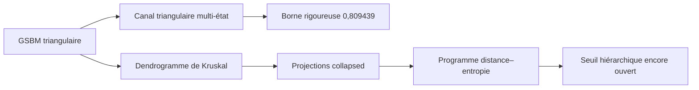

# Weak recovery et dynamique hiérarchique

Ce projet étudie le GSBM binaire homogène sur la grille triangulaire. Son
objectif est de transformer une dynamique de clusters hiérarchique en une
obstruction rigoureuse de weak recovery.

> [!IMPORTANT]
> **Ce qui est déjà prouvé.** Le dépôt établit
> $`p_{\mathrm{WR}}\ge0.809439`$ grâce à un canal triangulaire multi-état.
> Cette borne est rigoureuse, mais non hiérarchique.

> [!WARNING]
> **Ce qui reste ouvert.** La dynamique hiérarchique n'a pas encore produit
> de seuil supplémentaire sur la grille triangulaire. Sa piste active est le
> programme distance–entropie décrit ci-dessous.

Pour une photographie exacte et datée, consulter
[`CURRENT_STATUS.md`](CURRENT_STATUS.md). Pour retrouver une note précise,
utiliser l'[`INDEX.md`](INDEX.md).

## 1. La question en langage simple

Les spins cachés sont $`X_i\in\{-1,+1\}`$. Les observations donnent des
relations locales bruitées entre spins voisins. La weak recovery est possible
si un estimateur conserve un recouvrement macroscopique avec les spins
cachés, à un flip global près.

Une obstruction naturelle consiste à tirer $`I_L`$ et $`J_L`$
indépendamment et uniformément sur le tore. On peut écarter le voisinage
microscopique en conditionnant par $`d(I_L,J_L)\ge r_L`$, avec
$`r_L\to\infty`$ et $`r_L/L\to0`$ : les paires écartées représentent alors
$`o(|V_L|^2)`$ paires. Il suffit de montrer que la parité de la paire restante
devient asymptotiquement imprévisible en moyenne :

```math
\mathbb E\left[
\mathbb E[X_{I_L}X_{J_L}\mid O,I_L,J_L]^2
\right]
\longrightarrow 0.
\qquad\text{(1.1)}
```

Le [critère pairwise](foundations/03_HIERARCHICAL_WEAK_RECOVERY.md) explique
rigoureusement comment une telle décorrélation interdit la weak recovery.

## 2. À quoi sert le dendrogramme ?

Une réplique postérieure sert de référence. Chaque arête satisfaite reçoit
une horloge exponentielle ; les arêtes ouvertes avant le temps $`\beta`$
forment une partition $`\Pi_\beta`$. Quand deux composantes fusionnent, elles
créent un nœud du dendrogramme.

La dynamique interpole entre deux mécanismes familiers :

- près des feuilles, elle rééchantillonne de petites orientations comme une
  dynamique de Glauber ;
- près des racines, elle retourne des composantes entières comme
  Swendsen--Wang ;
- entre les deux, elle utilise le heat bath exact associé au dendrogramme.

Une fusion $`u`$ de deux enfants $`C_1,C_2`$ dépend de toute leur coupe
physique, et pas seulement de l'arête qui a sonné la première :

```math
E_u
=
\{\{x,y\}\in E:x\in C_1,\ y\in C_2\}.
\qquad\text{(2.1)}
```

Les quatre orientations relatives des deux enfants reçoivent des poids qui
intègrent le nœud courant, ses ancêtres et le potentiel extérieur. C'est ce
qui rend la dynamique exacte, mais aussi ce qui interdit une réduction naïve
à des canaux indépendants.

## 3. La séparation essentielle : résultat et programme



### Résultat établi

Le [certificat rationnel P809439](results/non_hierarchical/34_CERTIFICAT_RATIONNEL_P809439.md)
prouve, pour tout $`p\in[1/2,0.809439]`$, que le recouvrement quadratique de
tout estimateur tend vers zéro. Le canal local, les certificats de Sturm et
la fermeture par information-percolation sont tous exacts.

### Programme hiérarchique

Le but est de faire décroître la corrélation de paire en exploitant plusieurs
échelles du corridor entre $`i,j`$ et leur plus proche ancêtre commun. Le LCA
seul est généralement trop informatif : la profondeur des deux bras doit
créer les pertes répétées.

## 4. La piste active, étape par étape

La route actuelle unit les deux idées les plus prometteuses : une distance
adaptée au dendrogramme et un changement de mesure entropique.

1. **Enraciner l'expérience dans une paire.** Tirer d'abord une paire
   non ordonnée lointaine, puis explorer symétriquement ses deux bras. Le
   biais du LCA est alors porté par la loi de la paire elle-même.
2. **Définir un compteur utile.** Compter sur les deux bras les cellules
   géométriquement admissibles candidates, sans présupposer leur contraction.
3. **Travailler sous la loi ordinaire de la paire.** Prouver qu'un corridor
   pauvre en cellules candidates a une probabilité exponentiellement petite.
4. **Contracter un bloc.** Établir une perte pour la fonction de paire
   effectivement propagée, et non une marge uniforme sur tous les potentiels
   de bord.
5. **Changer de mesure par l'entropie.** Montrer que le biais par l'énergie
   entrante ne peut pas concentrer toute sa masse sur les rares mauvais
   corridors, sauf si la corrélation est déjà petite.
6. **Fermer le critère pairwise.** Sommer les pertes sur les échelles, puis
   appliquer (1.1).

Soit $`\mathcal P_D(i,j)`$ l'ensemble des arêtes du chemin unique entre les
deux feuilles dans le dendrogramme. Une règle déterministe et symétrique,
mesurable depuis le dendrogramme non marqué, sélectionne au plus une arête
d'ancrage par cellule candidate ; l'ensemble obtenu est
$`\mathcal A_D(i,j)\subseteq\mathcal P_D(i,j)`$. Le compteur est

```math
N_D^{\mathrm{geo}}(i,j)
=
\sum_{e\in\mathcal P_D(i,j)}
\mathbf 1_{\{e\in\mathcal A_D(i,j)\}}.
\qquad\text{(4.1)}
```

Cet objet est symétrique, mais il n'est pas encore une distance : la sélection
des ancrages peut dépendre de la paire. Il deviendrait une pseudo-distance
d'arbre si une même famille globale d'arêtes, indépendante de $`(i,j)`$,
convenait. Dans les deux cas, il compte seulement des occasions
**candidates** ; leur contraction énergétique est un lemme séparé.

Le [programme détaillé](active/35_DISTANCE_ENTROPIE_ERGODICITE.md) donne les
lemmes, les portes go/no-go et les limites exactes de l'argument.

## 5. Ce qui est établi dans la voie hiérarchique

| brique | statut | référence |
|---|---|---|
| mesure jointe du dendrogramme non marqué et heat baths | établi en volume fini | [01](foundations/01_MATHEMATICAL_FRAMEWORK.md) |
| réduction pairwise de la weak recovery | établie | [03](foundations/03_HIERARCHICAL_WEAK_RECOVERY.md) |
| chaîne ancestrale des taux | établie exactement | [08](foundations/ancestral/08_ANCESTRAL_LAMBDA_CHAIN.md), [10](foundations/ancestral/10_ANCESTRAL_LAMBDA_ESTIMATION.md) |
| loi des marques de frontière et biais de Palm | établie sous les conditionnements annoncés | [14](foundations/ancestral/14_CRITICAL_COMPONENT_BOUNDARY.md), [25](foundations/25_GEOMETRY_CONDITIONED_CUT_INFORMATION.md) |
| projections de heat bath et projection collapsed | établies en volume fini | [19](foundations/19_FAVORABLE_SWEEP_PROJECTIONS.md), [20](foundations/20_COLLAPSED_CORRIDOR_BLACKWELL.md) |
| corridor au plus persistant que le LCA seul | établi | [22](results/hierarchical/22_LCA_VS_FULL_HIERARCHY.md) |
| perte exponentielle sur un cactus triangulaire | établie dans ce modèle | [21](results/hierarchical/21_CACTUS_COLLAPSED_CERTIFICATE.md) |
| identité pythagoricienne de dissipation | établie en volume fini | [30](active/30_PIVOT_DISSIPATION_L2_SECTEUR_IMPAIR.md) |

Ces briques ne composent pas encore une preuve sur la grille triangulaire.

## 6. Deux no-go et quatre avertissements

| raccourci | nature | verdict |
|---|---|---|
| remplacer toutes les fusions par leur version critique | no-go démontré | faux pour une fusion multiport sous bord polarisé |
| garder un état local fini assez riche et obtenir un déficit Feynman--Kac | no-go démontré | l'état fidèle rend le twist mesurable et le déficit nul |
| accumuler une contraction uniforme sur tous les annuli | diagnostic fini | la dissipation observée se concentre dans une queue rare |
| utiliser seulement le LCA critique | avertissement structurel | sa coupe peut rester grande et informative |
| invoquer seulement Birkhoff | avertissement méthodologique | une fréquence asymptotique ne fournit pas la grande déviation nécessaire sous le tilt énergétique |
| appliquer Kingman à un coût critique linéaire | avertissement d'échelle | l'analogie FPP suggère plutôt une échelle logarithmique ou multiscalaire |

Seuls les deux premiers sont des réfutations exactes, démontrées dans
[l'audit aux rangs réels](diagnostics/29_AUDIT_FROID_PIVOT_RANGS_REELS.md).
Les quatre autres sont des diagnostics ou des portes de sécurité : ils
n'interdisent pas à eux seuls une preuve en volume infini.

## 7. Parcours de lecture

### Parcours A — le résultat quantitatif, 30 minutes

1. [Baseline du chapitre 11](foundations/02_CHAPTER_11_BASELINE.md)
2. [Canal triangulaire](results/non_hierarchical/11_TRIANGLE_BLOCK_SDPI.md)
3. [Théorème P809439](results/non_hierarchical/34_CERTIFICAT_RATIONNEL_P809439.md)

### Parcours B — la voie hiérarchique, lecture principale

1. [Cadre mathématique](foundations/01_MATHEMATICAL_FRAMEWORK.md)
2. [Critère pairwise](foundations/03_HIERARCHICAL_WEAK_RECOVERY.md)
3. [Information des coupes](foundations/25_GEOMETRY_CONDITIONED_CUT_INFORMATION.md)
4. [Projections](foundations/19_FAVORABLE_SWEEP_PROJECTIONS.md)
5. [Corridor collapsed](foundations/20_COLLAPSED_CORRIDOR_BLACKWELL.md)
6. [Audit et no-go](diagnostics/29_AUDIT_FROID_PIVOT_RANGS_REELS.md)
7. [Programme distance–entropie](active/35_DISTANCE_ENTROPIE_ERGODICITE.md)

### Parcours C — détails avancés

Lire la trilogie ancestrale
[08](foundations/ancestral/08_ANCESTRAL_LAMBDA_CHAIN.md) →
[10](foundations/ancestral/10_ANCESTRAL_LAMBDA_ESTIMATION.md) →
[14](foundations/ancestral/14_CRITICAL_COMPONENT_BOUNDARY.md), puis les
transferts répliqués [18](foundations/18_CRITICAL_PALM_REPLICATED_TRANSFER.md)
et les résultats hiérarchiques [21](results/hierarchical/21_CACTUS_COLLAPSED_CERTIFICATE.md),
[22](results/hierarchical/22_LCA_VS_FULL_HIERARCHY.md).

## 8. Organisation et statuts

- [`foundations/`](foundations/) : définitions, identités et outils durables ;
- [`results/`](results/) : théorèmes prouvés dans leur domaine annoncé ;
- [`active/`](active/) : programme actuellement poursuivi ;
- [`diagnostics/`](diagnostics/) : calculs exploratoires, benchmarks et no-go ;
- [`archive/`](archive/) : anciennes routes conservées pour traçabilité ;
- [`computations/`](computations/) : scripts, certificats et tests ;
- [`references/`](references/) : bibliographie commentée et fichier BibTeX.

L'[`INDEX.md`](INDEX.md) donne le rôle exact des 36 notes numérotées de `00`
à `35`.

## 9. Reproductibilité

Depuis la racine du dépôt :

```bash
python3 .agents/check_math.py
python3 .agents/check_markdown_links.py
python3 -m unittest discover \
  -s research/hierarchical-swendsen-wang/computations \
  -p 'test_*.py'
python3 -m compileall -q \
  research/hierarchical-swendsen-wang/computations
```

Le [guide des calculs](computations/README.md) relie chaque famille de scripts
à l'énoncé qu'elle certifie ou au raccourci qu'elle contre-audite.
