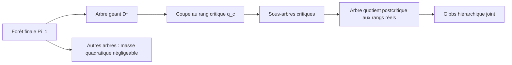

# Diagnostic à un dendrogramme : Gibbs critique sur l'arbre géant

**Statut : réduction finie exacte à dendrogramme fixé, diagnostic oracle
subordonné à la cible répliquée, aucun nouveau seuil revendiqué.**

> [!IMPORTANT]
> La [cible prioritaire](38_DOUBLE_GEANTE_GIBBS_REPLIQUE.md) emploie deux
> Gibbs exacts sur deux dendrogrammes complets indépendants, chacun coupé à
> $`\beta_c`$ uniquement comme séparateur d'élimination. Le
> [pilote SBM](37_PILOTE_SBM_GIBBS_HIERARCHIQUE.md) montre qu'un dendrogramme
> commun ou figé gonfle artificiellement l'overlap. Les réductions à
> $`\Xi_L^\star`$ ci-dessous restent exactes pour la variante oracle à un
> $D$ ; elles ne calculent pas le carré postérieur exact.

**Objet de ce diagnostic :** pour chaque $`p>1/2`$, calibrer le niveau de
percolation $`\beta_c(p)`$, isoler l'arbre de Kruskal de l'unique composante
géante finale, le couper à $`\beta_c(p)`$, puis étudier le Gibbs
hiérarchique joint sur les sous-arbres critiques ainsi obtenus, à
dendrogramme fixé. Les tirages sont indépendants entre les arbres **finaux**
du dendrogramme. Ils ne le sont pas entre les sous-arbres critiques d'un
même arbre final.

Cette note formalise l'enveloppe à un dendrogramme. La note 38 remplace sa
corrélation quenched par le produit de deux Gibbs indépendants, qui est la
quantité exacte de weak recovery.

## 1. Les trois niveaux de l'objet

Dans le GSBM triangulaire homogène, posons

```math
q_c
=
2\sin(\pi/18),
\qquad
u_p
=
\log\frac p{1-p},
\qquad
q_p(t)
=
p(1-e^{-u_pt}).
\qquad\text{(1.1)}
```

Le niveau critique étendu est

```math
\boxed{
\beta_c(p)
=
q_p^{-1}(q_c)
=
-\frac1{u_p}\log\left(1-\frac{q_c}{p}\right).
}
\qquad\text{(1.2)}
```

Il est fini pour tout $`p>1/2`$, mais le dendrogramme utilisé par la
dynamique est censuré à $`t=1`$. Ainsi,

```math
\beta_c(p)\le1
\quad\Longleftrightarrow\quad
p\ge
p_{\mathrm{SW}}
:=
\frac{1+q_c}{2}
=
0.6736481777\ldots.
\qquad\text{(1.3)}
```

Il faut donc distinguer trois objets.

1. $`\Pi_{\beta_c}`$ est la forêt critique. Elle n'a pas de composante de
   densité positive dans la limite thermodynamique.
2. $`\Pi_1`$ a la loi d'une percolation de paramètre
   $`q_1(p)=2p-1`$. Pour $`p>p_{\mathrm{SW}}`$, elle possède une unique
   composante géante $`R_L^\star`$ avec haute probabilité.
3. $`D_L^\star`$ est l'arbre du dendrogramme dont les feuilles sont les
   sommets de $`R_L^\star`$. La coupe de cet arbre à $`\beta_c`$ produit les
   sous-arbres critiques qu'il faut relier par le Gibbs postcritique.



Au point critique lui-même, parler de « composante géante critique » serait
donc trompeur. L'objet prioritaire est l'arbre de la géante **finale**, coupé
en composantes critiques.

## 2. Une même forêt critique pour tous les paramètres

La coordonnée de rang rend le couplage particulièrement simple. Donnons à
chaque arête physique un rang $`U_e\sim\mathrm{Unif}[0,1]`$ indépendant.
Dans la jauge de Nishimori,

```math
e\text{ est satisfaite}
\quad\Longleftrightarrow\quad
U_e\le p,
\qquad
e\in\Pi_t
\quad\Longleftrightarrow\quad
U_e\le q_p(t).
\qquad\text{(2.1)}
```

La forêt critique est donc toujours construite avec les arêtes
$`U_e\le q_c`$. Elle ne dépend pas de $p$. Pour une fusion de rang réel
$`q_u`$, seul le changement de coordonnée

```math
\beta_u(p)
=
-\frac1{u_p}\log\left(1-\frac{q_u}{p}\right)
\qquad\text{(2.2)}
```

et le cutoff final $`q_u\le q_1(p)=2p-1`$ dépendent de $p$. Cette
représentation permet de comparer plusieurs valeurs de $p$ sur les mêmes
environnements sans déplacer artificiellement les fusions vers le niveau
critique.

Quelques repères sont :

| $p$ | $`q_1=2p-1`$ | $`\beta_c(p)`$ | $`h_c(p)`$ |
|---:|---:|---:|---:|
| $`0.809439`$ | $`0.618878`$ | $`0.3874998656`$ | $`0.4160872195`$ |
| $`0.8099092892`$ | $`0.6198185784`$ | $`0.3863829728`$ | $`0.4175282692`$ |
| $`0.81`$ | $`0.62`$ | $`0.3861679623`$ | $`0.4178062232`$ |
| $`0.82`$ | $`0.64`$ | $`0.3632648163`$ | $`0.4484480010`$ |
| $`0.835805792367`$ | $`0.6716115847`$ | $`0.3300081063`$ | $`0.4968797586`$ |

Le dernier paramètre du tableau est le biais résiduel d'une arête encore
fermée à la coupe critique :

```math
h_c(p)
=
\frac{q_1(p)-q_c}{1-q_c}
=
\frac{2p-1-q_c}{1-q_c}.
\qquad\text{(2.3)}
```

Conditionnellement à $`U_e>q_c`$, les trois marques résiduelles ont les
probabilités

```math
\left(
h_c(p),
\frac{1-h_c(p)}2,
\frac{1-h_c(p)}2
\right).
\qquad\text{(2.4)}
```

Elles correspondent respectivement à une vraie arête qui ouvre dans
$`(\beta_c,1]`$, une vraie arête censurée après $1$ et une fausse arête.
Cette identité isole le paramètre local qui change avec $p$. Elle ne
factorise pas le Gibbs du quotient.

## 3. Coupe exacte de l'arbre géant

Fixons un volume fini et un dendrogramme non marqué $D$. Notons
$`\mathcal R(D)=\Pi_1`$ ses racines finales. Dans la plus grande racine
$`R^\star`$, posons

```math
\mathcal B_c^\star
=
\{A\in\Pi_{\beta_c}:A\subseteq R^\star\}.
\qquad\text{(3.1)}
```

Chaque $A\in\mathcal B_c^\star$ est la feuille contractée d'un arbre
supérieur. Le quotient $`\mathcal T_{D,+}^\star`$ conserve :

- toutes les fusions $u$ de rang $`q_u>q_c`$ ;
- leur rang réel $q_u$, donc leur temps réel $`\beta_u(p)`$ ;
- le bucket physique complet $`E_u`$ entre les deux composantes fusionnées ;
- les incidences de toutes les arêtes de ce bucket.

Il ne conserve pas seulement l'arête choisie par Kruskal. Il ne remplace pas
non plus $q_u$ par $q_c$.

Pour une paire $`i,j`$ uniforme dans $`R^\star`$, les blocs critiques sont
automatiquement biaisés par leur taille :

```math
\mathbb P(A(i)=A\mid D,R^\star)
=
\frac{|A|}{|R^\star|},
\qquad
\mathbb P(A(i)=A,A(j)=B\mid D,R^\star)
=
\frac{|A||B|}{|R^\star|^2}.
\qquad\text{(3.2)}
```

Pour des paires contraintes à être lointaines, les produits de tailles sont
remplacés par les comptes géométriques correspondants. Un nœud de fusion
déjà réalisé est pondéré par son nombre de paires descendantes
$`N_\rho`$, et non par $`mN_\rho`$ : la course de Kruskal a déjà introduit
le biais par la taille $m$ du bucket.

## 4. Loi Gibbs et indépendance exacte entre arbres finaux

Écrivons

```math
F_{u,p}(\sigma)
=
\Lambda_{u,p}(\sigma)
\exp\left[
(1-\beta_u(p))\Lambda_{u,p}(\sigma)
\right].
\qquad\text{(4.1)}
```

Sous l'a priori binaire i.i.d. uniforme, la conditionnelle exacte est

```math
\pi_D(\sigma)
:=
\nu_O(\sigma\mid D)
\propto
\prod_{u\in D}F_{u,p}(\sigma).
\qquad\text{(4.2)}
```

Chaque facteur appartient à une unique racine finale. Par conséquent,

```math
\boxed{
\pi_D
=
\bigotimes_{R\in\mathcal R(D)}
\pi_{D,R}.
}
\qquad\text{(4.3)}
```

Des tirages Gibbs peuvent donc être effectués avec des hasards indépendants
pour chaque arbre final $R$.

### Décomposition à la coupe critique

Pour $A\in\mathcal B_c(R)$, regroupons dans
$`\psi_{A,p}^-(\sigma_A)`$ l'a priori et tous les facteurs de rang au plus
$q_c$ contenus dans $A$. Alors

```math
\pi_{D,R}(\sigma_R)
\propto
\left[
\prod_{A\in\mathcal B_c(R)}
\psi_{A,p}^-(\sigma_A)
\right]
\left[
\prod_{\substack{u\subseteq R\\q_u>q_c}}
F_{u,p}(\sigma_R)
\right].
\qquad\text{(4.4)}
```

Le second produit couple les sous-arbres critiques d'une même racine. La
bonne affirmation d'indépendance est donc exactement :

- les Gibbs des différentes racines finales sont indépendants ;
- le Gibbs des sous-arbres critiques contenus dans une même racine est
  **joint**.

Supposer les sous-arbres critiques indépendants annulerait immédiatement
toutes les corrélations inter-blocs et donnerait artificiellement une
impossibilité pour presque tout $p<1$. Ce raccourci ne peut pas être une
conditionnelle de (4.4).

À l'autre extrême, un bucket postcritique de taille un est rigide lorsque
$D$ est fixé. Dans l'une des deux orientations relatives,
$`\Lambda_u=0`$, donc $`F_{u,p}=0`$ : le Gibbs ne peut pas casser la parité
imposée par cette fusion. Le pilote SBM montre que, lorsque toutes les
fusions sont de ce type, le dendrogramme figé s'arrête au seuil de
percolation Swendsen--Wang et manque Kesten--Stigum. Sur le tore triangulaire,
la densité et la connectivité des buckets unitaires deviennent donc un test
no-go obligatoire.

### Coordonnées exactes du quotient critique

Choisissons dans chaque bloc critique $A$ un ancrage $`a(A)`$, de manière
mesurable depuis $D$, et écrivons

```math
z_A
=
\sigma_{a(A)},
\qquad
y_x
=
\sigma_x\sigma_{a(A)}
\quad(x\in A).
\qquad\text{(4.5)}
```

Ainsi $`y_{a(A)}=1`$ et $`\sigma_x=y_xz_A`$. Les coordonnées $`y_A`$
décrivent la forme interne du sous-arbre critique, tandis que $`z_A`$ est son
orientation globale. Conditionnellement à

```math
\mathcal Y_c
=
\sigma\left(
O,D,(y_x)_{x\in V_L}
\right),
\qquad\text{(4.6)}
```

tous les facteurs de rang au plus $q_c$ sont invariants par les $`z_A`$. La
loi exacte des orientations dans une racine $R$ est donc

```math
\boxed{
\pi_{D,R}^c(z\mid y)
\propto
\prod_{\substack{u\subseteq R\\q_u>q_c}}
F_{u,p}(yz).
}
\qquad\text{(4.7)}
```

Si $`J_e\in\{-1,+1\}`$ est le signe observé de l'arête $e$, le facteur
supérieur utilise

```math
\Lambda_{u,p}(y,z)
=
u_p
\sum_{\{x,x'\}\in E_u}
\mathbf1_{\{
J_{\{x,x'\}}y_xy_{x'}z_{A(x)}z_{A(x')}=+1
\}}.
\qquad\text{(4.8)}
```

Un même facteur peut ainsi toucher de nombreux blocs critiques et de nombreux
ports physiques. La loi (4.7) n'est ni un modèle d'Ising nearest-neighbor sur
l'arbre quotient, ni un produit de canaux binaires.

Notons

```math
M_{AB}^c
=
\mathbb E_{\pi_{D,R}^c(\cdot\mid y)}
\left[z_Az_B\right],
\qquad
w_A=|A|,
\qquad
W_R=\mathrm{diag}(w_A:A\subseteq R).
\qquad\text{(4.9)}
```

La matrice $`M_R^c=(M_{AB}^c)`$ est positive semi-définie et de diagonale
un. Le tirage collectif des orientations, effectué indépendamment dans
chaque racine finale, est exactement la projection

```math
H_cg
=
\mathbb E[g\mid\mathcal Y_c].
\qquad\text{(4.10)}
```

Pour la fonction de paire, on obtient

```math
H_cf_{ij}
=
\begin{cases}
y_iy_j,
&A(i)=A(j),\\
y_iy_jM_{A(i)A(j)}^c,
&A(i)\ne A(j)\text{ dans la même racine},\\
0,
&i,j\text{ dans deux racines distinctes}.
\end{cases}
\qquad\text{(4.11)}
```

Sa persistance quadratique est donc calculable par

```math
G_L^c(p)
:=
\frac1{n_L^2}
\mathbb E
\sum_{R\in\Pi_1}
\mathrm{Tr}
\left[
\left(
W_R^{1/2}M_R^cW_R^{1/2}
\right)^2
\right].
\qquad\text{(4.12)}
```

En particulier, après réduction aux petites racines, le critère spectral

```math
\frac1{n_L}
\lambda_{\max}
\left(
W_{R_L^\star}^{1/2}
M_{R_L^\star}^c
W_{R_L^\star}^{1/2}
\right)
\longrightarrow0
\qquad\text{(4.13)}
```

implique $`G_L^c(p)\to0`$, car la trace de la matrice non normalisée vaut au
plus $n_L$. Ce critère spectral est suffisant, pas nécessaire.

Un contre-test fini montre que le couplage peut être très fort. À
$`L=5`$, $`p=0.809439`$ et pour une graine fixée, deux blocs critiques de
taille huit dans la même racine ont un cross-ratio de poids
$`2798.19\ldots`$, alors qu'une factorisation imposerait un cross-ratio
égal à un. Ce nombre est un diagnostic de volume fini, pas une estimation
de seuil.

## 5. Le Gibbs hiérarchique sur les sous-arbres

Pour un bloc critique $A\subset R$, définissons le block heat bath exact

```math
(P_{R,A}g)(\sigma_R)
=
\mathbb E_{\pi_{D,R}}
\left[
g(\widetilde\sigma_R)
\mid
\sigma_{R\setminus A}
\right].
\qquad\text{(5.1)}
```

Il rééchantillonne toute la configuration de $A$ conditionnellement aux
autres blocs. Sa conditionnelle contient les facteurs internes à $A$ et
tous les facteurs postcritiques affectés par un flip dans $A$.

Sous ergodicité de la conditionnelle, ce block heat bath peut être réalisé
comme limite d'un Gibbs hiérarchique interne :

1. garder $`\sigma_{R\setminus A}`$ fixe ;
2. parcourir les nœuds du sous-arbre critique de $A$ ;
3. utiliser à chaque nœud le heat bath exact incluant ses facteurs ancêtres
   dans l'arbre quotient ;
4. inclure le flip global de $A$ ;
5. mélanger jusqu'à la conditionnelle (5.1).

Un random scan de blocs est

```math
\overline P_R
=
\frac1{|\mathcal B_c(R)|}
\sum_{A\in\mathcal B_c(R)}P_{R,A}.
\qquad\text{(5.2)}
```

Un sweep systématique est un produit des mêmes projections. Dans les deux
cas, les blocs d'une même racine sont mis à jour conditionnellement et non
en parallèle comme s'ils étaient indépendants. Le noyau global est le
produit tensoriel

```math
K_D^{\mathrm{crit}}
=
\bigotimes_{R\in\mathcal R(D)}
K_{D,R}^{\mathrm{crit}},
\qquad\text{(5.3)}
```

avec des graines aléatoires indépendantes entre racines.

Le tirage idéal à l'équilibre d'une racine est la projection

```math
(\Pi_Rg)(\sigma_R)
=
\pi_{D,R}(g).
\qquad\text{(5.4)}
```

Cette projection est un oracle mathématique licite pour une preuve
d'impossibilité. Elle reformule cependant l'inférence conditionnelle complète
sur la racine ; le travail scientifique consiste à majorer son information à
l'aide de la géométrie de l'arbre coupé.

### Tirage collectif ou Gibbs récursif

Il faut distinguer deux noyaux.

1. Le tirage collectif (4.10) rééchantillonne les orientations $z_A$ en
   gardant les formes internes $y_A$. C'est la lecture la plus littérale
   d'un Gibbs sur les sous-arbres contractés.
2. Le Gibbs récursif met aussi à jour les formes internes par (5.1). S'il
   mélange dans chaque racine, il converge vers la projection idéale (5.4),
   qui oublie les $y_A$.

Ces projections sont ordonnées par l'information révélée. Si $`\Pi_D`$
désigne l'espérance sous $`\pi_D`$, alors

```math
\|\Pi_Df_{ij}\|_2^2
\le
\|H_cf_{ij}\|_2^2.
\qquad\text{(5.5)}
```

Plus généralement, les tribus obtenues en conservant les parités internes à
la coupe $`\beta`$ croissent avec $\beta$. La coupe critique est donc un
coarse-graining géométriquement naturel, pas le choix dynamiquement le plus
contractant. Si le tirage collectif à $`\beta_c`$ reste persistant, il faut
utiliser les mises à jour internes, plusieurs sweeps ou l'alternance qui
rafraîchit également $`D\mid\sigma`$.

## 6. Réduction exacte de la weak recovery à l'arbre géant

Pour $`f_{ij}(\sigma)=\sigma_i\sigma_j`$, posons

```math
m_{ij}^D
=
\pi_D(f_{ij}),
\qquad
Q_L
=
\frac1{n_L^2}
\sum_{i,j}
\mathbb E
\left[
\langle f_{ij}\rangle_O^2
\right].
\qquad\text{(6.1)}
```

Choisissons comme $`R_L^\star`$ la plus grande racine finale, avec une règle
déterministe en cas d'égalité. Définissons

```math
F_L^{\mathrm{fin}}(p)
=
\frac1{n_L^2}
\mathbb E
\sum_{\substack{R\in\Pi_1\\R\ne R_L^\star}}
|R|^2,
\qquad\text{(6.2)}
```

```math
S_L^c
=
\frac1{n_L^2}
\mathbb E
\sum_{A\in\Pi_{\beta_c}}
|A|^2,
\qquad\text{(6.3)}
```

et la quantité Gibbs inter-blocs de la géante

```math
\Xi_L^\star(p)
=
\frac1{n_L^2}
\mathbb E
\left[
\sum_{\substack{i,j\in R_L^\star\\A(i)\ne A(j)}}
(m_{ij}^D)^2
\right].
\qquad\text{(6.4)}
```

### Proposition 6.1 — réduction finie, statut : établi

Pour tout volume fini et tout $`p>p_{\mathrm{SW}}`$,

```math
\boxed{
Q_L
\le
F_L^{\mathrm{fin}}(p)
+
S_L^c
+
\Xi_L^\star(p).
}
\qquad\text{(6.5)}
```

#### Preuve

La tour des espérances et Jensen donnent

```math
\langle f_{ij}\rangle_O^2
\le
\mathbb E\left[(m_{ij}^D)^2\mid O\right].
\qquad\text{(6.6)}
```

Si $i,j$ appartiennent à deux racines finales distinctes, le flip global de
l'une de ces racines et la factorisation (4.3) donnent
$`m_{ij}^D=0`$. La somme sur les racines autres que $`R_L^\star`$ est
majorée par (6.2), puisque $`|m_{ij}^D|\le1`$. Dans la racine géante, les
paires appartenant au même bloc critique contribuent au plus (6.3). Les
paires restantes donnent exactement (6.4).

### Corollaire 6.2 — cible asymptotique

Si

```math
F_L^{\mathrm{fin}}(p)\longrightarrow0,
\qquad
S_L^c\longrightarrow0,
\qquad
\Xi_L^\star(p)\longrightarrow0,
\qquad\text{(6.7)}
```

alors $`Q_L\to0`$ et la weak recovery est impossible.

Les deux premiers termes sont géométriques. Si
$`M_L^{(2)}`$ est la taille de la deuxième racine finale,

```math
F_L^{\mathrm{fin}}(p)
\le
\mathbb E\frac{M_L^{(2)}}{n_L}.
\qquad\text{(6.8)}
```

De même,

```math
S_L^c
\le
\mathbb E
\frac{\max_{A\in\Pi_{\beta_c}}|A|}{n_L}.
\qquad\text{(6.9)}
```

La percolation finale est strictement supercritique et la coupe
$q_c$ est critique. Les limites attendues dans (6.8)--(6.9) sont donc les
deux entrées de percolation à formaliser sur l'exhaustion torique choisie.
Le seul terme nouveau est $`\Xi_L^\star(p)`$.

Le tirage collectif de la coupe fournit l'enveloppe plus directement
calculable

```math
Q_L
\le
\frac1{n_L^2}
\mathbb E
\sum_{R\in\Pi_1}
\mathrm{Tr}
\left[
\left(
W_R^{1/2}M_R^cW_R^{1/2}
\right)^2
\right]
=
G_L^c(p).
\qquad\text{(6.10)}
```

Par (5.5), la cible de racine pleinement mélangée dans (6.4) est au plus la
partie inter-blocs de $`G_L^c`$. Démontrer $`G_L^c\to0`$ suffirait donc, mais
peut être trop ambitieux : le conditionnement par les formes internes
conserve exactement les parités à l'intérieur des gros blocs critiques.

La réciproque est fausse : une valeur positive de $`\Xi_L^\star`$ ne prouve
pas la recovery, car le dendrogramme est une variable auxiliaire révélée.

## 7. Formulation dynamique calculable

Fixons deux blocs critiques distincts de $`R^\star`$ contenant $i$ et $j$.
Dans $`L^2(\pi_{D,R^\star})`$, chaque $`P_{R^\star,A}`$ est une projection
orthogonale. Pour tout programme Gibbs $K_{D,R^\star}^{(s)}` qui préserve
la moyenne,

```math
(m_{ij}^D)^2
=
\|\Pi_{R^\star}f_{ij}\|_2^2
\le
\|K_{D,R^\star}^{(s)}f_{ij}\|_2^2.
\qquad\text{(7.1)}
```

Ainsi, il suffit de construire des programmes $s=s_L$ tels que

```math
\frac1{n_L^2}
\mathbb E
\left[
\sum_{\substack{i,j\in R_L^\star\\A(i)\ne A(j)}}
\|K_{D,R_L^\star}^{(s_L)}f_{ij}\|_2^2
\right]
\longrightarrow0.
\qquad\text{(7.2)}
```

Une seconde représentation est utile pour simuler le vrai Gibbs. Soient
$`\sigma^{(1)},\sigma^{(2)}`$ deux répliques indépendantes de $`\pi_D`$ et
$`\tau_i=\sigma_i^{(1)}\sigma_i^{(2)}`$. Alors

```math
\Xi_L^\star(p)
=
\frac1{n_L^2}
\mathbb E
\left[
\left(
\sum_{i\in R_L^\star}\tau_i
\right)^2
-
\sum_{A\subseteq R_L^\star}
\left(
\sum_{i\in A}\tau_i
\right)^2
\right].
\qquad\text{(7.3)}
```

L'égalité vient de
$`(m_{ij}^D)^2=\mathbb E[\tau_i\tau_j\mid O,D]`$. Le terme entre crochets
peut être signé pour une paire de répliques particulière, mais son espérance
est la somme non négative des corrélations carrées inter-blocs. Cette formule
donne un estimateur Monte-Carlo sans énumérer toutes les paires.

Pour une mise à jour de bloc,

```math
\|g\|_2^2-\|P_{R,A}g\|_2^2
=
\mathbb E_{\pi_{D,R}}
\mathrm{Var}
\left(
g\mid\sigma_{R\setminus A}
\right).
\qquad\text{(7.4)}
```

Le programme actif [distance–entropie](35_DISTANCE_ENTROPIE_ERGODICITE.md)
devient ici le moteur analytique de (7.2). Pour une paire de la géante :

1. contracter ses deux blocs critiques ;
2. suivre le chemin dans $`\mathcal T_{D,+}^\star`$ ;
3. sélectionner $`K\asymp\log d(i,j)`$ sous-arbres siblings
   géométriquement protégés ;
4. appliquer les projections de Gibbs correspondantes aux rangs réels ;
5. regrouper les pertes avant d'incliner par l'énergie d'entrée.

Si $`A_K`$ désigne l'événement où ce chemin possède trop peu de cellules,
les deux lemmes cibles sont

```math
\mathbb P_{\mathrm{pair},\star}(A_K)
\le
e^{-\kappa K}
\qquad\text{(7.5)}
```

et

```math
\mathbb E[W_{\mathrm{out}}]
\le
\mathbb E[W_{\mathrm{in}}\mathbf1_{A_K}]
+
e^{-\lambda K}
\mathbb E[W_{\mathrm{in}}\mathbf1_{A_K^c}].
\qquad\text{(7.6)}
```

Le même tilt

```math
\frac{d\mathbb Q}{d\mathbb P}
=
\frac{W_{\mathrm{in}}}{\mathbb E W_{\mathrm{in}}}
\qquad\text{(7.7)}
```

doit être utilisé dans (7.5) et (7.6). Le budget d'entropie du fichier 35
transporte alors la petite probabilité de $A_K$ sous $`\mathbb Q`$.

Une inégalité globale de block factorization ou de strong spatial mixing
serait suffisante pour contrôler certains Gibbs par blocs ; voir
[Caputo–Parisi](https://arxiv.org/abs/2004.10574). Elle n'est pas disponible
ici : la coupe est critique, la mesure est frustrée et le conditionnement par
la géante est non local. La cible $`L^2`$ spécifique à $f_{ij}$ est plus
étroite et ne demande pas un théorème de mélange uniforme pour toutes les
fonctions.

## 8. La loi difficile : arbre géant vu depuis une paire

La difficulté principale est maintenant localisée. Il faut étudier
$`\mathcal T_{D,+}^\star`$ sous la loi de deux points de la géante, et non un
MST non conditionné.

### 8.1 Deux révélations

Une exploration naturelle sépare :

1. les rangs $`U_e\le q_c`$, qui construisent les blocs critiques ;
2. le sprinkling $`q_c<U_e\le q_1(p)`$, qui choisit la géante finale et
   construit son arbre quotient.

Avant le conditionnement par $`R_L^\star`$, les labels bruts de la seconde
étape sont indépendants des labels déjà révélés. Après sélection de la
géante et de deux endpoints, les blocs portent les biais
$`|A|`$, $`|A||B|`$ et $`N_\rho`$ de la section 3. L'indépendance brute ne
survit donc pas telle quelle.

### 8.2 Ce qu'il faut mesurer sur le chemin supérieur

Pour une paire $i,j\in R_L^\star$ dans deux blocs critiques distincts, les
observables prioritaires sont :

- la longueur du chemin supérieur après contraction de
  $`\Pi_{\beta_c}`$ ;
- le nombre de buckets non triviaux de taille petite ou modérée ;
- les rangs réels $`q_u>q_c`$ de ces buckets ;
- les sous-arbres siblings attachés avant leur dernière interaction ;
- les messages extérieurs atteints par le Gibbs ;
- la dissipation conditionnelle (7.4), pondérée par l'énergie propagée.

Le nombre de fusions ou la connectivité ne suffit pas. Après contraction de
la percolation critique, tout sprinkling positif crée déjà une géométrie
supercritique. Une percolation scalaire sur le quotient ne peut donc pas
établir (7.2).

### 8.3 Trois biais à ne pas confondre

- choisir une racine proportionnellement à sa taille ;
- choisir deux endpoints, ce qui pondère la géante par son carré de taille ;
- choisir un nœud réalisé sur leur chemin, ce qui le pondère par son nombre
  de paires descendantes.

Ajouter encore un facteur égal à la taille du bucket compterait deux fois le
biais de Kruskal.

## 9. Premiers diagnostics sur l'objet exact

Le module
[`giant_component_quotient_diagnostic.py`](../computations/giant_component_quotient_diagnostic.py)
construit précisément l'arbre supérieur de la plus grande racine et
échantillonne des paires lointaines dans deux blocs critiques distincts.

À $`p=0.809439`$, avec 20 environnements et 100 paires par environnement :

| $L$ | longueur du chemin quotient | buckets $`2\le m\le8`$ | atténuation oracle | corrélation oracle |
|---:|---:|---:|---:|---:|
| $`16`$ | $`10.367\pm0.450`$ | $`6.740\pm0.370`$ | $`2.992\pm0.163`$ | $`0.1974\pm0.0178`$ |
| $`32`$ | $`37.094\pm1.903`$ | $`25.297\pm1.584`$ | $`10.661\pm0.658`$ | $`0.0826\pm0.0150`$ |
| $`64`$ | $`117.705\pm6.035`$ | $`79.342\pm4.591`$ | $`33.013\pm1.927`$ | $`0.0469\pm0.0137`$ |

L'atténuation et la corrélation des deux dernières colonnes utilisent
PATH-FAC, c'est-à-dire un produit de fiabilités locales sans messages
ancêtres. Elles sont un oracle exploratoire et ne majorent pas encore le
Gibbs multiport réel. Le signal géométrique utile est la croissance du
chemin et des petits buckets.

La commande est :

```bash
python3 \
  research/hierarchical-swendsen-wang/computations/giant_component_quotient_diagnostic.py \
  --sides 16,32,64 --repetitions 20 --pairs 100 \
  --p 0.809439 --distance-fraction 0.25 --seed 20260726
```

Un second diagnostic, avec davantage d'environnements géométriques, montre
que la convergence de la coupe critique est lente :

| $L$ | paire de la géante dans le même bloc critique | plus grand bloc critique / géante |
|---:|---:|---:|
| $`16`$ | $`0.56598\pm0.01286`$ | $`0.72622\pm0.01094`$ |
| $`32`$ | $`0.48723\pm0.01420`$ | $`0.67291\pm0.01381`$ |
| $`64`$ | $`0.44377\pm0.01806`$ | $`0.64881\pm0.01706`$ |
| $`128`$ | $`0.34719\pm0.02179`$ | $`0.57584\pm0.02153`$ |

Ces nombres décroissent, mais les plus grands blocs critiques dominent
encore les volumes accessibles. Toute simulation du Gibbs quotient doit donc
échantillonner les blocs avec le biais de paire exact et agréger les erreurs
par environnement.

Enfin, l'énumération exacte à $`L=4`$ donne, sur 24 environnements à
$`p=0.809439`$,

```text
persistance collapsed du corridor     0.8694626373
carré postérieur du Gibbs de racine   0.8305937040
```

Le Gibbs complet gagne bien sur le corridor partiel à $D$ fixé. Le volume
est trop petit pour renseigner la limite thermodynamique.

## 10. Comment cette route peut améliorer la borne

La borne rigoureuse actuelle est

```math
p_{\mathrm{WR}}\ge0.809439.
\qquad\text{(10.1)}
```

Pour la variante à dendrogramme fixé, la première cible numérique serait
$`p_\star=0.81`$. Il suffirait de démontrer

```math
\Xi_L^\star(0.81)\longrightarrow0.
\qquad\text{(10.2)}
```

En effet, le canal d'observation à un paramètre plus petit est une
dégradation binaire de celui à $`p=0.81`$. L'impossibilité à $`0.81`$
s'étend donc à tout $`p\le0.81`$ et donnerait

```math
p_{\mathrm{WR}}\ge0.81,
\qquad\text{(10.3)}
```

soit une amélioration stricte de $`0.000561`$. Les jalons suivants seraient
$`0.82`$, puis le voisinage du point de Nishimori conjectural
$`0.835805792367\ldots`$.

Le diagnostic PATH-FAC rend (10.2) plausible géométriquement à la borne
actuelle. Il ne fournit aucune marge rigoureuse à $`0.81`$ et ignore les
contraintes dures des buckets unitaires. Avant d'attaquer (10.2), la variante
rafraîchie du fichier 37 doit produire un opérateur overlap de rayon spectral
strictement inférieur à un.

Définissons le seuil certifiable de la méthode par

```math
p_{\mathrm{GG}}
=
\sup
\left\{
p>p_{\mathrm{SW}}:
\Xi_L^\star(p)\longrightarrow0
\right\}.
\qquad\text{(10.4)}
```

Cette définition est un objectif, pas l'affirmation qu'un seuil aigu existe
pour la quantité oracle $`\Xi_L^\star`$.

## 11. Portes go/no-go

| porte | énoncé à établir | décision si échec |
|---|---|---|
| GG0 — factorisation | vérifier (4.3)--(4.4) et conserver tous les facteurs postcritiques | refuser tout sampler qui rend les blocs critiques indépendants |
| GG1 — réduction géante | formaliser (6.8)--(6.9) sur le tore | ne pas lancer l'analyse Gibbs avant d'avoir isolé le bon terme |
| GG2 — géométrie de paire | prouver (7.5) sur le chemin quotient de la géante | abandonner le simple compteur de cellules |
| GG3 — perte Gibbs | prouver (7.6) pour les potentiels réellement atteints | changer la famille de sous-arbres mis à jour |
| GG4 — même tilt | employer la même énergie d'entrée dans GG2 et GG3 | regrouper davantage les mises à jour |
| GG5 — gain numérique | fermer GG1--GG4 à $`p=0.81`$ | aucun nouveau seuil ne doit être annoncé |

## 12. Ordre de travail immédiat

1. terminer le benchmark SBM du fichier 37 ;
2. tirer deux dendrogrammes complets indépendants conditionnellement à
   l'observation, comme dans le fichier 38 ;
3. former la double géante et le raffinement commun des deux coupes
   critiques ;
4. dériver l'opérateur linéarisé à deux répliques avec le biais de paire
   exact ;
5. estimer puis certifier son rayon spectral à $`p=0.81`$ ;
6. seulement si ce rayon est strictement inférieur à un, construire une
   enveloppe non linéaire et réutiliser le transport entropique du fichier
   35 ;
7. annoncer une amélioration seulement après fermeture du critère pairwise
   en volume infini.

## 13. Verdict

À dendrogramme commun fixé, la proposition initiale produit la réduction
diagnostique :

```math
\boxed{
\text{forêt finale}
\ \longrightarrow\
\text{unique arbre géant}
\ \longrightarrow\
\text{coupe critique}
\ \longrightarrow\
\text{Gibbs quotient joint}
\ \longrightarrow\
\Xi_L^\star(p).
}
\qquad\text{(13.1)}
```

L'indépendance entre arbres finaux est un théorème exact à $D$ fixé et
élimine la forêt hors géante dans cette enveloppe. La weak recovery exacte
demande toutefois deux dendrogrammes indépendants et l'intersection de leurs
géantes. Les diagnostics à un arbre restent utiles pour mesurer les rangs et
les buckets, mais la fermeture doit désormais suivre les portes du fichier
38.
