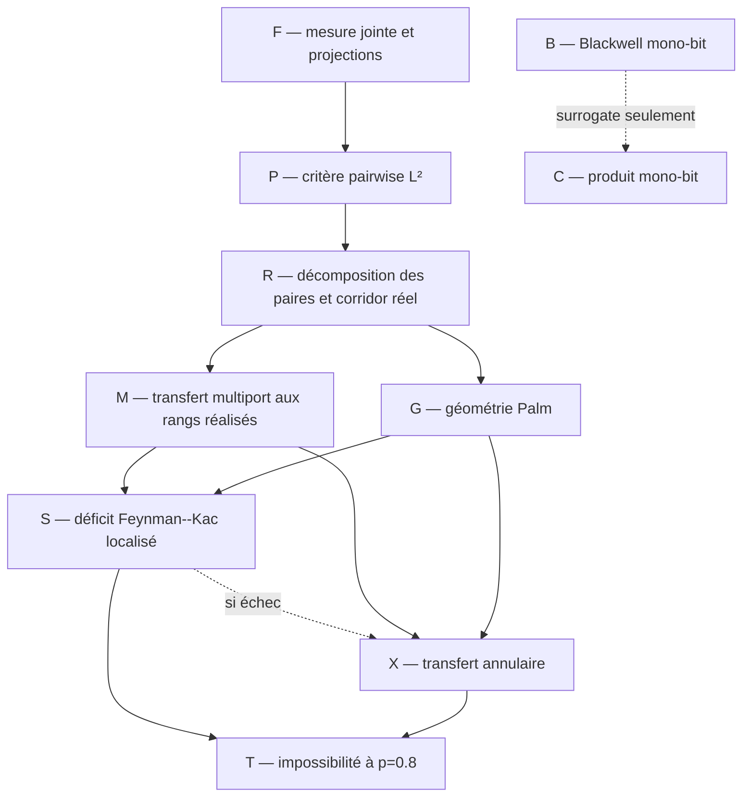

# Feuille de route des preuves

> [!WARNING]
> **Document archivé.** Certaines briques restent exactes, mais cet ordre de
> preuve a été remplacé par le
> [programme distance–entropie](../../active/35_DISTANCE_ENTROPIE_ERGODICITE.md).

> [!IMPORTANT]
> Le [programme prioritaire](00_RESEARCH_PROGRAM.md) donne l'exposé
> pédagogique et le statut des lemmes. Cette page conserve le graphe technique
> détaillé des dépendances historiques à $`p=4/5`$. La
> [feuille de route actuelle](../../diagnostics/29_AUDIT_FROID_PIVOT_RANGS_REELS.md) remplace
> la criticalisation réfutée par une dissipation annealed aux rangs réels.
> Les diagnostics D1--D2 rendent cette branche incertaine. D1-pop isole
> toutefois un enrichissement net de la dissipation dans la fenêtre critique,
> ce qui laisse une sous-piste étroite mais falsifiable. Le certificat
> rationnel P809439 du fichier 34 ferme déjà la borne
> $`p_{\mathrm{WR}}\ge0.809439`$ ; il est non hiérarchique.

Cette feuille de route remplace l'ancien inventaire chronologique. Elle ne
contient les dépendances historiques de la voie : corridor collapsed,
transfert multiport aux rangs réels et contraction multiscale à
$`p=4/5`$. Le fichier 24 teste d'abord la réduction plus simple aux buckets
bornés. Le fichier 25 corrige cette réduction au niveau géométrique en
introduisant la charge $`m h_p(\beta)^2`$ et la repondération LCA-Palm
$`mN_\rho`$ ; la synthèse générale et le théorème annulaire sont dans le
fichier 23.

## Théorème cible intermédiaire

Pour le GSBM binaire homogène sur les tores triangulaires, montrer qu'à

```math
p_0=\frac45
```

la weak recovery est impossible. Par dégradation BSC des observations, le
même résultat vaudrait alors pour $`p\in[1/2,p_0]`$.

Le critère à établir est

```math
\mathbb E[H_{\mathcal C}(I_L,J_L)^2]\longrightarrow0,
\qquad\text{(T)}
```

où $`P_{\mathcal C}`$ est le heat bath collapsed du corridor pair-spécifique.
Le théorème 2.2 du fichier 20 transforme (T) en impossibilité de weak
recovery par Jensen paire par paire.

Le point $`p=4/5`$ reste le pré-certificat de la branche hiérarchique. La
borne non hiérarchique est maintenant fermée à $`p=0.809439`$ dans le [fichier
34](../../results/non_hierarchical/34_CERTIFICAT_RATIONNEL_P809439.md). Pour que la dynamique hiérarchique
apporte un résultat propre, elle doit reproduire ou améliorer ce niveau par
la sous-feuille critique, avec traitement explicite des attaches ponctuelles.

## Graphe de dépendances



## Bloc F — fondations finies

### F1. Loi jointe

**Énoncé.** Pour le dendrogramme non marqué,

```math
\nu_O(\sigma\mid D)
\propto
\mu_0(\sigma)
\prod_{u\in D}
\Lambda_u(\sigma)e^{(1-\beta_u)\Lambda_u(\sigma)}.
```

**Statut.** Dérivé dans le fichier 01 et vérifié sur les petits graphes. Une
rédaction autonome avec toutes les masses censurées doit rester attachée à
tout théorème final.

### F2. Heat baths

**Énoncé.** Les quatre poids d'un nœud sont sa conditionnelle exacte ; les
updates à $`D`$ fixé sont des projections orthogonales de $`L^2(\pi_D)`$.

**Statut.** Établi en volume fini.

### F3. Bloc collapsed

**Énoncé.** Pour le corridor $`\mathcal C`$,

```math
\|K g\|_2^2
=
\|P_{\mathcal C}g\|_2^2
+\|K(I-P_{\mathcal C})g\|_2^2.
```

**Statut.** Établi dans le fichier 20.

### F4. Profondeur de la dynamique

Si $`P_u`$ est le heat bath du LCA seul et $`P_{\downarrow}`$ le heat bath
collapsed des deux bras jusqu'aux feuilles, alors

```math
\|P_uf_{ij}\|_2^2
=
\|P_{\downarrow}f_{ij}\|_2^2
+\|(P_u-P_{\downarrow})f_{ij}\|_2^2.
```

**Statut.** Établi dans le fichier 22. Pour un seul sweep, bottom-up est au
plus persistant que le LCA seul ; aucune comparaison top-down analogue ne
découle des seules projections.

## Bloc P — critère informationnel

### P1. Second moment pairwise

**Énoncé.** Si $`I_L,J_L`$ sont uniformes,

```math
\mathbb E[H(I_L,J_L)^2]\to0
\quad\Longrightarrow\quad
\text{pas de weak recovery}.
```

**Statut.** Établi dans les fichiers 03 et 18. Le couplage peut être choisi
séparément pour chaque paire dans le cas collapsed par le théorème 2.2 du
fichier 20 ; cette extension utilise Jensen paire par paire, et non la matrice
de Gram d'un sweep commun.

### P2. Transfert répliqué

**Énoncé.** Le second moment partage le même $`(O,D,\sigma)`$ entre deux
copies et seulement les aléas de heat bath sont indépendants.

**Statut.** Établi. Deux hiérarchies indépendantes calculeraient une autre
quantité.

## Bloc R — réduction favorable

### R0. Racines distinctes

```math
\beta_{ij}>1
\quad\Longrightarrow\quad
H_{\rm TD}(i,j)=H_{\rm BU}(i,j)=0.
```

**Statut.** Établi exactement.

### R1. Paires précoces

Pour tout $`\delta>0`$ fixé, une paire à distance macroscopique est connectée
sous $`q_c-\delta`$ avec probabilité tendant vers zéro.

**Statut.** Établi par décroissance sous-critique ; l'ordre des limites est
d'abord $`L\to\infty`$, puis $`\delta\downarrow0`$.

### R2. Décomposition

Les paires se partagent en : précoce, fenêtre critique gauche, postcritique
et racines distinctes. Après R0--R1, il reste à dominer la classe
postcritique par l'expérience critique favorable.

**Statut.** Décomposition établie ; domination géométrique ouverte.

## Bloc B — ordre favorable local

> [!NOTE]
> Les énoncés B1--B2 concernent un bucket mono-bit dont toutes les arêtes
> codent la même relation.

### B1. Canal d'un bucket

Pour $`s=s_p(t)`$,

```math
K\mid X=+1\sim1+\mathrm{Bin}(m-1,s),
\qquad
K\mid X=-1\sim\mathrm{Bin}(m-1,1-s).
```

### B2. Blackwell

À taille $`m`$ fixée, si $`t_1\le t_2`$, alors

```math
\mathcal E_{m,s_p(t_1)}
\succeq_{\rm Blackwell}
\mathcal E_{m,s_p(t_2)}.
```

**Statut.** Établi dans le fichier 19 par domination des courbes ROC.

### B3. Contre-audit pointwise

La fiabilité à $`K,B`$ fixés n'est pas monotone : un ancêtre opposé peut
rendre la fusion tardive plus persistante. Ce contre-exemple interdit les
preuves par comparaison réalisation par réalisation, mais pas l'ordre de
Blackwell sous la loi complète.

### B4. Contre-audit des tailles

L'ordre du bloc B2 n'est pas total lorsque $`m`$ change. À $`p=4/5`$, le
bucket critique $`m=4`$ et le bucket tardif $`m=2,t=4/5`$ sont incomparables
au sens de Blackwell. Deux écarts de fonctions call strictement négatifs sont
certifiés par intervalles rationnels dans le fichier 20.

**Conséquence.** Un couplage favorable doit préserver la taille des buckets,
ou vérifier explicitement la domination entre les deux expériences de
tailles différentes. Comparer seulement leurs niveaux est insuffisant.

## Bloc C — corridor fixé

> [!CAUTION]
> C1 est un théorème abstrait pour un produit conditionnel de canaux
> mono-bit. Il ne décrit pas le corridor collapsed multiport ; voir le
> contre-exemple du fichier 29.

### C1. Tensorisation

À squelette et tailles fixés, les dégradations de buckets se tensorisent.
Pour tout prior corrélé des parités et toute cible $`F`$,

```math
\mathbb E[
\mathbb E(F\mid K^{\rm late})^2
]
\le
\mathbb E[
\mathbb E(F\mid K^{\rm crit})^2
].
```

**Statut.** Établi dans le fichier 20.

### C2. Corridor factorisé

Sous parités indépendantes uniformes,

```math
\mathscr R
=
\prod_r\Gamma_{m_r}(t_r;p).
```

**Statut.** Établi dans l'expérience annoncée. Ne pas l'utiliser sur la
grille sans théorème de compression du bord.

## Bloc G — géométrie Palm, partiellement résolu sur cactus

### G0. Séparation en coordonnée $`q`$

Sous la loi jointe annealed, les rangs

```math
q_p(T_e)=p(1-e^{-u_pT_e})
```

ont une densité uniforme jusqu'à la censure. La forêt non marquée sous
$`q_\triangle`$ et tout conditionnement de paire mesurable à ce niveau ne
dépendent donc pas de $`p`$. Le canal résiduel dépend de
$`p`$ par $`s_c(p)=(p-q_\triangle)/(1-q_\triangle)`$.

**Statut.** Établi dans le fichier 20. Cette réduction ne traite ni les
ancêtres postcritiques, ni l'état de bord du transfert.

### G1. Variable à faire converger

Sous la Palm d'un événement de fusion réalisé, biaisé par une paire lointaine
séparée par ses deux enfants, étudier la loi de

```math
\left(
m_r,\beta_r,
m_{r,0},m_{r,1},m_{r,2},
Z_r,B_r,
\mathcal J_r
\right)_{r\in\mathcal C_{I_LJ_L}},
```

où $`Z_r`$ est l'état de bord minimal du transfert collapsed et

```math
\mathcal J_r=m_rh_p(\beta_r)^2.
```

### G1 bis. Intensité Palm exacte

Conditionnellement à la partition au niveau $`\beta`$, une coupe de taille
$`m`$ fusionne à taux $`m u_ps_p(\beta)`$. Le LCA d'une paire lointaine
repondère encore cette coupe par le nombre $`N_\rho`$ de paires séparées par
ses enfants. La mesure compensatrice **pré-saut** porte donc le facteur

```math
mN_\rho.
```

**Statut.** Établi dans le fichier 25 par la formule de compensation des
sauts. Sur le dendrogramme déjà réalisé, chaque événement est pondéré par
$`N_\rho`$ seulement : le facteur $`m`$ est déjà absorbé par la loi du saut.
La loi asymptotique de l'une ou l'autre représentation sur la grille reste
ouverte.

### G2. Porte postcritique aux rangs réels

La criticalisation globale autrefois annoncée est fausse pour une fusion
multiport. La première opération correcte conserve tout niveau
$`t_r>\beta_c`$ et construit son transfert $`K_r,U_r`$ exact.

Il reste deux options, par ordre de robustesse :

1. prouver une contraction annealed directe sur les corridors Palm de rang
   $`q\ge q_c`$ ;
2. à défaut, démontrer une domination **cible-spécifique** sous la véritable
   loi de bord, puis payer explicitement :

```math
\varepsilon_L^{\rm géom}
+\varepsilon_L^{\rm bord}
+\varepsilon_L^{\rm Palm}.
```

La somme doit tendre vers zéro. Blackwell traite le bucket mono-bit ; fixer
squelette et tailles ne suffit pas pour le bucket multiport. La première
option est la voie active.

### G3. Premier modèle

Sur une chaîne de cactus triangulaires à bord libre, l'incidence
arborescente réduit l'état de bord à la parité répliquée. Le fichier 21
établit exactement

```math
A_h^{\rm LCA\ only}(p,q)=\kappa_{\rm flux}(p,q),
\qquad
A_h^{\rm LCA}(p,q)
=
\kappa_{\rm flux}(p,q)\kappa_{\rm conn}(p,q)^{h-1},
```

contre-audité par énumération globale, transfert local, quadrature et
intervalles rationnels. Les deux coefficients décroissent avec $`q`$ : le
rang critique est bien le cas postcritique le plus favorable sur ce modèle.

**Statut.** Établi sur le cactus. La prochaine étape est le test de dernière
interaction et un quotient de ports Markov-fermé ; une bande triangulaire de
largeur deux ne vient qu'ensuite. Ni le cactus ni une bande de largeur fixée
ne possèdent une géante à $`q_\triangle`$ : ce sont des certificats de canal
et d'état de bord, pas des substituts à la loi Palm bidimensionnelle.

## Bloc X — déficit aux rangs réels à $`p=0.805`$, ouvert

### X1. Bloc élémentaire

Pour $`m=2`$ et message $`|B|\le b`$,

```math
\kappa_2(b)
=
s_c+(1-s_c)\tanh^2(b/2)<1,
\qquad
s_c=0.693582222752\ldots.
```

**Statut.** Établi.

### X1 bis. Réduction simple par buckets bornés

Pour $`m=2`$ et tout niveau $`0\le\beta\le1`$,

```math
\Gamma_2(\beta;p)=s_p(\beta)\le p<1.
```

Avec $`|B|\le B_0`$,

```math
\kappa_2(B;\beta,p)
\le
p+(1-p)\tanh^2(B_0/2)<1.
```

Par conséquent, si un corridor exact contient $`N_L\to\infty`$ buckets
$`m=2`$ disjoints et screenés dont les contractions se composent
conditionnellement, alors sa persistance tend vers zéro. La même conclusion
vaut pour $`2\le m\le M`$ dès qu'une borne uniforme strictement inférieure à
un est certifiée sur l'espace fini correspondant.

**Statut.** Établi pour le corridor factorisé ; implication globale
conditionnelle au screening et à l'abondance. Voir le fichier 24.

### X2. Bon bloc annulaire

Dans l'ancienne route locale, un bloc devait avoir un nombre borné de ports,
un screening latéral, au moins deux routes candidates et un transfert
répliqué exact dont le coefficient sur le secteur impair vérifiait

```math
\eta_{\chi^2}(\mathscr U_{p,k}\mid Z_k)\le\kappa(p)<1
```

pour tout état de bord admis. Une arête pivotale isolée, donc un bucket
$`m=1`$, est un canal parfait et ne compte pas comme bloc contractant.

Ce coefficient ne devient composable qu'après un quotient Markov-fermé ;
l'état fidèle donne au contraire $`d=0`$. Dans la route active, le bloc est
une projection collapsed et son coefficient est évalué seulement sur la
fonction entrante réellement issue de $`f_{ij}`$, comme dans le fichier 30.

**Statut.** Cactus établi ; quotient local ouvert et probablement non borné ;
dissipation collapsed finie établie, lemme annulaire ouvert.

### X3. Abondance

L'ancienne cible consistait à extraire $`N_L\to\infty`$ blocs dont le
coefficient répliqué était uniformément inférieur à un. Elle n'est valide
sur la grille qu'après fermeture d'un quotient. Les motifs candidats restent :

- des coupes $`m=2`$ screenées ;
- des blocs cactus, dont le coefficient est maintenant certifié dans le
  fichier 21 ;
- des blocs de bande admis par un programme linéaire de dégradation.

Sur des annuli séparés, viser

```math
\mathbb E[\mathbf1_{G_k}M_{k-1}^2]
\ge
a(p)\mathbb E[M_{k-1}^2]-\eta_{k,L}.
```

Elle doit être obtenue sous la loi Palm à deux points, et non par une simple
application de RSW non conditionnée. L'abondance non pondérée ne contrôle pas
les environnements rares qui portent le second moment.

**Statut.** Ouvert sur la grille.

### X4. Composition

Construire des blocs collapsed imbriqués tels que

```math
\mathbb E[H_{\mathcal C}(I_L,J_L)^2\mid\mathrm{Palm\ d'événement\ réalisé}]
\le
\mathbb E\!\left[
e^{-\sum_{k=1}^{K_L}\alpha_{k,L}}
\right]+o(1).
```

L'identité télescopique définissant les $`\alpha_{k,L}`$ est établie en
volume fini dans le fichier 30. Sa moyenne annealed est ouverte sur la grille.

Sous une minoration énergétique comme X3 sur $`K_L\asymp\log L`$ cellules
critiques séparées, la
borne quantitative devient

```math
\mathbb E[H_{\mathcal C}^2]
\le
\bigl(1-a(p)\delta(p)\bigr)^{K_L}+o(1),
```

avec les erreurs amorties de la proposition 3.1 du fichier 30. Ici
$`a(p)`$ est la masse énergétique des bons blocs et $`\delta(p)`$ leur
dissipation relative cible-spécifique ; aucun coefficient local
$`\kappa(p)`$ n'est utilisé dans cette route.

## Prochain lemme structurel

Pour deux blocs collapsed emboîtés, poser

```math
M_k
=
\mathbb E[f_{ij}\mid\mathcal F_k],
\qquad
\Gamma_{k,L}
=
\frac{\mathbb E[(M_{k-1}-M_k)^2]}
{\mathbb E[M_{k-1}^2]}.
```

Les deux tests finis sont effectués. D1 donne $`\Gamma_{2,L}>0`$ sur un
witness réel, mais sa marge uniforme s'annule sur les potentiels extérieurs
de bord. D2 montre une dissipation dominée par peu de paquets et une queue
rare. L'audit non sélectionné D1-pop montre que les cellules dans
$`|q-q_c|\le0.02`$ reçoivent $`4.13\%`$ de l'énergie mais portent
$`34.12\%`$ de la seconde perte sur deux graines poolées. Ce signal de petit
volume ne valide que le [programme critique
resserré](../../active/33_SOUS_FEUILLE_ROUTE_CELLULES_CRITIQUES_L2.md). Le scan de dernière
incidence reste utile pour réduire l'état, mais il ne libère pas à lui seul
le twist global.

## Contre-test local : calcul certifié de bande

Seulement après fermeture du quotient, sur une bande triangulaire de largeur
deux :

1. encoder la partition non marquée des sommets de coupe ;
2. ajouter les orientations de frontière encore actives, sans conserver le
   twist déjà éliminé ;
3. transporter exactement le potentiel projectif $`\Psi`$ ;
4. construire la matrice de transfert collapsed $`\mathscr U_{p,2}`$ ;
5. la recalculer par une énumération globale indépendante sur deux cellules ;
6. certifier une contraction à $`p=0.805`$ par intervalles ;
7. extraire les configurations finies de ports qui réalisent cette
   contraction ;
8. les joindre aux rangs réalisés sous la Palm d'événement.

Un résultat n'est accepté que si les deux implémentations donnent les mêmes
poids avant l'arrondi d'intervalle. Le rayon spectral ne doit jamais être
calculé après projection prématurée sur une seule majorité.

## Pistes reléguées

Les pistes suivantes restent des audits, mais ne doivent plus détourner le
programme principal :

- majorité scalaire globale d'une coupe ;
- contraction scalaire d'un triangle isolé ; le canal multi-état A0 possède
  désormais un certificat PSD exact distinct de cette heuristique ;
- calibration Nishimori utilisée comme preuve ;
- chemin physique marqué de la MSF ;
- formule PATH-FAC appliquée sans factorisation ;
- nouveaux diagnostics de grands tores avant un lemme analytique de cellule
  critique pondérée par l'énergie.

Les exposants exacts de la percolation de sites sur le réseau triangulaire ne
doivent pas être transférés sans preuve à la percolation par arêtes utilisée
ici. La première version du lemme annulaire doit s'appuyer seulement sur les
outils planaires robustes réellement disponibles pour le modèle considéré.

## Critère de clôture à $`p=0.8`$

Le jalon est atteint seulement lorsque les quatre lignes suivantes sont
simultanément prouvées :

```math
\begin{aligned}
\text{précoce}_L&=o(1),\\
\text{racines distinctes}_L&=0,\\
A_L^{\rm actual}
&\le
\mathbb E\!\left[
e^{-\sum_{k=1}^{K_L}\alpha_{k,L}}
\right]
+o(1),\\
\mathbb E\!\left[
e^{-\sum_{k=1}^{K_L}\alpha_{k,L}}
\right]&=o(1).
\end{aligned}
```

Avant cela, $`p=0.8`$ reste une cible et non une nouvelle borne annoncée.
