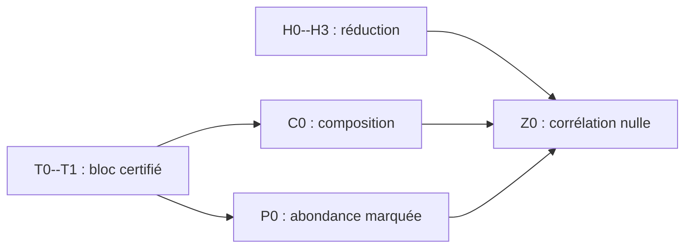

# Sous-feuille de route : corridor hiérarchique à $`p_0=161/200`$

> [!WARNING]
> **Document archivé.** Ce protocole à $`p=0.805`$ a été exécuté puis révisé
> par l'[audit aux rangs réels](../../diagnostics/29_AUDIT_FROID_PIVOT_RANGS_REELS.md).

> [!CAUTION]
> Cette sous-feuille est corrigée par le
> [fichier 29](../../diagnostics/29_AUDIT_FROID_PIVOT_RANGS_REELS.md). La criticalisation
> multiport et l'inégalité (3.3) sont fausses en général. Le théorème cible
> doit porter sur le corridor à ses rangs réalisés. De plus, un état fidèle
> qui conserve le twist donne exactement $`|U|=K`$ et $`d=0`$. La première
> porte n'est donc plus « calculer T2 ». La jauge locale est un dernier
> contre-test ; la priorité active est la
> [dissipation quadratique collapsed](../../active/30_PIVOT_DISSIPATION_L2_SECTEUR_IMPAIR.md)
> sur la fonction de paire réellement propagée, désormais resserrée aux
> [cellules critiques](../../active/33_SOUS_FEUILLE_ROUTE_CELLULES_CRITIQUES_L2.md).

Cette note transforme la
[feuille de route générale](26_FEUILLE_DE_ROUTE_PSTAR.md) en un chantier
falsifiable au point

```math
p_0=\frac{161}{200}=0.805.
```

L'objectif est une borne rigoureuse

```math
p_{\mathrm{WR}}
\ge
\frac{161}{200}
>
0.8.
\qquad\text{(0.1)}
```

La voie étudiée ici est exclusivement hiérarchique : heat bath collapsed du
corridor réel, transfert multiport aux rangs réalisés dans le secteur de
parité et composition sous la loi marquée de la paire. Le certificat de
triangle sans dendrogramme du
[fichier 34](../../results/non_hierarchical/34_CERTIFICAT_RATIONNEL_P809439.md) établit déjà la borne plus forte
$`p_{\mathrm{WR}}\ge0.809439`$ ; il ne remplace aucun des lemmes hiérarchiques de
cette page.

Cette sous-feuille spécialise le
[programme prioritaire](00_RESEARCH_PROGRAM.md), la
[stratégie d'obstruction](23_OPTIMAL_WEAK_RECOVERY_OBSTRUCTION.md), le
[test des buckets résiduels](../../diagnostics/24_SIMPLE_RESIDUAL_BALANCE_OBSTRUCTION.md), la
[loi géométrique des coupes](../../foundations/25_GEOMETRY_CONDITIONED_CUT_INFORMATION.md) et
la [feuille de route quantitative](26_FEUILLE_DE_ROUTE_PSTAR.md).

> [!IMPORTANT]
> E2G a échoué dans l'état fidèle et reste seulement un contre-test. Le
> premier lemme à fermer est maintenant la variance d'une cellule à deux
> fusions near-critical sous pondération énergétique. Les annuli génériques
> et toute preuve géométrique longue restent gelés jusqu'à cette porte.

> [!NOTE]
> **Mise à jour après les deux contre-audits.** Le
> [fichier 28](../../diagnostics/finite_volume/28_FIRST_CORRIDOR_P0805_RESULTS.md) certifie le secteur neutre
> E1+ mais montre aussi qu'un potentiel extérieur non borné fait tendre le
> second moment brut vers un. La forme uniforme (5.5) ne peut donc pas être
> exigée sur tout le simplexe projectif. Le fichier 29 montre ensuite que
> conserver toute cette polarisation avec les orientations fidèles annule le
> déficit local, tandis que la projection contractante testée n'est pas
> fermée. Le chantier prioritaire est la jauge exacte ; Feynman--Kac ne vient
> qu'après. La composition de Doob finie est, elle, déjà établie.

## 1. Statuts utilisés

| statut | signification |
|---|---|
| **Établi** | preuve en volume fini déjà disponible dans les notes citées |
| **Diagnostic** | calcul numérique ou simulation servant à choisir le bon objet |
| **Certificat** | inégalité finie vérifiée exactement ou par arithmétique d'intervalles |
| **Théorème** | énoncé analytique uniforme permettant le passage thermodynamique |
| **No-go** | résultat qui invalide une route précise, sans invalider tout le programme |

Un rayon spectral flottant, une simulation Palm ou une marge observée sur
quelques états de bord est un diagnostic. Ce n'est un certificat qu'après
contrôle de tous les états et paramètres continus annoncés.

## 2. Théorème cible

Soit $`G_L`$ le tore triangulaire. Pour

```math
f_{ij}(\sigma)=\sigma_i\sigma_j,
\qquad
c_{ij}(O)=\langle f_{ij}\rangle_{\mu_O},
```

posons

```math
Q_L(p)
=
\frac{1}{|V_L|^2}
\sum_{i,j}
\mathbb E[c_{ij}(O)^2].
\qquad\text{(2.1)}
```

Conditionnellement aux observations $`O`$ et au dendrogramme non marqué
$`D`$, soit $`P_{ij}`$ le heat bath conjoint exact des orientations du
corridor descendant de $`i`$ et $`j`$. Tous les facteurs ancestraux restent
dans la loi conditionnelle. Définissons

```math
A_{ij}(O,D)
=
\|P_{ij}f_{ij}\|_{L^2(\pi_D)}^2.
\qquad\text{(2.2)}
```

Le théorème pair-spécifique du
[fichier 20](../../foundations/20_COLLAPSED_CORRIDOR_BLACKWELL.md) donne déjà

```math
Q_L(p)
\le
\mathbb E[A_{I_LJ_L}(O,D)].
\qquad\text{(2.3)}
```

### Théorème P0805 à établir

**Prérequis désormais explicite.** Il existe un quotient de ports
Markov-fermé qui transporte le potentiel extérieur, agrège plusieurs signes
du twist dans une même transition et possède une complexité contrôlable le
long du corridor. Sans ce quotient, l'énoncé suivant n'est pas une cible
active.

À $`p=p_0`$, il existe alors une sélection mesurable de blocs disjoints
$`B_1,\ldots,B_{N_{ij}}`$ du corridor réel, des noyaux de masse $`K_r`$ aux
rangs réalisés et des déficits transitionnels $`d_r(z,z')\ge0`$ tels que

```math
A_{ij}^{\mathrm{actual}}
\le
C_w
\mathbb E^{K_1,\ldots,K_{N_{ij}}}
\left[
\exp\left(
-\sum_{r=1}^{N_{ij}}d_r(Z_{r-1},Z_r)
\right)
\mathrel{\Big|}O,D
\right]
+
\varepsilon_{ij}^{\mathrm{tr}},
\qquad
C_w<\infty,
\qquad
\varepsilon_{ij}^{\mathrm{tr}}\ge0,
\qquad\text{(2.4)}
```

et, sous la loi marquée des paires lointaines pertinentes,

```math
\mathbb E
\mathbb E^{K_1,\ldots,K_{N_{I_LJ_L}}}
\left[
\exp\left(
-\sum_{r=1}^{N_{I_LJ_L}}d_r(Z_{r-1},Z_r)
\right)
\mathrel{\Big|}O,D
\right]
\longrightarrow0,
\qquad
\mathbb E[\varepsilon_{I_LJ_L}^{\mathrm{tr}}]
\longrightarrow0.
\qquad\text{(2.5)}
```

Une condition suffisante pour le premier terme de (2.5) est la divergence
de la somme des déficits en probabilité sous la loi jointe marquée et la
chaîne de masse, puisque l'exponentielle est bornée par un.

Alors

```math
Q_L(p_0)\longrightarrow0,
```

donc la weak recovery est impossible à $`p_0`$. Par dégradation BSC, elle
est également impossible pour tout $`p\in[1/2,p_0]`$.

La version à bons blocs uniformes est le cas particulier

```math
d_r
=
-\log\kappa_0
\quad\text{sur un bon bloc},
\qquad
0<\kappa_0<1,
```

pour lequel il suffit de montrer $`N_{I_LJ_L}\to\infty`$ en probabilité.
La formulation par somme de déficits est plus robuste : elle autorise des
tailles, temps et états de bord variables.

## 3. Décomposition exacte et rangs réalisés

Posons

```math
q_p(\beta)
=
p(1-e^{-u_p\beta}),
\qquad
u_p=\log\frac{p}{1-p},
\qquad
q_c=2\sin\left(\frac{\pi}{18}\right).
\qquad\text{(3.1)}
```

Pour une paire, soit $`T_{ij}=q_p(\beta_{ij})`$, avec
$`T_{ij}=+\infty`$ si elle ne fusionne pas avant la censure.
À $`\delta>0`$ fixé, la preuve sépare :

1. $`T_{ij}<q_c-\delta`$ : masse $`o_L(1)`$ pour une paire lointaine ;
2. $`q_c-\delta\le T_{ij}\le2p_0-1`$ : corridor réel à traiter ;
3. $`T_{ij}>2p_0-1`$ : racines distinctes et persistance exactement nulle.

L'ordre des limites est $`L\to\infty`$ à $`\delta`$ fixé, puis
$`\delta\downarrow0`$.

Sur le deuxième secteur, conserver le squelette, les tailles, les incidences,
les attaches **et les temps réalisés**. L'ancien proxy tronquait les temps par

```math
\beta_v^{\mathrm{fav}}
=
\min(\beta_v,\beta_c).
\qquad\text{(3.2)}
```

mais ce proxy ne fournit pas la domination autrefois annoncée

```math
A_{ij}^{\mathrm{réel}}
\le
A_{ij}^{\mathrm{fav}}.
\qquad\text{(3.3)}
```

L'inégalité (3.3) est **fausse en général** pour une fusion multiport à
gagnante marginalisée. Elle reste vraie dans le surrogate produit mono-bit.
Le transfert T2 doit donc employer directement $`\beta_v`$ ou $`q_v`$ ; voir
le contre-exemple exact du fichier 29.

## 4. Calibration exacte au point $`p_0`$

À $`p_0=161/200`$,

```math
u_0
=
\log\frac{161}{39},
\qquad
2p_0-1
=
\frac{61}{100},
```

et

```math
\beta_c
=
-\frac{1}{u_0}
\log\left(1-\frac{q_c}{p_0}\right)
=
0.398224964786\ldots.
\qquad\text{(4.1)}
```

La qualité d'une arête de frontière au seuil est

```math
s_c
=
\frac{p_0-q_c}{1-q_c}
=
0.701242667184\ldots,
```

```math
h_c
=
2s_c-1
=
0.402485334367\ldots.
\qquad\text{(4.2)}
```

Pour une coupe de taille $`m`$, la charge critique vaut donc

```math
\mathcal J_{m,\beta_c}
=
m h_c^2
=
0.161994444381\ldots\,m.
\qquad\text{(4.3)}
```

Une grande coupe critique est très informative. Le LCA seul n'est donc pas
le bon bloc contractant. Le filtre géométrique prioritaire le long des deux
bras est

```math
\mathcal J_v
=
m_v h_{p_0}(\beta_v)^2.
\qquad\text{(4.4)}
```

Une faible charge désigne un candidat ; elle ne constitue pas un certificat
en présence d'un message extérieur ou d'un contournement.

Pour $`m=2`$, le canal de fusion est un canal d'effacement. Avec message
extérieur $`B`$,

```math
\kappa_2(B;\beta,p_0)
=
s_{p_0}(\beta)
+
\bigl(1-s_{p_0}(\beta)\bigr)
\tanh^2(B/2).
\qquad\text{(4.5)}
```

Au seuil et à message neutre, son coefficient est $`s_c`$. C'est le premier
motif à tester. Un bucket $`m=1`$ est au contraire parfait à cause de
l'arête gagnante ; il doit être exclu de toute liste de blocs contractants.

## 5. Objets exacts du transfert

### 5.1 Corridor et environnement partagé

Le corridor $`\mathcal C_{ij}`$ contient les deux bras descendants allant des
endpoints à leur LCA. Les orientations au-dessus du LCA ne doivent pas
nécessairement être rééchantillonnées, mais leurs facteurs doivent être
évalués.

Pour chaque ancêtre $`v`$ et chaque choix de flips
$`a,b\in\{0,1\}`$, le poids contient

```math
F_v(\Lambda_v^{ab})
=
\Lambda_v^{ab}
\exp\bigl((1-\beta_v)\Lambda_v^{ab}\bigr).
\qquad\text{(5.1)}
```

Les quatre $`\Lambda_v^{ab}`$ doivent être conservés jusqu'après
l'application de $`F_v`$. Une majorité scalaire ne suffit pas.

Les deux répliques du calcul de second moment partagent le même
$`(O,D,\sigma_{\mathrm{ext}})`$. Seules leurs orientations internes,
rééchantillonnées par le heat bath, sont conditionnellement indépendantes.
Deux dendrogrammes indépendants calculeraient une autre quantité.

### 5.2 État de bord

Pour un bloc $`B`$ à $`b`$ ports, utiliser au départ l'état surparamétré

```math
z_B
=
\bigl(
\mathcal G_B,
\Pi_B,
\Psi_B,
x_B^{(1)},
x_B^{(2)}
\bigr).
\qquad\text{(5.2)}
```

Ici :

- $`\mathcal G_B`$ contient le squelette, les temps, les tailles, les groupes
  d'incidence, le statut de fusion et les attaches en peigne ;
- $`\Pi_B`$ est la partition signée des ports ;
- $`\Psi_B`$ est le potentiel extérieur projectif sur les orientations
  relatives ;
- $`x_B^{(1)},x_B^{(2)}`$ sont les orientations relatives des deux
  répliques, modulo le flip global.

Une réduction de cet état n'est autorisée qu'après une preuve de fermeture
du noyau.

### 5.3 Transferts non tordu et tordu

Soit
$`\epsilon_B=\chi_B^{(1)}\chi_B^{(2)}\in\{-1,+1\}`$ l'incrément répliqué de
la parité de la paire. Le transfert positif levé est

```math
\mathsf T_{B,p_0}(z,dz',d\epsilon).
\qquad\text{(5.3)}
```

Définir

```math
\mathscr T_B^{(0)}(z,dz')
=
\sum_{\epsilon}
\mathsf T_{B,p_0}(z,dz',d\epsilon),
```

et

```math
(\mathscr U_Bg)(z)
=
\sum_{\epsilon}
\int
\epsilon g(z')
\mathsf T_{B,p_0}(z,dz',d\epsilon).
\qquad\text{(5.4)}
```

$`\mathscr T_B^{(0)}`$ transporte la masse. Le transfert
$`\mathscr U_B`$ agit dans le secteur tordu
$`\chi\otimes\chi`$ qui porte le second moment de la corrélation spin--spin.
Le mode constant du transfert positif ne doit jamais être inclus dans la
contraction recherchée.

### 5.4 Forme du certificat fini

Après une transformée de Doob cohérente du transfert de masse, chercher un
poids commun $`w>0`$ tel que, pour toute cellule admissible $`B`$ et tout
paramètre de bord $`\theta`$,

```math
\left|
\widehat{\mathscr U}_{B,\theta}
\right|w
\le
\kappa_B w,
\qquad
\kappa_B<1.
\qquad\text{(5.5)}
```

Pour une famille inhomogène, le même $`w`$ doit fonctionner, ou bien les
changements de jauge doivent former un cocycle dont les rapports sont
explicitement bornés. Des normalisations indépendantes suivies de la
multiplication des rayons spectraux ne donnent pas un certificat.

Le premier calcul E1+ montre que $`\kappa_B<1`$ ne peut pas être uniforme
sur des potentiels extérieurs arbitrairement polarisés pour le second moment
brut. Deux formes restent réalistes :

1. (5.5) sur une classe de messages explicitement tronquée, avec la masse
   extérieure payée par une erreur ou un drift ;
2. le transformé de Doob rétrograde donnant automatiquement une chaîne de
   masse finie, puis un déficit transitionnel
   $`d_r=-\log(d|U_r|/dK_r)`$ composé par Feynman--Kac.

La seconde forme est désormais prioritaire.

## 6. Workstream T — transfert fini

### T1 — test simple de buckets

1. Énumérer exactement le bucket $`m=2`$, l'arête gagnante et tous les états
   de parité.
2. Ajouter successivement un message scalaire, deux ports latéraux, puis un
   état d'attache en peigne.
3. Mesurer la perte de marge lorsque $`\Psi_B`$ devient polarisé.
4. Tester aussi les petites coupes vérifiant
   $`m h_{p_0}(\beta)^2\le J_0`$.

**Go :** une classe d'états définie géométriquement possède une marge
uniforme non négligeable.

**No-go local :** la contraction n'existe qu'après avoir imposé
gratuitement $`|B|\le B_0`$. Dans ce cas, intégrer la polarisation dans
l'état ou déplacer cette borne vers un lemme Palm explicite.

### T2 — bande triangulaire de largeur deux

Construire ce bloc **seulement après** la fermeture de la jauge. Il doit
contenir :

- deux bras possibles ;
- une route latérale de contournement ;
- trois ports au minimum ;
- une fusion et une attache postcritique ;
- les quatre groupes d'incidence nécessaires aux $`\Lambda_v^{ab}`$.

Deux implémentations sont obligatoires :

1. énumération directe des marques, orientations et sorties du heat bath ;
2. matrice de transfert obtenue par élimination dynamique des variables
   internes.

Elles doivent coïncider état par état avant toute optimisation spectrale.

Si l'état de sortie conserve le twist, le test attendu est $`d=0`$ et non
une marge numérique. Si une projection donne $`d>0`$ sans mettre à jour
exactement $`\Psi_B`$, elle est rejetée comme non composable.

### T3 — potentiel extérieur continu

Commencer par des boîtes rationnelles dans le simplexe projectif de
$`\Psi_B`$ :

1. enveloppe par intervalles ;
2. recherche du pire état ;
3. subdivision adaptative seulement près des boîtes presque critiques ;
4. extraction d'un vecteur poids rationnel ;
5. certification finale par intervalles.

Un état **overflow** de persistance $`1`$ est interdit. Les états hors
troncature doivent produire soit une erreur additive sommable, soit un drift
pondéré explicite vers le domaine fini.

### T4 — porte de sortie

Le workstream T est fermé seulement si l'on possède :

- la définition exacte du bloc et de son état ;
- deux constructions concordantes du noyau ;
- un transformé de Doob rétrograde et soit un poids sur une classe tronquée,
  soit un déficit de Feynman--Kac dépendant de l'état ;
- une marge ou un déficit certifié à $`p_0`$ ;
- une borne explicite des erreurs de troncature ;
- le motif géométrique précis auquel le certificat s'applique.

## 7. Workstream C — composition

### C1 — découpage mesurable

Définir une règle déterministe qui extrait du corridor des blocs disjoints à
partir du squelette non marqué et des données révélées. Cette règle doit
éviter le double comptage des buckets et conserver les attaches tardives
dans l'état transmis.

### C2 — inégalité de produit

Pour les blocs certifiés, établir conditionnellement à l'environnement

```math
\|\mathscr U_{B_N}\cdots\mathscr U_{B_1}g\|_w
\le
C_w
\exp\left(
-\sum_{r=1}^N d_r
\right)
\|g\|_w
+
\varepsilon_N^{\mathrm{tr}}.
\qquad\text{(7.1)}
```

Les mauvais blocs peuvent avoir $`d_r=0`$, mais ne doivent pas accroître la
norme hors d'un facteur de bord contrôlé. Le coût total des changements de
jauge, des ports rares et des troncatures doit rester $`o(1)`$ après moyenne.

### C3 — retour au heat bath collapsed

Prouver que le transfert par blocs représente exactement la projection
$`P_{ij}`$, ou donne une borne supérieure de sa persistance. Un sweep unique
top-down n'est pas un substitut : les projections locales ne commutent pas.
Des sweeps répétés peuvent servir de diagnostic, car ils convergent en volume
fini vers le bloc collapsed.

### C4 — porte de sortie

**Go :** (7.1) est valide pour toute suite admissible de blocs, avec une
constante $`C_w`$ indépendante de la longueur.

**No-go :** chaque bloc a un rayon spectral inférieur à un, mais aucun poids
commun ni contrôle de produit n'existe. Il faut alors étudier le rayon
spectral joint ou agrandir l'état ; multiplier les rayons individuels serait
incorrect.

## 8. Workstream P — géométrie Palm

### P1 — loi d'échantillonnage correcte

Pour deux enfants $`A,B`$ d'une fusion et une distance macroscopique
$`\rho L`$, définir

```math
N_\rho(A,B)
=
\#\{(x,y)\in A\times B:d_L(x,y)\ge\rho L\}
+
\#\{(x,y)\in B\times A:d_L(x,y)\ge\rho L\}.
\qquad\text{(8.1)}
```

Dans la représentation pré-saut de Campbell, dans une même tranche
infinitésimale autour de $`\beta`$, une coupe candidate de la partition
contribue avec l'intensité

```math
u_{p_0}s_{p_0}(\beta)
m(A,B)N_\rho(A,B)\,d\beta
=
\frac{m(A,B)N_\rho(A,B)}{1-q}\,dq,
\qquad
q=q_{p_0}(\beta).
\qquad\text{(8.2)}
```

Le facteur $`m(A,B)`$ vient du taux de la course des arêtes ; le facteur
$`N_\rho(A,B)`$ vient du choix de la paire séparée par la fusion.

> [!CAUTION]
> **Deux estimateurs équivalents à rang égal, deux poids différents.** Dans
> une fine fenêtre pré-saut, avant de savoir quelle coupe fusionnera, il faut
> utiliser l'intensité (8.2). Dans le même intervalle de rang d'un arbre de
> Kruskal déjà réalisé, la course des arêtes a déjà introduit le facteur
> $`m(A,B)`$ et le hazard : il faut pondérer chaque nœud de fusion seulement
> par $`N_\rho(A,B)`$. Une procédure exactement équivalente consiste à tirer
> une paire lointaine uniforme puis à prendre son LCA, toujours en restreignant
> son rang à la même fenêtre. Pondérer un nœud réalisé par
> $`m(A,B)N_\rho(A,B)`$ compterait deux fois la taille de coupe et produirait
> à tort un biais $`m(A,B)^2N_\rho(A,B)`$.

Toute simulation ou énumération doit annoncer lequel de ces deux estimateurs
elle utilise et la fenêtre de rang commune. Campbell ne permet pas de
comparer un snapshot au seuil avec l'ensemble des fusions réalisées jusqu'à
la censure. Échantillonner uniformément une coupe candidate de la partition
ou ajouter une seconde fois le facteur $`m`$ donne également la mauvaise loi.

Pour retrouver la moyenne sur toutes les paires, travailler d'abord à
$`\rho>0`$ fixé, prendre $`L\to\infty`$, puis $`\rho\downarrow0`$. Les
paires restantes occupent une proportion $`o_\rho(1)`$.

### P2 — diagnostic avant théorème

Sur des tores croissants, effectuer d'abord un contre-audit local dans de
fines fenêtres de rang autour de $`q_c`$. Dans chaque fenêtre, comparer
l'intensité pré-saut (8.2) aux nœuds réalisés pondérés seulement par
$`N_\rho`$. Relever :

- la distribution des tailles $`m_v`$ ;
- les temps $`\beta_v`$ ;
- les charges $`\mathcal J_v=m_vh_{p_0}(\beta_v)^2`$ ;
- le nombre de ports et de contournements ;
- la fréquence des buckets $`m=2`$ ;
- la longueur des histoires en peigne ;
- le déficit certifié cumulé correspondant aux motifs du workstream T.

Le diagnostic doit porter sur les deux bras complets, pas seulement sur le
bucket du LCA. La loi du corridor final, contenant tous les événements
réalisés jusqu'à $`q_1=2p_0-1`$, est ensuite mesurée séparément en tirant une
paire lointaine puis son LCA ; ses histogrammes ne sont pas censés coïncider
avec ceux d'une fenêtre autour de $`q_c`$.

### P3 — lemme d'abondance minimal

Ne pas chercher la loi limite complète du dendrogramme. Chercher directement

```math
D_{ij}
:=
\sum_{r=1}^{N_{ij}}d_r(Z_{r-1},Z_r)
\xrightarrow{\mathbb P}
+\infty
\qquad
\text{sous la loi jointe marquée et la chaîne de masse}.
\qquad\text{(8.3)}
```

Deux formes sont acceptables :

1. un nombre divergent de motifs uniformément contractants ;
2. une somme divergente de petits déficits dépendant de
   $`(\mathcal J_v,Z_v,\Psi_v)`$.

La seconde forme est préférable si les tailles de coupe ne sont pas tendues.

### P4 — outils géométriques ciblés

Une preuve multiscale peut utiliser :

- RSW pour créer des traversées et séparateurs duaux à probabilité non
  dégénérée ;
- séparation des interfaces et quasi-multiplicativité sous un
  conditionnement à deux points ;
- finite energy pour insérer le motif fini certifié ;
- sprinkling pour comparer des fenêtres de rang proches.

L'événement de bon bloc doit être formulé avec les ports et contournements
réellement utilisés par le transfert. Un pivot isolé ne convient pas :
il correspond souvent à une coupe $`m=1`$, donc à un canal parfait.

### P5 — cible moyennée

Une borne uniforme conditionnellement à toute histoire Palm est trop forte
comme premier objectif. La cible réaliste est

```math
\mathbb E\left[
\exp(-D_{I_LJ_L})
\mathbin{\Big|}
I_L\leftrightarrow J_L
\text{ dans }\Pi_1
\right]
\longrightarrow0.
\qquad\text{(8.4)}
```

Elle suffit avec la composition et l'annulation exacte des racines
distinctes.

## 9. Expériences finies prioritaires

| code | expérience | sortie attendue | statut maximal |
|---|---|---|---|
| E0 | certifier $`q_c,\beta_c,s_c,h_c`$ à $`p_0`$ | intervalles rationnels ou dirigés | Certificat |
| E1 | reproduire le cactus et le bucket $`m=2`$ | tests unitaires état par état | Certificat |
| E2G | jauge de ports : fermeture de $`\Psi_B`$ et non-mesurabilité du twist | quotient exact ou certificat de no-go | Établi ou No-go |
| E2 | double énumération de la bande largeur deux, conditionnelle à E2G | matrices identiques | Certificat |
| E3 | recherche adversariale sur $`\Psi_B`$ et les attaches | pire mode et pire état de bord | Diagnostic |
| E4 | Doob rétrograde et carte du déficit selon $`\Psi_B`$, seulement après E2G | marge locale ou densité de Feynman--Kac à $`p_0`$ | Composition abstraite établie ; quotient ouvert |
| E5 | rationalisation des poids, déficits et boîtes de message | (5.5) sur la classe tronquée ou domination de Feynman--Kac | Certificat |
| E6 | contre-audit Campbell dans les mêmes fines fenêtres autour de $`q_c`$ : intensité pré-saut (8.2) contre nœuds réalisés pondérés par $`N_\rho`$ ; corridor final analysé séparément | compatibilité fenêtre par fenêtre, puis histogrammes propres au corridor final | Diagnostic |
| E7 | test d'échelle de $`D_{ij}`$ | croissance compatible avec $`\log L`$ ou plus | Diagnostic |
| E8 | preuve de composition sur toutes les suites admissibles | inégalité (7.1) | Théorème |
| E9 | preuve d'abondance sous la loi marquée | (8.3) ou (8.4) | Théorème |

Les diagnostics E3, E6 et E7 peuvent réfuter rapidement un choix de bloc.
Ils ne prouvent ni le screening, ni l'abondance, ni la disparition de
$`Q_L`$.

## 10. Lemmes minimaux et dépendances

| code | lemme | statut actuel | dépend de |
|---|---|---|---|
| H0 | critère pairwise $`Q_L\le\mathbb E[A_{I_LJ_L}]`$ | Établi | invariance jointe, Jensen |
| H1 | paires sous-critiques négligeables et racines distinctes effacées | Établi | décroissance sous-critique, flips de racine |
| H2 | criticalisation Blackwell sur le squelette réel | Faux globalement ; lemme mono-bit établi | le corridor réel exige un transfert direct |
| H3 | loi des frontières, charge $`mh^2`$ et équivalence locale entre l'intensité pré-saut $`u_ps_p(\beta)mN_\rho\,d\beta`$ et les nœuds réalisés pondérés par $`N_\rho`$ dans la même fenêtre | Établi | conditionnement par la partition, Campbell |
| T0 | fermeture d'un état de bloc fini ou tronqué | Ouvert | objets de la section 5 |
| T1 | contraction tordue certifiée à $`p_0`$ | Ouvert | T0, E2--E5 |
| C0 | Doob rétrograde, composition Feynman--Kac et erreur sommable | normalisation finie établie ; identification au corridor ouverte | T1 |
| P0 | divergence du déficit sous la loi marquée | Ouvert | motif de T1, formule Palm H3 |
| Z0 | clôture $`Q_L(p_0)\to0`$ | Formel après les précédents | H0--H3, C0, P0 |

La dépendance utile est :



Le travail géométrique P0 ne doit commencer à pleine échelle qu'après
l'identification, par T1, d'un événement fini réellement contractant.

## 11. Portes go/no-go

### G1 — bucket simple

- **Go :** les buckets $`m=2`$ avec état de bord certifié apparaissent avec
  une fréquence croissante sous la loi LCA-Palm correctement échantillonnée.
- **No-go :** ils disparaissent sous cette loi marquée ou sont presque
  toujours contournés. Passer à une classe définie par la charge et à un bloc
  de largeur deux.

### G2 — transfert largeur deux ou trois

- **Go :** déficit positif sur une classe définie par l'état, robuste aux
  attaches, avec une composition commune et les états polarisés conservés.
- **No-go :** aucun poids commun après élargissement raisonnable de l'état.
  Identifier le mode persistant ; ne pas augmenter aveuglément la largeur.
  L'absence de marge brute uniforme sur les potentiels non bornés est déjà
  attendue et ne constitue pas, seule, un no-go de la composition annealed.

### G3 — troncature

- **Go :** la masse hors état fini donne une erreur additive dont la somme
  est $`o(1)`$, ou satisfait un drift pondéré.
- **No-go :** l'overflow porte une masse macroscopique ou une parité presque
  parfaite. Il faut intégrer cette géométrie comme état ordinaire.

### G4 — composition

- **Go :** les produits inhomogènes gardent une constante de bord uniforme.
- **No-go :** les changements de jauge accumulent un facteur exponentiel.
  Employer une jauge commune, un cocycle contrôlé ou le rayon spectral joint.

### G5 — abondance

- **Go :** le déficit cumulé diverge sous la loi marquée réelle.
- **No-go du motif :** le nombre de motifs reste tendu. Changer de motif ou
  utiliser une somme de déficits de charge variable.

### G6 — marge à $`0.805`$

- **Go :** la marge certifiée domine explicitement les erreurs de
  troncature et de composition.
- **No-go du point :** la marge est négative ou plus petite que les erreurs.
  Scanner d'abord des rationnels strictement supérieurs à $`0.8`$ pour
  localiser le seuil du certificat, sans annoncer un seuil physique.

## 12. Risques et no-go analytiques

Les objectifs suivants ne sont pas des prérequis raisonnables :

1. un gap spectral uniforme ou un temps de mélange global près de la
   criticité du spin glass ;
2. la loi asymptotique complète du dendrogramme sous une Palm à deux points ;
3. une domination de toute géométrie postcritique par une géométrie critique
   indépendante ;
4. une monotonie point par point en $`\beta`$, fausse en présence
   d'anti-alignement ancestral ;
5. une multiplication de fiabilités locales sans état de bord partagé ;
6. un screening imposé uniformément sans payer sa probabilité ;
7. l'utilisation du seul LCA, qui ne transforme pas la distance en
   contraction accumulée ;
8. l'importation d'exposants de percolation de sites dans ce modèle de
   percolation par arêtes ;
9. l'identification de $`0.8358\ldots`$ à un seuil exact à partir du seul
   passage d'un rayon spectral.

Un seuil exact demanderait en plus une minoration de reconstruction et un
décodeur construit à partir des observations. Le présent chantier vise
uniquement une nouvelle borne d'impossibilité.

## 13. Ordre d'exécution recommandé

1. **Figer les conventions.** Filtration collapsed, orientations intégrées,
   mesure de paire et rangs réalisés.
2. **D1, effectué.** La seconde perte est positive sur un witness réel, mais
   la marge uniforme s'annule sur les potentiels extérieurs de bord.
3. **D2, effectué.** À distance maximale sur $`L=4`$, la dissipation est
   dominée par peu de paquets et la seconde perte par une queue rare.
4. **D1-pop, effectué.** L'audit non sélectionné confirme une queue rare,
   mais localise une part disproportionnée de sa dissipation dans
   $`|q-q_c|\le0.02`$.
5. **Certifier une cellule critique blindée.** Dériver la formule locale de
   variance et une minoration cible-spécifique sous pondération énergétique.
6. **Diagnostiquer la Palm réelle.** Pondérer les bons motifs par
   $`M_{k-1}^2`$, pas seulement par leur abondance ; garder les conventions
   $`mN_\rho`$ pré-saut et $`N_\rho`$ événement réalisé.
7. **Prouver seulement le lemme géométrique nécessaire.** Produire un nombre
   divergent de cellules critiques actives sur des annuli séparés, sans
   classifier tout le dendrogramme.
8. **Garder E2G en parallèle secondaire.** Chercher une compression spéciale
   de la jauge ; ne relancer T2--E5 que si elle est Markov-fermée.
9. **Assembler Z0.** Décomposition des paires, dissipation collapsed,
   occupation énergétique, puis théorème pairwise.
10. **Optimiser après clôture.** Tester d'autres valeurs de $`p`$ uniquement
    après la fermeture du lemme critique à une valeur donnée.

## 14. Checklist de clôture à $`p_0=161/200`$

### Fondations

- [ ] Le théorème pairwise est cité avec exactement la notion de weak
  recovery utilisée.
- [ ] Les paires proches sont retirées avec le bon ordre des limites.
- [ ] Les paires sous-critiques ont une contribution $`o(1)`$.
- [ ] Les racines distinctes ont une persistance exactement nulle.
- [ ] Chaque cellule conserve son rang réalisé, ses tailles, incidences et attaches.

### Dissipation collapsed

- [ ] Les tribus collapsed sont réellement imbriquées et
  $`M_0=f_{ij}`$ sur la classe même-racine.
- [ ] Chaque identité de Pythagore est vérifiée par le calcul indépendant de
  $`\|M_{k-1}-M_k\|_2^2`$.
- [ ] La seconde perte est calculée sur la fonction propagée, pas sur
  $`f_{ij}`$ réinitialisée.
- [ ] Le même environnement est partagé par les deux répliques.
- [ ] Les quatre $`\Lambda_v^{ab}`$ ancestraux sont présents.
- [ ] L'arête gagnante de chaque fusion est incluse.
- [ ] Le secteur certifié est $`\chi\otimes\chi`$, pas le mode constant.
- [ ] La minoration porte sur l'énergie de la famille entrante accessible,
  jamais sur tout $`L^2`$ qui contient les constantes.
- [ ] Les bords extrêmes restent dans la moyenne annealed ou produisent une
  erreur amortie explicitement contrôlée.

### Branche locale optionnelle

- [ ] Toute jauge T2 annoncée met à jour exactement $`\Psi_B`$.
- [ ] Si le twist est mesurable, le déficit local est déclaré nul.
- [ ] Deux implémentations indépendantes donnent le même quotient.

### Composition

- [ ] La sélection des blocs est mesurable et edge-disjoint.
- [ ] Les blocs mauvais et les histoires en peigne sont conservés.
- [ ] Les pertes relatives télescopent sur la même filtration collapsed.
- [ ] L'inégalité globale majore bien le heat bath collapsed.
- [ ] La somme des erreurs de troncature est $`o(1)`$.

### Géométrie marquée

- [ ] L'estimateur pré-saut utilise l'intensité complète
  $`u_{p_0}s_{p_0}(\beta)mN_\rho\,d\beta`$, ou sa densité en rang.
- [ ] Dans la même fenêtre de rang, l'estimateur sur l'arbre réalisé pondère
  les nœuds seulement par $`N_\rho`$.
- [ ] Le corridor final est échantillonné séparément par une paire lointaine
  uniforme puis son LCA ; il n'est pas comparé à un snapshot autour de
  $`q_c`$.
- [ ] Aucun nœud de fusion déjà réalisé n'est repondéré par $`mN_\rho`$.
- [ ] La charge $`m h_{p_0}(\beta)^2`$ sert seulement de filtre.
- [ ] Les buckets $`m=1`$ ne sont jamais comptés comme contractants.
- [ ] Les ports et routes latérales de l'événement géométrique correspondent
  exactement à ceux du transfert certifié.
- [ ] Les fenêtres near-critical sont définies par des probabilités de
  traversée et non par un exposant importé sans preuve.
- [ ] Un nombre divergent de cellules critiques blindées reste actif sous la
  mesure inclinée par $`M_{k-1}^2`$.
- [ ] La somme des pertes relatives diverge sous la loi marquée, ou son
  exponentielle a une espérance tendant vers zéro.

### Conclusion

- [ ] La borne finale porte sur $`\mathbb E[A_{I_LJ_L}]`$, pas seulement sur
  une Palm rare conditionnelle.
- [ ] Toutes les erreurs sont uniformes dans l'ordre des limites annoncé.
- [ ] On obtient $`Q_L(p_0)\to0`$.
- [ ] La dégradation BSC étend l'impossibilité à tout
  $`p\in[1/2,p_0]`$.
- [ ] Le résultat est annoncé comme
  $`p_{\mathrm{WR}}\ge161/200>0.8`$, sans prétention de seuil exact.

## Conclusion opérationnelle

Le chantier hiérarchique se résume désormais à trois inconnues réellement
nouvelles :

1. une marge locale sur une cellule consécutive critique et blindée ;
2. une occupation énergétique multiscalaire suffisante sous la Palm
   d'événement ;
3. un contrôle amorti des bords extrêmes et des erreurs de découpage.

Le critère pairwise, la loi des frontières, la charge $`mh^2`$ et la
normalisation finie sont disponibles ; la criticalisation multiport et le
déficit sur état fidèle sont réfutés. D1 prouve que la seconde dissipation est
algébriquement possible sur un witness, mais sa marge globale est nulle au
bord ; D2 montre une concentration dans peu de paquets et une queue rare.
D1-pop montre que 14 cellules proches de $`q_c`$ portent $`34.1\%`$ de la
perte pour $`4.13\%`$ de l'énergie entrante sur deux graines poolées. Ce
signal de petit volume ouvre uniquement la [sous-feuille
critique](../../active/33_SOUS_FEUILLE_ROUTE_CELLULES_CRITIQUES_L2.md). Si le blindage ne
dépolarise pas la mesure énergétique ou si le nombre de cellules actives
reste tendu, il faut arrêter l'accumulation collapsed. E2G reste un
contre-test secondaire.
